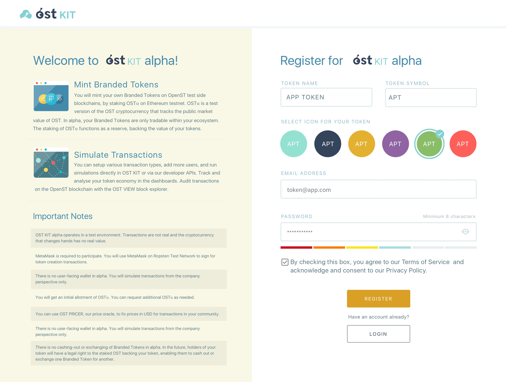
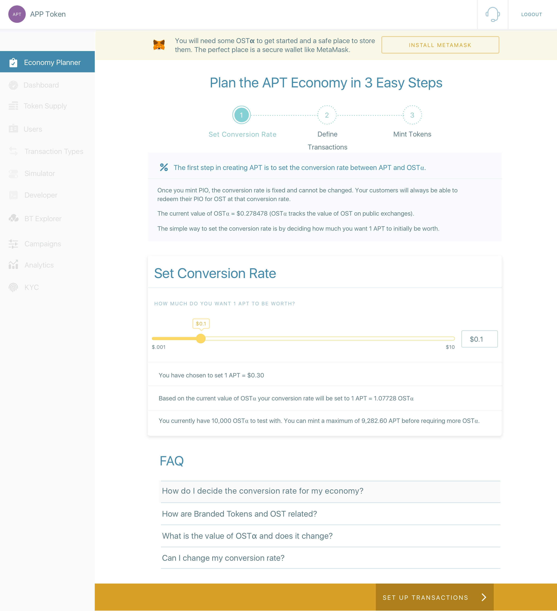
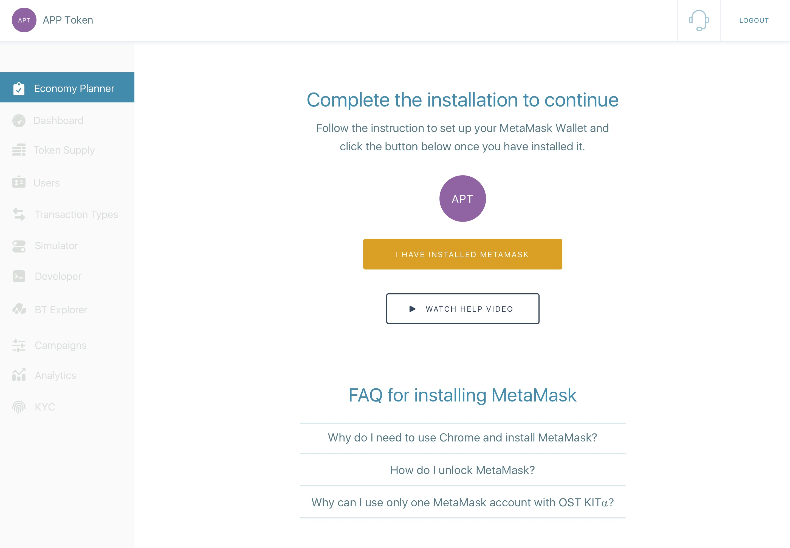
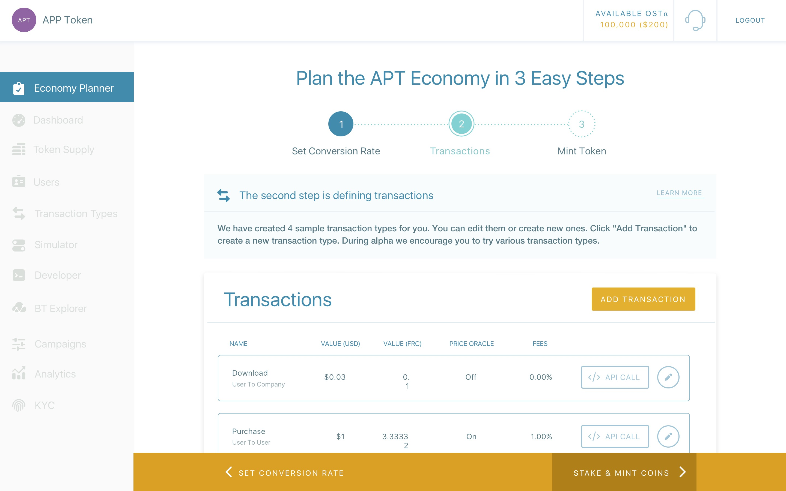
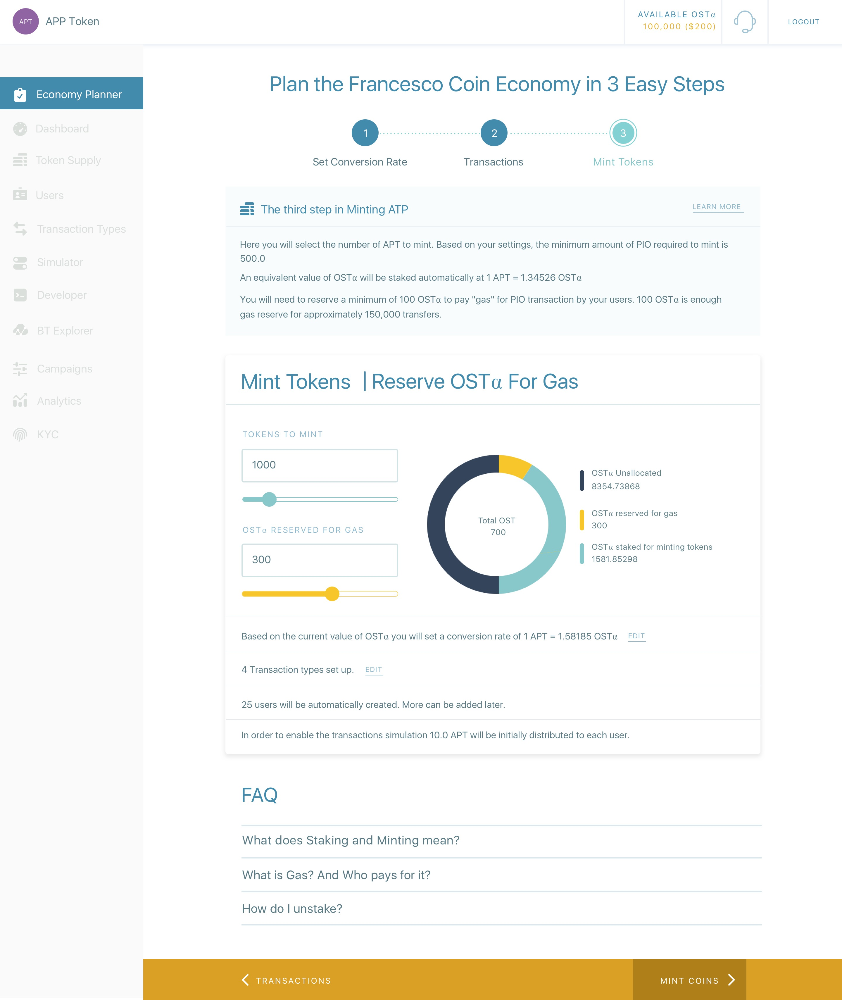
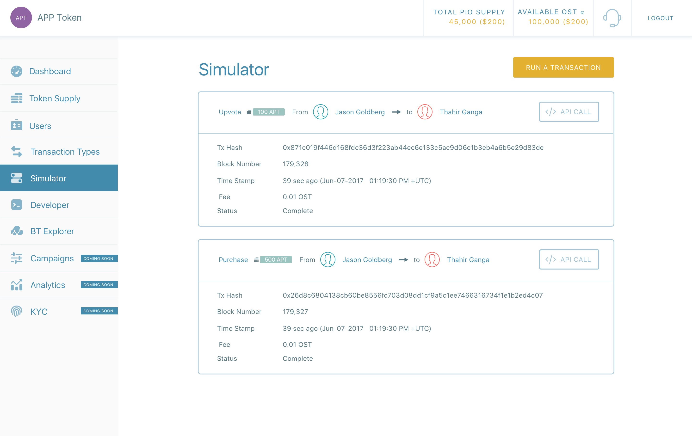

###  1. Create an Account
The first thing you need to get started with OST KIT⍺ is to [<u>sign up for a free account</u>](https://kit.ost.com/sign-up). During registration, you will setup your Token Name and select a short name Token Symbol for your token. You will have to activate your account using the activation link sent to you upon registration.

###  3. Set Conversion Rate
For creating your Branded Tokens you need to set the conversion rate between your Branded Token and OST⍺. The simplest way to set your conversion rate is to consider how much $USD you would like 1 of your Branded Tokens to initially be worth.

###  2. Install MetaMask
MetaMask is required to participate in OST KIT⍺. You will receive an initial allotment of OST⍺ into your MetaMask account and you will also use MetaMask to sign for token creation transactions on Ropsten Test Network.  OST⍺ is a test version of the OST cryptocurrency that tracks the public market value of OST for the purpose of testing. OST⍺ has no real value.

###  4. Setup Transactions
The next step is defining Transactions. A transaction represents a core action or event for your business, for example, a "like", "share", "purchase", "API call", "view", "download", "reward", "monthly winner", or "birthday event".  We have created 4 sample transaction types for you. We encourage you to try various transaction types in OST KIT⍺. You can create as many transaction types as you like and you can name them as best fits the economic drivers of your business.

###  5. Mint Tokens & Reserve Gas
OST KIT⍺ enables you to easily and safely create your own Branded Tokens on highly scalable OpenST Side Blockchains. The OpenST technology protocol enables Branded Tokens to be created, or "minted", on side blockchains by staking OST⍺ on the public Ropsten Ethereum blockchain.

When you send tokens, interact with a smart contract, or do anything else on the blockchain, you must pay for the computation done to validate the action. The common term for the costs of the computations is "gas". In OST KIT⍺ the company pays the gas for each transaction. In the future, the company could also choose to have its customers pay for some of the gas. Because the company pays the gas charges, we require you to set aside a small amount of OST⍺ to cover future transaction simulations. 
       

 
### 6. What NEXT
Having minted your Tokens, you should visit the Simulator Page. There, you'll see we've created an environment that models how transactions would run in your application. You can also execute multiple transactions via our APIs. [<u>OST KIT⍺ API</u>](2_00_API_OVERVIEW.md) allows you to:     
* Programmatically add or update users to participate in your token economy
* Setup core actions in your application as transactions
* Airdrop tokens to users
* Execute token transfers between users
	
                                
