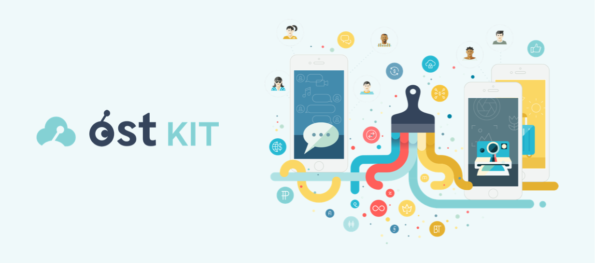

## Introducing OST KIT

OST KIT gives you all the tools you need to run your blockchain-powered economy on scalable OpenST utility blockchains. Launch your own Branded Token without an ICO.

  

    

      <a href="getting-started-developing-with-reaction">
        
        <h3 class="accent-color text-center">Developers</h3>
      </a>
    

  

  

    

      <a href="deploying">
        
        <h3 class="accent-color text-center">System Admins</h3>
      </a>
    

  

  

    

      <a href="dashboard">
        
        <h3 class="accent-color text-center">Operators</h3>
      </a>
    

  

  

    

      <a href="http://gitter.im/reactioncommerce/">
        
        <h3 class="accent-color text-center">Chat</h3>
      </a>
    

  

  

    

      <a href="http://api.docs.reactioncommerce.com/">
        
        <h3 class="accent-color text-center">Core API</h3>
      </a>
    

  

  

    

      <a href="https://forums.reactioncommerce.com/">
        
        <h3 class="accent-color text-center">Forums</h3>
      </a>
    

  

## OST KIT Intro

The first thing you need to get started with OST KIT⍺ is to sign up for a free account. During registration, you will setup your Token Name and select a short name Token Symbol for your token. You will have to activate your account using the activation link sent to you upon registration.
