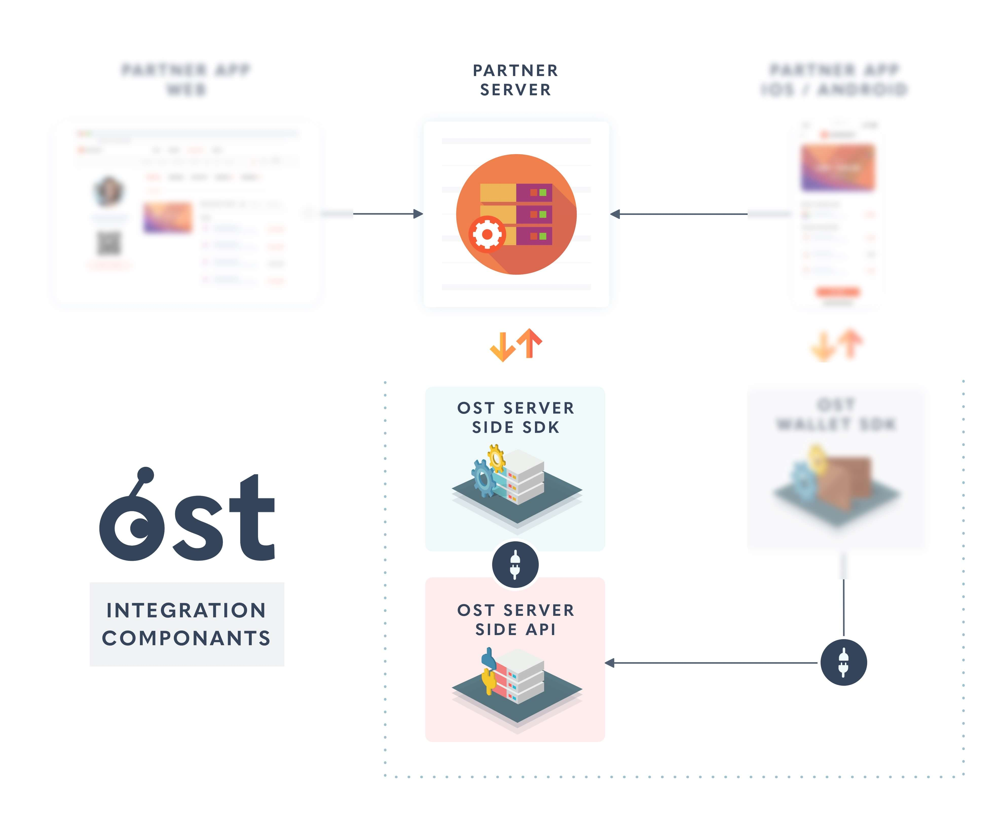

# Introduction

OST Platform API allows developers to interact with smart contract layer through API. The URLs returns JSON response with standard HTTP response codes.

This API library includes API calls that will be used by client company's server for integration. 

<!--  -->


Available Server Side sdk:

1. [PHP SDK](/platform/docs/sdk/server-side-sdks/php/)
2. [Ruby SDK](/platform/docs/sdk/server-side-sdks/ruby/)
3. [Java SDK](/platform/docs/sdk/server-side-sdks/java/)
4. [Node.js SDK](/platform/docs/sdk/server-side-sdks/nodejs/)


## Access

> Sandbox Environment Base API URL

```json
"https://api.ost.com/testnet/v2/"
```

> Production Environment Base API URL

```json
"https://api.ost.com/mainnet/v2/"
```

### Sandbox Environment
You can signup on [OST Platform](https://platform.ost.com/) to create your account. By default you will land in Sandbox environment. You can create a token in Sandbox environment to test the API. <br><br>

Once you have created your token (refer [create token guide](/platform/docs/1-create/)) to create token, then you can head over to [developers page ](https://platform.ost.com/testnet/developer/) to get access to API key and API secret.


### Production Environment
A request to enable the Production environment can be made after login in to Sandbox environment. Our team will reach out to you to check if you are ready to go live. Once our team is done with the check, your account will be moved to Production environment. 

A toggle switch will be enabled that can be used to switch back to Sandbox environment.


## Authentication
All the server side sdk will handle authentication for you. You just need to provide your API key and API secret while initializing the Server side sdk. If you are going to use one of the SDK then you can skip this section.

For other languages you can implement the signature generation by computing the `sha256` digest of the API secret and the query string. The resulting signature must be then included in the request.

Every API request on `https://api.ost.com/testnet/v2/` or `https://api.ost.com/mainnet/v2/` requires hash-based message authentication.

Every request has 4 mandatory parameters that must be included: <br>
- `api_key`, the API key as provided from [developers page](https://platform.ost.com/testnet/developer) inside OST Platform dashboard.<br>
- `api_request_timestamp`, the current unix timestamp in seconds.<br>
- `api_signature`, the signature as the sha256 digest of the shared API secret and the correctly formatted query string as described below.<br>
- `api_signature_kind`, the value for this parameter should be `OST1-HMAC-SHA256`.
<br>

The request timestamp will be valid for up to 60 seconds.  Your computer clock must therefore be synchronised for authentication to succeed.

The reason for these 4 mandatory parameters in each request is to ensure that the man-in-the-middle cannot change the input params to the request and also so to validate the signature on the server side.


### A. Creating the string to sign.

To generate the signature you must first form the string to sign. This string to sign can be formed by concatenation of the following elements

-  Resource endpoint without trailing slash("/"). Example: `/users`, `/users/{id}/devices`
-  `api_key`, the API key is provided from [Developers Tab](https://platform.ost.com/testnet/developer) in OST Platform.
-  `api_request_timestamp`, the current unix timestamp in seconds.
-  `api_signature_kind`, the value for this parameter should be `OST1-HMAC-SHA256`
-   API parameters.

> Sample String-to-sign :

```js
"/users?api_key=4b66f566d7596e2b733b&api_request_timestamp=1521073147&api_signature_kind=OST1-HMAC-SHA256"
```

**Note:** All the parameters must be alphabetically sorted on the keys. The keys are lower-case, snake case (Example: `user_id`)  as documented for each API endpoint. Spaces in input values are replaced with plus sign `+`.

### B. Generating a signature

The signature is the sha256 digest of the shared API secret and the correctly formatted query string

SIGNATURE = Hmac_Sha256_Hexdigest(string-to-sign, api-secret)

### C. Final URL

> Sample Final URL

```json
"https://api.ost.com/testnet/v2/users?api_key=4b66f566d7596e2b733b&api_request_timestamp=1521073147&api_signature_kind=OST1-HMAC-SHA256&api_signature=SIGNATURE"
```


Please ensure that the signature is appended in the final URL and it is encoded while making the API request.

## Pagination
OST Platform API v2 supports pagination. All `list` API has extra attributes to support (`meta` attribute) pagination. Response of all `list` API like [list user](/platform/docs/api/#list-all-users), [list device](/platform/docs/api/#list-all-devices) has a common structure. 


To explain pagination we will take example of [list user API](/platform/docs/api/#list-all-users).

### Pagination Example

### List user API call


> Pagination Example: List User Sample code

```php
<?php
require 'vendor/autoload.php';

$params = array();
$params['apiKey']='65e20fcfce72f4c34546338a70518478';
$params['apiSecret']='f07f94340ab66045634d7505385a53e4ed12f7d9792a40798f60fa9a95adb3e0';
$params['apiBaseUrl']='https://api.ost.com/testnet/v2/';

// The config field is optional
$configParams = array();
// Request timeout in seconds. Default is 10 seconds.
$configParams["timeout"] = 15;
$params["config"] = $configParams;

$ostObj = new OSTSdk($params);

$userService = $ostObj->services->users;

// List users without any filters. This will return 10 users because the default limit is 10.
$getParams = array();

$response = $userService->getList($getParams)->wait();
echo json_encode($response, JSON_PRETTY_PRINT);

?>
```

On the right hand side, a sample code is given to get a list of user. By default the `limit` of entities in 1 page is 10. **Max value of limit is 25**.


**List user API call response:**
This call will return a hash with 2 properties `success` and `data`. If valid inputs were provided then value of success attribute will be `true`. The `data` property will have 3 child properties `result_type`, `users` and `meta`.<br><br>

The value of `data.result_type` property will be `users` and list of users will be available under `data.users` property. The pagination data will be available under `data.meta` property. The example response is given on the right hand side.

> Pagination Example: List all user response 


```json
{
  "success": true,
  "data": {
    "result_type": "users",
    "users": [
        {
            "id": "fd836794-96fe-4841-a486-f3d2966d3ac8",
            "token_id": 1085,
            "token_holder_address": "0x3c20b6063aae91716efa7c4c20ecc5ae8be739d1",
            "device_manager_address": "0xa86701116f6dccbb6b7e7c1fa7e815ef444fd0ca",
            "recovery_address": "0x6f472b55a989009a261bac3ae14db3ba4c1a9a15",
            "recovery_owner_address": "0xf481c20ada19d60f96ae4051845e34408d55b541",
            "type": "user",
            "status": "ACTIVATED",
            "updated_timestamp": 1552055725
        },
        {
            "id": "fbb7990a-c396-46d2-a179-b69e783bf231",
            "token_id": 1085,
            "token_holder_address": null,
            "device_manager_address": null,
            "recovery_address": null,
            "recovery_owner_address": null,
            "type": "user",
            "status": "CREATED",
            "updated_timestamp": 1551975577
        },
        {
            "id": "f909d31d-5f6d-4440-ab1f-bfb40709f5aa",
            "token_id": 1085,
            "token_holder_address": "0xc835b03fbb0bf630df39ccce0af75cb201d91eb6",
            "device_manager_address": "0xd0de2b520b72804116c0987b733b776232de1f94",
            "recovery_address": "0x8562281b40937b2227ba6042fc77b76b78fa666f",
            "recovery_owner_address": "0x986c7bc12ee02f7c08d89d5951f0d0f86ad7d6ae",
            "type": "user",
            "status": "ACTIVATED",
            "updated_timestamp": 1552287905
        },
        {
            "id": "f6a0a826-02fc-4403-822c-b506bea9b3e7",
            "token_id": 1085,
            "token_holder_address": null,
            "device_manager_address": null,
            "recovery_address": null,
            "recovery_owner_address": null,
            "type": "user",
            "status": "CREATED",
            "updated_timestamp": 1552243644
        },
        {
            "id": "f16bab15-95a5-4e4a-a404-6cbe3901bca2",
            "token_id": 1085,
            "token_holder_address": null,
            "device_manager_address": null,
            "recovery_address": null,
            "recovery_owner_address": null,
            "type": "user",
            "status": "CREATED",
            "updated_timestamp": 1551972063
        },
        {
            "id": "f0e07d5d-a26b-4c86-9e1f-d6f74bcb1310",
            "token_id": 1085,
            "token_holder_address": "0x579ab7e6529bc581c93c0c7d0adc9c0a1dba4437",
            "device_manager_address": "0x2d9e1318e61ca76a10b9eb89cbe9842b55cbd6f0",
            "recovery_address": "0x88dfcec86125f3b3bf2b0aef207f7ecd69dc72d6",
            "recovery_owner_address": "0x770ebef3ffb78d6d395fc1e3e6acf00b6057abc1",
            "type": "user",
            "status": "ACTIVATED",
            "updated_timestamp": 1551943048
        },
        {
            "id": "ee3aef76-b883-402b-addf-2ade7f6af2b2",
            "token_id": 1085,
            "token_holder_address": null,
            "device_manager_address": null,
            "recovery_address": null,
            "recovery_owner_address": null,
            "type": "user",
            "status": "CREATED",
            "updated_timestamp": 1551942824
        },
        {
            "id": "ea77075b-c262-45d2-9c91-607a830c4cf2",
            "token_id": 1085,
            "token_holder_address": null,
            "device_manager_address": null,
            "recovery_address": null,
            "recovery_owner_address": null,
            "type": "user",
            "status": "CREATED",
            "updated_timestamp": 1552243474
        },
        {
            "id": "e9404642-64f1-4c44-8fa3-800cb463b776",
            "token_id": 1085,
            "token_holder_address": null,
            "device_manager_address": null,
            "recovery_address": null,
            "recovery_owner_address": null,
            "type": "user",
            "status": "CREATED",
            "updated_timestamp": 1552243749
        },
        {
            "id": "e66d9210-9f47-4bdf-ab49-34d5ca2edb9b",
            "token_id": 1085,
            "token_holder_address": "0x8e4a581c59d9feb59753a018f12451334b9e57e4",
            "device_manager_address": "0x3594de752d941b9e6cd97dabe6aecf7185e6bf93",
            "recovery_address": "0xfbb43a8c5a659fbf88ed0720a94350a063a70e0b",
            "recovery_owner_address": "0x7306c650e874fd0f365482aecd10fff8d86c7383",
            "type": "user",
            "status": "ACTIVATED",
            "updated_timestamp": 1551879248
        }
    ],
    "meta": {
        "next_page_payload": {
            "pagination_identifier": "eyJsYXN0RXZhbHVhdGVkS2V5Ijp7InRpZCI6eyJOIjoiMTA4NSJ9LCJ1aWQiOnsiUyI6ImU2NmQ5MjEwLTlmNDctNGJkZi1hYjQ5LTM0ZDVjYTJlZGI5YiJ9fSwicGFnZSI6MiwibGltaXQiOjEwfQ=="
        }
    }
  }
}
```

### Requesting next page

If next page is not present, `next_page_payload` will be empty hash and `pagination_identifier` key won't be present.

> Pagination Exmaple: Requesting next page users

```php
<?php
require 'vendor/autoload.php';

$params = array();

$params['apiKey']='65e20fcfce72f4c34546338a70518478';
$params['apiSecret']='f07f94340ab66045634d7505385a53e4ed12f7d9792a40798f60fa9a95adb3e0';
$params['apiBaseUrl']='https://api.ost.com/testnet/v2/';

// The config field is optional
$configParams = array();
// Request timeout in seconds. Default is 10 seconds.
$configParams["timeout"] = 15;
$params["config"] = $configParams;

$ostObj = new OSTSdk($params);

$userService = $ostObj->services->users;

$getParams = array();

// Requesting next page using the pagination_identifier received in last page under `meta` attribute.
$getParams['pagination_identifier'] = 'eyJsYXN0RXZhbHVhdGVkS2V5Ijp7InRpZCI6eyJOIjoiMTA4NSJ9LCJ1aWQiOnsiUyI6ImU2NmQ5MjEwLTlmNDctNGJkZi1hYjQ5LTM0ZDVjYTJlZGI5YiJ9fSwicGFnZSI6MiwibGltaXQiOjEwfQ==';
$response = $userService->getList($getParams)->wait();
echo json_encode($response, JSON_PRETTY_PRINT);

// 

?>
```

Now to request next page, we will use the `pagination_identifier` present in `data.meta.next_page_payload` of response object. Sample code is on the right hand side.


> Pagination Example: List users 2nd page example response

```json
{
    "success": true,
    "data": {
        "result_type": "users",
        "users": [
            {
                "id": "e5f124e1-e171-4d08-9765-21da77be625b",
                "token_id": 1085,
                "token_holder_address": null,
                "device_manager_address": null,
                "recovery_address": null,
                "recovery_owner_address": null,
                "type": "user",
                "status": "CREATED",
                "updated_timestamp": 1552451707
            },
            {
                "id": "e52580d4-9df2-4f9b-a418-e4aebd5d95db",
                "token_id": 1085,
                "token_holder_address": "0x5b15418780e33eab59ed2b977d52f8b304c87893",
                "device_manager_address": "0x7a10cd5b7e9cca7d88b7f84d909c61d1a6339b24",
                "recovery_address": "0xec502f6431e9cfbf61980d825406203a68666b0d",
                "recovery_owner_address": "0x6083b8498006e29211e6150ce3c1176196ec0840",
                "type": "user",
                "status": "ACTIVATED",
                "updated_timestamp": 1552486489
            },
            {
                "id": "e4aee71b-c152-4c6e-bd6a-d547c87730c5",
                "token_id": 1085,
                "token_holder_address": "0x9f0b2cc749b3bfd7fc35bee1a7e7370ccae8405e",
                "device_manager_address": "0x6f181b74123aa169a078d4135b7f66f947dad427",
                "recovery_address": "0x724e83bb8a52a7744f663dcc38f01a1f7bd36b83",
                "recovery_owner_address": "0xba4d884fb0d6a3d938e584154593cf53a5c3f883",
                "type": "user",
                "status": "ACTIVATED",
                "updated_timestamp": 1552392315
            },
            {
                "id": "dfe634c0-e00b-41ce-b2d2-9d7f89575a8e",
                "token_id": 1085,
                "token_holder_address": "0x95192701980c88996bead742ed195034b6bffc42",
                "device_manager_address": "0x9bdb4b337d9ad6b42369bddaff67f6d5f54a3be1",
                "recovery_address": "0x711868d2ad9c02199aa3568118a619bc936bf21f",
                "recovery_owner_address": "0xe1dd14462ae381c30ed7dc2608e5cc7f063e36ad",
                "type": "user",
                "status": "ACTIVATED",
                "updated_timestamp": 1552028211
            },
            {
                "id": "df9917bd-a5ab-41a7-9867-02605816ece3",
                "token_id": 1085,
                "token_holder_address": "0x79414aad96ddbdfb7202f5b626996f8805641f98",
                "device_manager_address": "0xa6cd5936f17a146085540b20d2b7f6ae154ae7af",
                "recovery_address": "0xc5ae6d3ea728924053128c01ea6d498ed289e3b6",
                "recovery_owner_address": "0x734d3f5e8e51c40dd5e166fda7b8329655d49ef6",
                "type": "user",
                "status": "ACTIVATED",
                "updated_timestamp": 1551871595
            },
            {
                "id": "dc2a3554-ec6b-4a90-aa13-4ce243512e60",
                "token_id": 1085,
                "token_holder_address": "0xa8a4849aee244aad079dde66c32f333a8b1cb83c",
                "device_manager_address": "0x66c1ab9f7bd8f8a6365f60e4083a9254fc9cc641",
                "recovery_address": "0xdbca6f5bcfb03310a679e34a46f151a4378ee006",
                "recovery_owner_address": "0x9c9a013bcdcb082205ded160413f10b3d1747d5c",
                "type": "user",
                "status": "ACTIVATED",
                "updated_timestamp": 1551974220
            },
            {
                "id": "dbe569f5-913b-41db-bccb-2566d4ecf7ea",
                "token_id": 1085,
                "token_holder_address": "0xca4bd87323ad55cfac61168b40358fb27005a28b",
                "device_manager_address": "0xf24d09ba5a031ad105d1aca279a0d09dae83f555",
                "recovery_address": "0xbd1ad20e083ffae0814e90fe975e2dc7e4ce5fce",
                "recovery_owner_address": "0x9efc04c7f182cbf9f0e2a3df12d534b1067b5a0a",
                "type": "user",
                "status": "ACTIVATED",
                "updated_timestamp": 1552405647
            },
            {
                "id": "d8d47aef-fbde-41d4-9ed6-d202cf2a31fc",
                "token_id": 1085,
                "token_holder_address": null,
                "device_manager_address": null,
                "recovery_address": null,
                "recovery_owner_address": null,
                "type": "user",
                "status": "CREATED",
                "updated_timestamp": 1551976307
            },
            {
                "id": "cdbea777-2296-4220-a2e2-d35ac22e6d0b",
                "token_id": 1085,
                "token_holder_address": "0x1dad53d2446567fa8cb928af7a0713ea999c8270",
                "device_manager_address": "0xc91286afca54fd3b9675ab6760c2e118ab269669",
                "recovery_address": "0x48084ec9ff53332ec973c749b86d14440aa60d3b",
                "recovery_owner_address": "0x0e49e20ca9dc329d951933b73f09042faa4afadc",
                "type": "user",
                "status": "ACTIVATED",
                "updated_timestamp": 1552401247
            },
            {
                "id": "c9e1bf13-dc31-414a-be01-35b151f9a5e0",
                "token_id": 1085,
                "token_holder_address": "0x5609d8068be61f2122567819f4b46e5bf17c3866",
                "device_manager_address": "0x1294b9d5fbc99d6d3a203d69f6bd192e5945611c",
                "recovery_address": "0x7a8934a1182c9b71e6605f63cf3144fcacd520e2",
                "recovery_owner_address": "0x2450815eb770acff67d92dca12adce91fdbd1003",
                "type": "user",
                "status": "ACTIVATED",
                "updated_timestamp": 1551978377
            }
        ],
        "meta": {
            "next_page_payload": {
                "pagination_identifier": "eyJsYXN0RXZhbHVhdGVkS2V5Ijp7InRpZCI6eyJOIjoiMTA4NSJ9LCJ1aWQiOnsiUyI6ImM5ZTFiZjEzLWRjMzEtNDE0YS1iZTAxLTM1YjE1MWY5YTVlMCJ9fSwicGFnZSI6MywibGltaXQiOjEwfQ=="
            }
        }
    }
}

```


## Versioning

This is version 2 (v2) OST Platform API. Earlier versions have been removed from the platform.


# Users
`Users` API allows you to create, get and list user. Below you can find details about `Users` object.

## User Object

| Attribute  | Description  |
|---|---|
| **id** <br> **String**, [**\<uuid v4\>**](/platform/docs/definitions/#uuid-v4)  | UUID V4  |
| **token_id** <br> **Integer** | Unique integer for the token |
|  **token\_holder\_address** <br> **String**,  [**\<Address\>**](/platform/docs/definitions/#contract-address),<br> **default is null** | This will be the address of [token-holder contract](/platform/docs/definitions/#tokenholder-contract).|
| **device\_manager\_address** <br> **String** [**\<Address\>**](/platform/docs/definitions/#contract-address), <br> **default is null**   | This will be the address of [device manager contract](/platform/docs/definitions/#devicemanager-multisig-contract) contract.   |
|  **recovery_address** <br> **String** [**\<Address\>**](/platform/docs/definitions/#contract-address), <br> **default is null**  | This will be the address of recovery contract.  |
| **recovery\_owner\_address** <br> **String** [**\<Address\>**](/platform/docs/definitions/#contract-address), <br> **default is null**  | This will be the recovery owner address.  |
| **type** <br> **String** | `type` string will determine the type of user. It can have two possible values `user` and `company`. <br> `user`: All end-users will be of type `user`<br> `company`: Accounts used by client companies will have type `company`   |
| **status** <br> **String**| CREATED / ACTIVATING / ACTIVATED. <br> `CREATED`: This will be the default status when a user is created. At this stage there are no smart contracts deployed on blockchain.  <br> `ACTIVATING`: This will be the user's status when smart contracts for the user are being deployed. <br> `ACTIVATED`: This will be the user's status when all the smart contracts for the user are deployed and user now can now perform the wallet actions.|
| **updated_timestamp** <br> **EPOCH \<time in seconds\>**| Last update timestamp.  |


## Create User

```php
<?php
require 'vendor/autoload.php';

$params = array();
$params['apiKey']='65e20fcfce72f4c34546338a70518478';
$params['apiSecret']='f07f94340ab66045634d7505385a53e4ed12f7d9792a40798f60fa9a95adb3e0';
$params['apiBaseUrl']='https://api.ost.com/testnet/v2/';

// The config field is optional
$configParams = array();
// Request timeout in seconds. Default is 10 seconds.
$configParams["timeout"] = 15;
$params["config"] = $configParams;

$ostObj = new OSTSdk($params);

$userService = $ostObj->services->users;
$createParams = array();
$response = $userService->create($createParams)->wait();
echo json_encode($response, JSON_PRETTY_PRINT);

?>
```

```ruby
require('ost-sdk-ruby')

ost_sdk = OSTSdk::Saas::Services.new({
                                      "api_key": '65e20fcfce72f4c34546338a70518478', 
                                      "api_secret": 'f07f94340ab66045634d7505385a53e4ed12f7d9792a40798f60fa9a95adb3e0', 
                                      "api_base_url": 'https://api.ost.com/testnet/v2/', 
                                      "config": {"timeout": 15}
                                    })

users_service = ost_sdk.services.users
create_params = {}

response = users_service.create(create_params)
```

```javascript
const OSTSDK = require('@ostdotcom/ost-sdk-js');

// OBTAINED FROM DEVELOPER PAGE
let apiKey = '65e20fcfce72f4c34546338a70518478'; 

// OBTAINED FROM DEVELOPER PAGE
let apiSecret = 'f07f94340ab66045634d7505385a53e4ed12f7d9792a40798f60fa9a95adb3e0';  

/* 
  The valid API endpoints are:
  1. Mainnet: "https://api.ost.com/mainnet/v2/"
  2. Testnet: "https://api.ost.com/testnet/v2/"
*/
let apiEndpoint = 'https://api.ost.com/testnet/v2/';

const ostObj = new OSTSDK({
                            "apiKey": apiKey, 
                            "apiSecret": apiSecret, 
                            "apiEndpoint": apiEndpoint,
                            "config": {"timeout": 15}
                        });

const usersService = ostObj.services.users;

usersService.create({})
    .then(function(res) { 
        console.log(JSON.stringify(res)); 
    })
    .catch(function(err) { 
        console.log(JSON.stringify(err)); 
    });                    
```


```java
import com.google.gson.Gson;
import com.google.gson.JsonObject;
import com.ost.OSTSDK;

public class Test {

  public static void main(String args[]) {

    HashMap<String,Object> sdkConfig = new HashMap<String,Object>();
    sdkConfig.put("apiEndpoint","https://api.ost.com/testnet/v2/");
    sdkConfig.put("apiKey","65e20fcfce72f4c34546338a70518478");
    sdkConfig.put("apiSecret","f07f94340ab66045634d7505385a53e4ed12f7d9792a40798f60fa9a95adb3e0");

    HashMap <String,Object> nestedparam = new HashMap<String,Object>();
    nestedparam.put("timeout", (long) 60);
    sdkConfig.put("config", nestedparam);

    OSTSDK ostObj = new OSTSDK(sdkConfig);
    com.ost.services.Manifest services = (com.ost.services.Manifest) ostObj.services;


    com.ost.services.Users usersService = services.users;

    HashMap <String,Object> params = new HashMap<String,Object>();
    JsonObject response = usersService.create( params );
    System.out.println("response: " + response.toString() );


    }
}
```


#### <span> POST </span> &nbsp; &nbsp; /users


<u>**Success Response**</u><br>
This call will return a hash with 2 properties `success` and `data`. If valid inputs were provided then value of success attribute will be `true`. The `data` property will have 2 child properties `result_type` and `user`.<br><br>

The value of `data.result_type` property will be `user` and user object will be available under `data.user` property. The example response is given on the right hand side. 

> Example Response

```json
{
  "success": true,
  "data": {
      "result_type": "user",
      "user": {
          "id": "5ff57c15-f54f-45fe-acf5-6c6fbfdf815a",
          "token_id": 1085,
          "token_holder_address": null,
          "device_manager_address": null,
          "recovery_address": null,
          "recovery_owner_address": null,
          "type": "user",
          "status": "CREATED",
          "updated_timestamp": 1552289121
      }
  }
}

```

## Get a User


```php
<?php
require 'vendor/autoload.php';

$params = array();
$params['apiKey']='65e20fcfce72f4c34546338a70518478';
$params['apiSecret']='f07f94340ab66045634d7505385a53e4ed12f7d9792a40798f60fa9a95adb3e0';
$params['apiBaseUrl']='https://api.ost.com/testnet/v2/';

// The config field is optional
$configParams = array();
// Request timeout in seconds. Default is 10 seconds.
$configParams["timeout"] = 15;
$params["config"] = $configParams;

$ostObj = new OSTSdk($params);

$userService = $ostObj->services->users;

$getParams = array();
$getParams['user_id'] = '5ff57c15-f54f-45fe-acf5-6c6fbfdf815a'; // replace this with your user's id
$response = $userService->get($getParams)->wait();
echo json_encode($response, JSON_PRETTY_PRINT);

?>
```

```ruby
require('ost-sdk-ruby')

ost_sdk = OSTSdk::Saas::Services.new({
                                      "api_key": '65e20fcfce72f4c34546338a70518478', 
                                      "api_secret": 'f07f94340ab66045634d7505385a53e4ed12f7d9792a40798f60fa9a95adb3e0', 
                                      "api_base_url": 'https://api.ost.com/testnet/v2/', 
                                      "config": {"timeout": 15}
                                    })

users_service = ost_sdk.services.users

get_params = {}
get_params[:user_id] = '91263ebd-6b2d-4001-b732-4024430ca758'
response = users_service.get(get_params)
```

```javascript
const OSTSDK = require('@ostdotcom/ost-sdk-js');

// OBTAINED FROM DEVELOPER PAGE
let apiKey = '65e20fcfce72f4c34546338a70518478'; 

// OBTAINED FROM DEVELOPER PAGE
let apiSecret = 'f07f94340ab66045634d7505385a53e4ed12f7d9792a40798f60fa9a95adb3e0';  

/* 
  The valid API endpoints are:
  1. Mainnet: "https://api.ost.com/mainnet/v2/"
  2. Testnet: "https://api.ost.com/testnet/v2/"
*/
let apiEndpoint = 'https://api.ost.com/testnet/v2/';

const ostObj = new OSTSDK({
                            "apiKey": apiKey, 
                            "apiSecret": apiSecret, 
                            "apiEndpoint": apiEndpoint,
                            "config": {"timeout": 15}
                        });

const usersService = ostObj.services.users;

usersService.get({user_id: 'c2c6fbb2-2531-4c80-9e43-e67195bb01c7'})
  .then(function(res) { 
    console.log(JSON.stringify(res)); 
  })
  .catch(function(err) { 
    console.log(JSON.stringify(err)); 
  });                  
```


```java
import com.google.gson.Gson;
import com.google.gson.JsonObject;
import com.ost.OSTSDK;

public class Test {

  public static void main(String args[]) {

    HashMap<String,Object> sdkConfig = new HashMap<String,Object>();
    sdkConfig.put("apiEndpoint","https://api.ost.com/testnet/v2/");
    sdkConfig.put("apiKey","65e20fcfce72f4c34546338a70518478");
    sdkConfig.put("apiSecret","f07f94340ab66045634d7505385a53e4ed12f7d9792a40798f60fa9a95adb3e0");

    HashMap <String,Object> nestedparam = new HashMap<String,Object>();
    nestedparam.put("timeout", (long) 60);
    sdkConfig.put("config", nestedparam);

    OSTSDK ostObj = new OSTSDK(sdkConfig);
    com.ost.services.Manifest services = (com.ost.services.Manifest) ostObj.services;


    com.ost.services.Users usersService = services.users;

    HashMap <String,Object> params = new HashMap<String,Object>();
    params.put("user_id", "29f57b59-60af-4579-9d6c-2ebcb36a9142");
    JsonObject response = usersService.get( params );
    System.out.println("response: " + response.toString() );


    }
}
```

#### <span> GET </span> &nbsp; &nbsp; /users/{user_id}

<u>**URL Parameters**</u>

| Parameter  | Description  |
|---|---|
| **user_id**  <br> **Required**, [**\<uuid v4\>**](/platform/docs/definitions/#uuid-v4) | uuid of the end-user.  |

<u>**Success Response**</u><br>
This call will return a hash with 2 properties `success` and `data`. If valid inputs were provided then value of success attribute will be `true`. The `data` property will have 2 child properties `result_type` and `user`.<br><br>

The value of `data.result_type` property will be `user` and user object will be available under `data.user` property. The example response is given on the right hand side.

> Example Response

```json
{
  "success": true,
  "data": {
    "result_type": "user",
    "user": {
      "id": "5ff57c15-f54f-45fe-acf5-6c6fbfdf815a",
      "token_id": 1085,
      "token_holder_address": null,
      "device_manager_address": null,
      "recovery_address": null,
      "recovery_owner_address": null,
      "type": "user",
      "status": "CREATED",
      "updated_timestamp": 1552289121
    }
  }
}

```


## List all Users

```php
<?php
require 'vendor/autoload.php';

$params = array();
$params['apiKey']='65e20fcfce72f4c34546338a70518478';
$params['apiSecret']='f07f94340ab66045634d7505385a53e4ed12f7d9792a40798f60fa9a95adb3e0';
$params['apiBaseUrl']='https://api.ost.com/testnet/v2/';

// The config field is optional
$configParams = array();
// Request timeout in seconds. Default is 10 seconds.
$configParams["timeout"] = 15;
$params["config"] = $configParams;

$ostObj = new OSTSdk($params);

$userService = $ostObj->services->users;

// List users without any filters. This will return 10 users because the default limit is 10.
$getParams = array();
$response = $userService->getList($getParams)->wait();
echo json_encode($response, JSON_PRETTY_PRINT);

// List 4 users.
$getParams = array();
$getParams['limit']='4';
$response = $userService->getList($getParams)->wait();
echo json_encode($response, JSON_PRETTY_PRINT);

// List users with `ids` parameter. This will list only 2 users whose id matches with the ids passed as parameter.
$getParams = array();
$getParams['ids'] = array('fd836794-96fe-4841-a486-f3d2966d3ac8', 'fbb7990a-c396-46d2-a179-b69e783bf231');
$response = $userService->getList($getParams)->wait();
echo json_encode($response, JSON_PRETTY_PRINT);

// List next 10 users using pagination.
$getParams = array();
$getParams['pagination_identifier'] = 'eyJsYXN0RXZhbHVhdGVkS2V5Ijp7InRpZCI6eyJOIjoiMTA4NSJ9LCJ1aWQiOnsiUyI6ImU2NmQ5MjEwLTlmNDctNGJkZi1hYjQ5LTM0ZDVjYTJlZGI5YiJ9fSwicGFnZSI6MiwibGltaXQiOjEwfQ==';
$response = $userService->getList($getParams)->wait();
echo json_encode($response, JSON_PRETTY_PRINT);

// 

?>
```

```ruby
require('ost-sdk-ruby')

ost_sdk = OSTSdk::Saas::Services.new({
                                      "api_key": '65e20fcfce72f4c34546338a70518478', 
                                      "api_secret": 'f07f94340ab66045634d7505385a53e4ed12f7d9792a40798f60fa9a95adb3e0', 
                                      "api_base_url": 'https://api.ost.com/testnet/v2/', 
                                      "config": {"timeout": 15}
                                    })

users_service = ost_sdk.services.users

get_params = {}
# get_params[:ids] = ['91263ebd-6b2d-4001-b732-4024430ca758', '45673ebd-6b2d-4001-b732-4024430ca758']
# get_params[:limit] = 10
response = users_service.get_list(get_params)
```

```javascript
const OSTSDK = require('@ostdotcom/ost-sdk-js');

// OBTAINED FROM DEVELOPER PAGE
let apiKey = '65e20fcfce72f4c34546338a70518478'; 

// OBTAINED FROM DEVELOPER PAGE
let apiSecret = 'f07f94340ab66045634d7505385a53e4ed12f7d9792a40798f60fa9a95adb3e0';  

/* 
  The valid API endpoints are:
  1. Mainnet: "https://api.ost.com/mainnet/v2/"
  2. Testnet: "https://api.ost.com/testnet/v2/"
*/
let apiEndpoint = 'https://api.ost.com/testnet/v2/';

const ostObj = new OSTSDK({
                            "apiKey": apiKey, 
                            "apiSecret": apiSecret, 
                            "apiEndpoint": apiEndpoint,
                            "config": {"timeout": 15}
                        });

const usersService = ostObj.services.users;

usersService.getList({ 
 // ids: ["c2c6fbb2-2531-4c80-9e43-e67195bb01c7", "d2c6fbb2-2531-4c80-9e43-e67195bb01c7"]
 // limit: 10 
}).then(function(res) { 
    console.log(JSON.stringify(res)); 
  })
  .catch(function(err) { 
    console.log(JSON.stringify(err)); 
  });                 
```

```java
import com.google.gson.Gson;
import com.google.gson.JsonObject;
import com.ost.OSTSDK;

public class Test {

  public static void main(String args[]) {

    HashMap<String,Object> sdkConfig = new HashMap<String,Object>();
    sdkConfig.put("apiEndpoint","https://api.ost.com/testnet/v2/");
    sdkConfig.put("apiKey","65e20fcfce72f4c34546338a70518478");
    sdkConfig.put("apiSecret","f07f94340ab66045634d7505385a53e4ed12f7d9792a40798f60fa9a95adb3e0");

    HashMap <String,Object> nestedparam = new HashMap<String,Object>();
    nestedparam.put("timeout", (long) 60);
    sdkConfig.put("config", nestedparam);

    OSTSDK ostObj = new OSTSDK(sdkConfig);
    com.ost.services.Manifest services = (com.ost.services.Manifest) ostObj.services;


    com.ost.services.Users usersService = services.users;

    HashMap <String,Object> params = new HashMap<String,Object>();
    //ArrayList<Object> idsArray = new ArrayList<Object>();
    //idsArray.add("29f57b59-60af-4579-9d6c-2ebcb36a9142");
    //idsArray.add("12f57b59-60af-4579-9d6c-2ebcb36a9123");
    //params.put("ids", idsArray);
    //params.put("limit", 10);
    JsonObject response = usersService.getList( params );
    System.out.println("response: " + response.toString() );


    }
}
```

#### <span> GET </span> &nbsp; &nbsp; /users


<u>**Query Parameters**</u>

| Parameter  | Description  |
|---|---|
| **ids** <br> **Optional**   | List of user id's to be retrieved. Max 25 ids can be passed.  |
| **limit** <br> **Optional**   |  Limit on the number of users to be returned. Max limit is 25.  **Default value of limit is 10** <br> **Limit is ignored when user ids are passed.**  |

<u>**Success Response**</u><br>
This call will return a hash with 2 properties `success` and `data`. If valid inputs were provided then value of success attribute will be `true`. The `data` property will have 3 child properties `result_type`, `users` and `meta`.<br><br>

The value of `data.result_type` property will be `users` and list of users will be available under `data.users` property. The pagination data will be available under `data.meta` property. The example response is given on the right hand side. 

> List all Users - Example Response

```json
{
  "success": true,
  "data": {
    "result_type": "users",
    "users": [
        {
            "id": "fd836794-96fe-4841-a486-f3d2966d3ac8",
            "token_id": 1085,
            "token_holder_address": "0x3c20b6063aae91716efa7c4c20ecc5ae8be739d1",
            "device_manager_address": "0xa86701116f6dccbb6b7e7c1fa7e815ef444fd0ca",
            "recovery_address": "0x6f472b55a989009a261bac3ae14db3ba4c1a9a15",
            "recovery_owner_address": "0xf481c20ada19d60f96ae4051845e34408d55b541",
            "type": "user",
            "status": "ACTIVATED",
            "updated_timestamp": 1552055725
        },
        {
            "id": "fbb7990a-c396-46d2-a179-b69e783bf231",
            "token_id": 1085,
            "token_holder_address": null,
            "device_manager_address": null,
            "recovery_address": null,
            "recovery_owner_address": null,
            "type": "user",
            "status": "CREATED",
            "updated_timestamp": 1551975577
        },
        {
            "id": "f909d31d-5f6d-4440-ab1f-bfb40709f5aa",
            "token_id": 1085,
            "token_holder_address": "0xc835b03fbb0bf630df39ccce0af75cb201d91eb6",
            "device_manager_address": "0xd0de2b520b72804116c0987b733b776232de1f94",
            "recovery_address": "0x8562281b40937b2227ba6042fc77b76b78fa666f",
            "recovery_owner_address": "0x986c7bc12ee02f7c08d89d5951f0d0f86ad7d6ae",
            "type": "user",
            "status": "ACTIVATED",
            "updated_timestamp": 1552287905
        },
        {
            "id": "f6a0a826-02fc-4403-822c-b506bea9b3e7",
            "token_id": 1085,
            "token_holder_address": null,
            "device_manager_address": null,
            "recovery_address": null,
            "recovery_owner_address": null,
            "type": "user",
            "status": "CREATED",
            "updated_timestamp": 1552243644
        },
        {
            "id": "f16bab15-95a5-4e4a-a404-6cbe3901bca2",
            "token_id": 1085,
            "token_holder_address": null,
            "device_manager_address": null,
            "recovery_address": null,
            "recovery_owner_address": null,
            "type": "user",
            "status": "CREATED",
            "updated_timestamp": 1551972063
        },
        {
            "id": "f0e07d5d-a26b-4c86-9e1f-d6f74bcb1310",
            "token_id": 1085,
            "token_holder_address": "0x579ab7e6529bc581c93c0c7d0adc9c0a1dba4437",
            "device_manager_address": "0x2d9e1318e61ca76a10b9eb89cbe9842b55cbd6f0",
            "recovery_address": "0x88dfcec86125f3b3bf2b0aef207f7ecd69dc72d6",
            "recovery_owner_address": "0x770ebef3ffb78d6d395fc1e3e6acf00b6057abc1",
            "type": "user",
            "status": "ACTIVATED",
            "updated_timestamp": 1551943048
        },
        {
            "id": "ee3aef76-b883-402b-addf-2ade7f6af2b2",
            "token_id": 1085,
            "token_holder_address": null,
            "device_manager_address": null,
            "recovery_address": null,
            "recovery_owner_address": null,
            "type": "user",
            "status": "CREATED",
            "updated_timestamp": 1551942824
        },
        {
            "id": "ea77075b-c262-45d2-9c91-607a830c4cf2",
            "token_id": 1085,
            "token_holder_address": null,
            "device_manager_address": null,
            "recovery_address": null,
            "recovery_owner_address": null,
            "type": "user",
            "status": "CREATED",
            "updated_timestamp": 1552243474
        },
        {
            "id": "e9404642-64f1-4c44-8fa3-800cb463b776",
            "token_id": 1085,
            "token_holder_address": null,
            "device_manager_address": null,
            "recovery_address": null,
            "recovery_owner_address": null,
            "type": "user",
            "status": "CREATED",
            "updated_timestamp": 1552243749
        },
        {
            "id": "e66d9210-9f47-4bdf-ab49-34d5ca2edb9b",
            "token_id": 1085,
            "token_holder_address": "0x8e4a581c59d9feb59753a018f12451334b9e57e4",
            "device_manager_address": "0x3594de752d941b9e6cd97dabe6aecf7185e6bf93",
            "recovery_address": "0xfbb43a8c5a659fbf88ed0720a94350a063a70e0b",
            "recovery_owner_address": "0x7306c650e874fd0f365482aecd10fff8d86c7383",
            "type": "user",
            "status": "ACTIVATED",
            "updated_timestamp": 1551879248
        }
    ],
    "meta": {
        "next_page_payload": {
            "pagination_identifier": "eyJsYXN0RXZhbHVhdGVkS2V5Ijp7InRpZCI6eyJOIjoiMTA4NSJ9LCJ1aWQiOnsiUyI6ImU2NmQ5MjEwLTlmNDctNGJkZi1hYjQ5LTM0ZDVjYTJlZGI5YiJ9fSwicGFnZSI6MiwibGltaXQiOjEwfQ=="
        }
    }
  }
}
```


# Devices

Devices are the wallet devices that are added by a user. `Devices` API allows you to `register`, `get` and `list` the devices.  

## Device Object

| Attribute  | Description  |
|---|---|
|  **user_id** <br> **String**, [**\<uuid v4\>**](/platform/docs/definitions/#uuid-v4)| uuid of the end-user.  |
|  **address** <br> **String** [**\<Address\>**](/platform/docs/definitions/#contract-address) | This will be the address of the device's key in user's [TokenHolder Contract](/platform/docs/definitions/#TokenHolder-contracts).  |
|  **linked_address** <br> **String** [**\<Address\>**](/platform/docs/definitions/#contract-address), <br> **default is null** | Address that points to the device's address in the **device manager contract's** linked list of `owners`. This is used during recovery.  |
|  **api\_signer_address** <br> **String** [**\<Address\>**](/platform/docs/definitions/#contract-address) | Will be used to validate the request coming from the Wallet SDK.  |
|   **status** <br> **String**| REGISTERED / AUTHORIZING / AUTHORIZED / REVOKING / REVOKED / RECOVERING / ABORTING. <br> `REGISTERED`: Status when client company registers device with OST. <br>`AUTHORIZING `: Status when device address is being authorized in user's **device manager Contract. <br>`AUTHORIZED `: Status when the authorization is complete.<br>`REVOKING `: Status when device is being revoked from user's **device manager Contract.<br>`REVOKED `: Status when revocation of the device address is complete. <br> `RECOVERING`: Status when device address is being revoked and a replacement address is being authorized in user's **device manager Contract (recovery). <br> `ABORTING`: Status when recovery is being aborted. |
| **updated_timestamp** <br> **EPOCH \<time in seconds\>**| Last update timestamp.  |


## Register Devices

```php
<?php
require 'vendor/autoload.php';

$params = array();
$params['apiKey']='65e20fcfce72f4c34546338a70518478';
$params['apiSecret']='f07f94340ab66045634d7505385a53e4ed12f7d9792a40798f60fa9a95adb3e0';
$params['apiBaseUrl']='https://api.ost.com/testnet/v2/';

// The config field is optional
$configParams = array();
// Request timeout in seconds. Default is 10 seconds.
$configParams["timeout"] = 15;
$params["config"] = $configParams;

$ostObj = new OSTSdk($params);

$deviceService = $ostObj->services->devices;

$createParams = array();
$createParams['user_id'] = '5ff57c15-f54f-45fe-acf5-6c6fbfdf815a';
$createParams['address'] = '0x2Ea365269A3e6c8fa492eca9A531BFaC8bA1649C';
$createParams['api_signer_address'] = '0x5F860598383868e8E8Ee0ffC5ADD92369Db37455';
$response = $deviceService->create($createParams)->wait();
echo json_encode($response, JSON_PRETTY_PRINT);

?>
```

```ruby
require('ost-sdk-ruby')

ost_sdk = OSTSdk::Saas::Services.new({
                                      "api_key": '65e20fcfce72f4c34546338a70518478', 
                                      "api_secret": 'f07f94340ab66045634d7505385a53e4ed12f7d9792a40798f60fa9a95adb3e0', 
                                      "api_base_url": 'https://api.ost.com/testnet/v2/', 
                                      "config": {"timeout": 15}
                                    })

devices_service = ost_sdk.services.devices

create_params = {}
create_params[:user_id] = 'd194aa75-acd5-4f40-b3fb-e73a7cf7c0d9'
create_params[:address] = '0x1Ea365269A3e6c8fa492eca9A531BFaC8bA1649E'
create_params[:api_signer_address] = '0x5F860598383868e8E8Ee0ffC5ADD92369Db37455'

response = devices_service.create(create_params)
```

```javascript
const OSTSDK = require('@ostdotcom/ost-sdk-js');

// OBTAINED FROM DEVELOPER PAGE
let apiKey = '65e20fcfce72f4c34546338a70518478'; 

// OBTAINED FROM DEVELOPER PAGE
let apiSecret = 'f07f94340ab66045634d7505385a53e4ed12f7d9792a40798f60fa9a95adb3e0';  

/* 
  The valid API endpoints are:
  1. Mainnet: "https://api.ost.com/mainnet/v2/"
  2. Testnet: "https://api.ost.com/testnet/v2/"
*/
let apiEndpoint = 'https://api.ost.com/testnet/v2/';

const ostObj = new OSTSDK({
                            "apiKey": apiKey, 
                            "apiSecret": apiSecret, 
                            "apiEndpoint": apiEndpoint,
                            "config": {"timeout": 15}
                        });

const devicesService = ostObj.services.devices;

devicesService.create({
    user_id: 'c2c6fbb2-2531-4c80-9e43-e67195bb01c7', 
    address: '0x1Ea365269A3e6c8fa492eca9A531BFaC8bA1649E',
    api_signer_address: '0x5F860598383868e8E8Ee0ffC5ADD92369Db37455'
    })
    .then(function(res) { 
      console.log(JSON.stringify(res)); 
    })
    .catch(function(err) { 
      console.log(JSON.stringify(err)); 
    });                
```

```java
import com.google.gson.Gson;
import com.google.gson.JsonObject;
import com.ost.OSTSDK;

public class Test {

  public static void main(String args[]) {

    HashMap<String,Object> sdkConfig = new HashMap<String,Object>();
    sdkConfig.put("apiEndpoint","https://api.ost.com/testnet/v2/");
    sdkConfig.put("apiKey","65e20fcfce72f4c34546338a70518478");
    sdkConfig.put("apiSecret","f07f94340ab66045634d7505385a53e4ed12f7d9792a40798f60fa9a95adb3e0");

    HashMap <String,Object> nestedparam = new HashMap<String,Object>();
    nestedparam.put("timeout", (long) 60);
    sdkConfig.put("config", nestedparam);

    OSTSDK ostObj = new OSTSDK(sdkConfig);
    com.ost.services.Manifest services = (com.ost.services.Manifest) ostObj.services;


    com.ost.services.Devices devicesService = services.devices;

    HashMap <String,Object> params = new HashMap<String,Object>();
    params.put("user_id", "29f57b59-60af-4579-9d6c-2ebcb36a9142");
    params.put("address", "0x1Ea365269A3e6c8fa492eca9A531BFaC8bA1649E");
    params.put("api_signer_address", "0x5F860598383868e8E8Ee0ffC5ADD92369Db37455");
    JsonObject response = devicesService.create( params );
    System.out.println("response: " + response.toString() );

    }
}
```

#### <span> POST </span> &nbsp; &nbsp; /users/{user_id}/devices

<u>**URL Parameters**</u>

| Parameter  | Description  |
|---|---|
| **user_id**  <br> **Required**, [**\<uuid v4\>**](/platform/docs/definitions/#uuid-v4) | uuid of the end-user.  |


<u>**POST Parameters**</u>

| Parameter  | Description  |
|---|---|
| **address** <br> **Required**   | This device address is generated by Wallet SDK when the device keys are created.  |
| **api_signer_address** <br> **Required**   | Device API signer address, so that subsequent requests from the device can be authorized by OST server. This address is generated by Wallet SDK when the device keys are created.  |

<u>**Success Response**</u><br>
This call will return a hash with 2 properties `success` and `data`. If valid inputs were provided then value of success attribute will be `true`. The `data` property will have 2 child properties `result_type` and `device`.<br><br>

The value of `data.result_type` property will be `device` and device object will be available under `data.device` property. The example response is given on the right hand side. 

> Register Device - Example Response

```json
{
  "success": true,
  "data": {
    "result_type": "device",
    "device": {
      "user_id": "5ff57c15-f54f-45fe-acf5-6c6fbfdf815a",
      "address": "0x2ea365269a3e6c8fa492eca9a531bfac8ba1649c",
      "linked_address": null,
      "api_signer_address": "0x5f860598383868e8e8ee0ffc5add92369db37455",
      "status": "REGISTERED",
      "updated_timestamp": 1552291023
    }
  }
}

```


## Get a Device

```php
<?php
require 'vendor/autoload.php';

$params = array();
$params['apiKey']='65e20fcfce72f4c34546338a70518478';
$params['apiSecret']='f07f94340ab66045634d7505385a53e4ed12f7d9792a40798f60fa9a95adb3e0';
$params['apiBaseUrl']='https://api.ost.com/testnet/v2/';

// The config field is optional
$configParams = array();
// Request timeout in seconds. Default is 10 seconds.
$configParams["timeout"] = 15;
$params["config"] = $configParams;

$ostObj = new OSTSdk($params);
$deviceService = $ostObj->services->devices;

$getParams = array();
$getParams['user_id'] = '5ff57c15-f54f-45fe-acf5-6c6fbfdf815a';
$getParams['device_address'] = '0x2ea365269a3e6c8fa492eca9a531bfac8ba1649c';
$response = $deviceService->get($getParams)->wait();
echo json_encode($response, JSON_PRETTY_PRINT);

?>
```

```ruby
require('ost-sdk-ruby')

ost_sdk = OSTSdk::Saas::Services.new({
                                      "api_key": '65e20fcfce72f4c34546338a70518478', 
                                      "api_secret": 'f07f94340ab66045634d7505385a53e4ed12f7d9792a40798f60fa9a95adb3e0', 
                                      "api_base_url": 'https://api.ost.com/testnet/v2/', 
                                      "config": {"timeout": 15}
                                    })

devices_service = ost_sdk.services.devices

get_params = {}
get_params[:user_id] = 'd194aa75-acd5-4f40-b3fb-e73a7cf7c0d9'
get_params[:device_address] = '0x1Ea365269A3e6c8fa492eca9A531BFaC8bA1649E'
response = devices_service.get(get_params)
```

```javascript
const OSTSDK = require('@ostdotcom/ost-sdk-js');

// OBTAINED FROM DEVELOPER PAGE
let apiKey = '65e20fcfce72f4c34546338a70518478'; 

// OBTAINED FROM DEVELOPER PAGE
let apiSecret = 'f07f94340ab66045634d7505385a53e4ed12f7d9792a40798f60fa9a95adb3e0';  

/* 
  The valid API endpoints are:
  1. Mainnet: "https://api.ost.com/mainnet/v2/"
  2. Testnet: "https://api.ost.com/testnet/v2/"
*/
let apiEndpoint = 'https://api.ost.com/testnet/v2/';

const ostObj = new OSTSDK({
                            "apiKey": apiKey, 
                            "apiSecret": apiSecret, 
                            "apiEndpoint": apiEndpoint,
                            "config": {"timeout": 15}
                        });

const devicesService = ostObj.services.devices;

devicesService.get({
   user_id: "d194aa75-acd5-4f40-b3fb-e73a7cf7c0d9",
   device_address: "0x1Ea365269A3e6c8fa492eca9A531BFaC8bA1649E"
}).then(function(res) { 
  console.log(JSON.stringify(res)); 
})
.catch(function(err) { 
  console.log(JSON.stringify(err)); 
});               
```


```java
import com.google.gson.Gson;
import com.google.gson.JsonObject;
import com.ost.OSTSDK;

public class Test {

  public static void main(String args[]) {

    HashMap<String,Object> sdkConfig = new HashMap<String,Object>();
    sdkConfig.put("apiEndpoint","https://api.ost.com/testnet/v2/");
    sdkConfig.put("apiKey","65e20fcfce72f4c34546338a70518478");
    sdkConfig.put("apiSecret","f07f94340ab66045634d7505385a53e4ed12f7d9792a40798f60fa9a95adb3e0");

    HashMap <String,Object> nestedparam = new HashMap<String,Object>();
    nestedparam.put("timeout", (long) 60);
    sdkConfig.put("config", nestedparam);

    OSTSDK ostObj = new OSTSDK(sdkConfig);
    com.ost.services.Manifest services = (com.ost.services.Manifest) ostObj.services;


    com.ost.services.Devices devicesService = services.devices;

    HashMap <String,Object> params = new HashMap<String,Object>();
    params.put("user_id", "29f57b59-60af-4579-9d6c-2ebcb36a9142");
    params.put("device_address", "0x1Ea365269A3e6c8fa492eca9A531BFaC8bA1649E");
    JsonObject response = devicesService.get( params );
    System.out.println("response: " + response.toString() );

    }
}
```

#### <span> GET </span> &nbsp; &nbsp; /users/{user_id}/devices/{device_address}


<u>**URL Parameters**</u>

| Parameter  | Description  |
|---|---|
| **user_id**  <br> **Required**, [**\<uuid v4\>**](/platform/docs/definitions/#uuid-v4) | uuid of the end-user.  |
| **device_address** <br> **Required**   | Device address |

<u>**Success Response**</u><br>
This call will return a hash with 2 properties `success` and `data`. If valid inputs were provided then value of success attribute will be `true`. The `data` property will have 2 child properties `result_type` and `device`.<br><br>

The value of `data.result_type` property will be `device` and device object will be available under `data.device` property. The example response is given on the right hand side. 

> Get Device - Example Response

```json
{
  "success": true,
  "data": {
    "result_type": "device",
    "device": {
      "user_id": "5ff57c15-f54f-45fe-acf5-6c6fbfdf815a",
      "address": "0x2ea365269a3e6c8fa492eca9a531bfac8ba1649c",
      "linked_address": null,
      "api_signer_address": "0x5f860598383868e8e8ee0ffc5add92369db37455",
      "status": "REGISTERED",
      "updated_timestamp": 1552291023
    }
  }
}

```


## List all Devices

```php
<?php
require 'vendor/autoload.php';

$params = array();
$params['apiKey']='65e20fcfce72f4c34546338a70518478';
$params['apiSecret']='f07f94340ab66045634d7505385a53e4ed12f7d9792a40798f60fa9a95adb3e0';
$params['apiBaseUrl']='https://api.ost.com/testnet/v2/';

// The config field is optional
$configParams = array();
// Request timeout in seconds. Default is 10 seconds.
$configParams["timeout"] = 15;
$params["config"] = $configParams;

$ostObj = new OSTSdk($params);

$deviceService = $ostObj->services->devices;

$getParams = array();
$getParams['user_id'] = 'cdbea777-2296-4220-a2e2-d35ac22e6d0b';

// limiting the number of 
$getParams['limit'] = '2';

$response = $deviceService->getList($getParams)->wait();
echo json_encode($response, JSON_PRETTY_PRINT);

?>
```

```ruby
require('ost-sdk-ruby')

ost_sdk = OSTSdk::Saas::Services.new({
                                      "api_key": '65e20fcfce72f4c34546338a70518478', 
                                      "api_secret": 'f07f94340ab66045634d7505385a53e4ed12f7d9792a40798f60fa9a95adb3e0', 
                                      "api_base_url": 'https://api.ost.com/testnet/v2/', 
                                      "config": {"timeout": 15}
                                    })

devices_service = ost_sdk.services.devices

get_params = {}
get_params[:user_id] = 'd194aa75-acd5-4f40-b3fb-e73a7cf7c0d9'
# get_params[:pagination_identifier] = "eyJsYXN0RXZhbHVhdGVkS2V5Ijp7InVpZCI6eyJTIjoiZDE5NGFhNzUtYWNkNS00ZjQwLWIzZmItZTczYTdjZjdjMGQ5In0sIndhIjp7IlMiOiIweDU4YjQxMDY0NzQ4OWI4ODYzNTliNThmZTIyMjYwZWIxOTYwN2IwZjYifX19"
# get_params[:addresses] = ["0x5906ae461eb6283cf15b0257d3206e74d83a6bd4","0xab248ef66ee49f80e75266595aa160c8c1abdd5a"]
# get_params[:limit] = 10
response = devices_service.get_list(get_params)
```
```javascript
const OSTSDK = require('@ostdotcom/ost-sdk-js');

// OBTAINED FROM DEVELOPER PAGE
let apiKey = '65e20fcfce72f4c34546338a70518478'; 

// OBTAINED FROM DEVELOPER PAGE
let apiSecret = 'f07f94340ab66045634d7505385a53e4ed12f7d9792a40798f60fa9a95adb3e0';  

/* 
  The valid API endpoints are:
  1. Mainnet: "https://api.ost.com/mainnet/v2/"
  2. Testnet: "https://api.ost.com/testnet/v2/"
*/
let apiEndpoint = 'https://api.ost.com/testnet/v2/';

const ostObj = new OSTSDK({
                            "apiKey": apiKey, 
                            "apiSecret": apiSecret, 
                            "apiEndpoint": apiEndpoint,
                            "config": {"timeout": 15}
                        });

const devicesService = ostObj.services.devices;

devicesService.getList({user_id: 'c2c6fbb2-2531-4c80-9e43-e67195bb01c7',
// pagination_identifier: 'eyJsYXN0RXZhbHVhdGVkS2V5Ijp7InVpZCI6eyJTIjoiZDE5NGFhNzUtYWNkNS00ZjQwLWIzZmItZTczYTdjZjdjMGQ5In0sIndhIjp7IlMiOiIweDU4YjQxMDY0NzQ4OWI4ODYzNTliNThmZTIyMjYwZWIxOTYwN2IwZjYifX19',
// addresses: ["0x5906ae461eb6283cf15b0257d3206e74d83a6bd4","0xab248ef66ee49f80e75266595aa160c8c1abdd5a"]
// limit: 10 
})
.then(function(res) { 
  console.log(JSON.stringify(res)); 
})
.catch(function(err) { 
  console.log(JSON.stringify(err)); 
});               
```


```java
import com.google.gson.Gson;
import com.google.gson.JsonObject;
import com.ost.OSTSDK;

public class Test {

  public static void main(String args[]) {

    HashMap<String,Object> sdkConfig = new HashMap<String,Object>();
    sdkConfig.put("apiEndpoint","https://api.ost.com/testnet/v2/");
    sdkConfig.put("apiKey","65e20fcfce72f4c34546338a70518478");
    sdkConfig.put("apiSecret","f07f94340ab66045634d7505385a53e4ed12f7d9792a40798f60fa9a95adb3e0");

    HashMap <String,Object> nestedparam = new HashMap<String,Object>();
    nestedparam.put("timeout", (long) 60);
    sdkConfig.put("config", nestedparam);

    OSTSDK ostObj = new OSTSDK(sdkConfig);
    com.ost.services.Manifest services = (com.ost.services.Manifest) ostObj.services;


    com.ost.services.Devices devicesService = services.devices;

    HashMap <String,Object> params = new HashMap<String,Object>();
    params.put("user_id", "29f57b59-60af-4579-9d6c-2ebcb36a9142");
    //params.put("pagination_identifier", "eyJsYXN0RXZhbHVhdGVkS2V5Ijp7InVpZCI6eyJTIjoiZDE5NGFhNzUtYWNkNS00ZjQwLWIzZmItZTczYTdjZjdjMGQ5In0sIndhIjp7IlMiOiIweDU4YjQxMDY0NzQ4OWI4ODYzNTliNThmZTIyMjYwZWIxOTYwN2IwZjYifX19");
    //ArrayList<Object> addressesArray = new ArrayList<Object>();
    //addressesArray.add("0x5906ae461eb6283cf15b0257d3206e74d83a6bd4");
    //addressesArray.add("0xab248ef66ee49f80e75266595aa160c8c1abdd5a");
    //params.put("addresses", addressesArray);
    //params.put("limit", 10);
    JsonObject response = devicesService.getList( params );
    System.out.println("response: " + response.toString() );

    }
}
```


#### <span> GET </span> &nbsp; &nbsp; /users/{user_id}/devices


<u>**URL Parameters**</u>

| Parameter  | Description  |
|---|---|
| **user_id**  <br> **Required**, [**\<uuid v4\>**](/platform/docs/definitions/#uuid-v4) | uuid of the end-user.  |


<u>**Query Parameters**</u>

| Parameter  | Description  |
|---|---|
| **addresses** <br> **Optional**   | List of device addresses to be retrieved. Max 25 devices addresses can be passed.  |
| **limit** <br> **Optional**   |  Limit on the number of devices to be returned. Max limit is 25. **Default value of limit is 10** <br> **Limit is ignored when device addresses are passed.**  |

<u>**Success Response**</u><br>
This call will return a hash with 2 properties `success` and `data`. If valid inputs were provided then value of success attribute will be `true`. The `data` property will have 3 child properties `result_type`, `devices` and `meta`.<br><br>

The value of `data.result_type` property will be `devices` and list of devices will be available under `data.devices` property. The pagination data will be available under `data.meta` property. The example response is given on the right hand side. 

> List all Devices - Example Response

```json
```{
    "success": true,
    "data": {
        "result_type": "devices",
        "devices": [
            {
                "user_id": "cdbea777-2296-4220-a2e2-d35ac22e6d0b",
                "address": "0x70856388901ae5613483fd3ad117b87c749194c4",
                "linked_address": "0x0000000000000000000000000000000000000001",
                "api_signer_address": "0xff39a9374d61236ff5ba98da8542416a03690766",
                "status": "AUTHORIZED",
                "updated_timestamp": 1552407684
            },
            {
                "user_id": "cdbea777-2296-4220-a2e2-d35ac22e6d0b",
                "address": "0x1f9e06a5c4abec36a68bdc976fde54127d024866",
                "linked_address": null,
                "api_signer_address": "0xe39534e792aa90e86e6195006c6117bbb4b0c9b8",
                "status": "REVOKED",
                "updated_timestamp": 1552407684
            }
        ],
        "meta": {
            "next_page_payload": {
                "pagination_identifier": "eyJsYXN0RXZhbHVhdGVkS2V5Ijp7InVpZCI6eyJTIjoiY2RiZWE3NzctMjI5Ni00MjIwLWEyZTItZDM1YWMyMmU2ZDBiIn0sIndhIjp7IlMiOiIweDFmOWUwNmE1YzRhYmVjMzZhNjhiZGM5NzZmZGU1NDEyN2QwMjQ4NjYifX0sInBhZ2UiOjIsImxpbWl0IjoyfQ=="
            }
        }
    }
}```
```


# Sessions
`Sessions` object holds information about ephemeral address of the end-user. Using `sessions`
API you can `get` and `list` user's sessions. Sessions are generated by Wallet SDK.

## Session Object

| Attribute  | Description  |
|---|---|
|  **user_id** <br> **String**, [**\<uuid v4\>**](/platform/docs/definitions/#uuid-v4) | uuid of the end-user.   |
|  **address** <br> **String** [**\<Address\>**](/platform/docs/definitions/#contract-address)  | This will be the [session key address](/platform/docs/definitions/#session-key).   |
|  **expiration_height** <br> **Integer** | Block height when the session address will expire |
|   **approx\_expiration\_timestamp** <br> **EPOCH \<time in seconds\>**, <br> **default is null**| Approximate time at which the session address will expire.  |
|  **spending_limit** <br> **String \<BigInt\>** | Maximum allowed [atto Token](/platform/docs/guides/execute-transactions/#converting-brand-token-to-atto-brand-token) that can be transferred in one transaction by this session address. |
|   **nonce** <br> **Integer**,<br> **default is null**| Transaction counter of session address which helps prevents replay attacks.  |
|  **status** <br> **String**| Status gives us status of session key. It can take one of these values. INITIALIZING / AUTHORIZED / REVOKING / REVOKED <br> `INITIALIZING`: Status when the session address is being authorized in user's device manager(MultiSig) contract. <br>`AUTHORIZED`: Status when the authorization is complete <br> `REVOKING`: Status when the session is being revoked from device manager(MultiSig) contract<br> `REVOKED`: Status when the session revocation is complete|
|  **updated_timestamp** <br> **EPOCH \<time in seconds\>**| Last update timestamp.  |

## Get a User's Session

```php
<?php
require 'vendor/autoload.php';

$params = array();
$params['apiKey']='65e20fcfce72f4c34546338a70518478';
$params['apiSecret']='f07f94340ab66045634d7505385a53e4ed12f7d9792a40798f60fa9a95adb3e0';
$params['apiBaseUrl']='https://api.ost.com/testnet/v2/';

// The config field is optional
$configParams = array();
// Request timeout in seconds. Default is 10 seconds.
$configParams["timeout"] = 15;
$params["config"] = $configParams;

$ostObj = new OSTSdk($params);

$sessionService = $ostObj->services->sessions;

$getParams = array();
$getParams['user_id'] = '10543373-5eb5-4dce-8fac-dff38ba941ba';
$getParams['session_address'] = '0xf531dc2f474ae13b5f45c0fe19f5fb8988c2d0aa';
$response = $sessionService->get($getParams)->wait();
echo json_encode($response, JSON_PRETTY_PRINT);

?>
```


```ruby
require('ost-sdk-ruby')

ost_sdk = OSTSdk::Saas::Services.new({
                                      "api_key": '65e20fcfce72f4c34546338a70518478', 
                                      "api_secret": 'f07f94340ab66045634d7505385a53e4ed12f7d9792a40798f60fa9a95adb3e0', 
                                      "api_base_url": 'https://api.ost.com/testnet/v2/', 
                                      "config": {"timeout": 15}
                                    })

sessions_service = ost_sdk.services.sessions

get_params = {}
get_params[:user_id] = 'e50e252c-318f-44a5-b586-9a9ea1c41c15'
get_params[:session_address] = '0x5F860598383868e8E8Ee0ffC5ADD92369Db37455'
response = sessions_service.get(get_params)
```

```javascript
const OSTSDK = require('@ostdotcom/ost-sdk-js');

// OBTAINED FROM DEVELOPER PAGE
let apiKey = '65e20fcfce72f4c34546338a70518478'; 

// OBTAINED FROM DEVELOPER PAGE
let apiSecret = 'f07f94340ab66045634d7505385a53e4ed12f7d9792a40798f60fa9a95adb3e0';  

/* 
  The valid API endpoints are:
  1. Mainnet: "https://api.ost.com/mainnet/v2/"
  2. Testnet: "https://api.ost.com/testnet/v2/"
*/
let apiEndpoint = 'https://api.ost.com/testnet/v2/';

const ostObj = new OSTSDK({
                            "apiKey": apiKey, 
                            "apiSecret": apiSecret, 
                            "apiEndpoint": apiEndpoint,
                            "config": {"timeout": 15}
                        });

const sessionsService = ostObj.services.sessions;

sessionsService.get({
  user_id: 'c2c6fbb2-2531-4c80-9e43-e67195bb01c7', 
  session_address: '0x1Ea365269A3e6c8fa492eca9A531BFaC8bA1649E'
}).then(function(res) { 
  console.log(JSON.stringify(res)); 
})
.catch(function(err) { 
  console.log(JSON.stringify(err)); 
});              
```


```java
import com.google.gson.Gson;
import com.google.gson.JsonObject;
import com.ost.OSTSDK;

public class Test {

  public static void main(String args[]) {

    HashMap<String,Object> sdkConfig = new HashMap<String,Object>();
    sdkConfig.put("apiEndpoint","https://api.ost.com/testnet/v2/");
    sdkConfig.put("apiKey","65e20fcfce72f4c34546338a70518478");
    sdkConfig.put("apiSecret","f07f94340ab66045634d7505385a53e4ed12f7d9792a40798f60fa9a95adb3e0");

    HashMap <String,Object> nestedparam = new HashMap<String,Object>();
    nestedparam.put("timeout", (long) 60);
    sdkConfig.put("config", nestedparam);

    OSTSDK ostObj = new OSTSDK(sdkConfig);
    com.ost.services.Manifest services = (com.ost.services.Manifest) ostObj.services;


    com.ost.services.Sessions sessionsService = services.sessions;

    HashMap <String,Object> params = new HashMap<String,Object>();
    params.put("user_id", "29f57b59-60af-4579-9d6c-2ebcb36a9142");
    params.put("session_address", "0x1Ea365269A3e6c8fa492eca9A531BFaC8bA1649E");
    JsonObject response = sessionsService.get( params );
    System.out.println("response: " + response.toString() );

    }
}
```

#### <span> GET </span> &nbsp; &nbsp; /users/{user_id}/sessions/{session_address}

<u>**URL Parameters**</u>

| Parameter  | Description  |
|---|---|
| **user_id**  <br> **Required**, [**\<uuid v4\>**](/platform/docs/definitions/#uuid-v4) | uuid of the end-user.  |
| **session_address** <br> **Required**   | Session address |


<u>**Success Response**</u><br>
This call will return a hash with 2 properties `success` and `data`. If valid inputs were provided then value of success attribute will be `true`. The `data` property will have 2 child properties `result_type` and `session`.<br><br>

The value of `data.result_type` property will be `session` and session object will be available under `data.session` property. The example response is given on the right hand side. 

> Get Session - Example Response

```json
{
 "success": true,
 "data": {
   "result_type": "session",
   "session": {
      "user_id": "10543373-5eb5-4dce-8fac-dff38ba941ba",
      "address": "0xf531dc2f474ae13b5f45c0fe19f5fb8988c2d0aa",
      "expiration_height": 716529,
      "approx_expiration_timestamp": 1553252223,
      "spending_limit": "10000000000000",
      "nonce": 2,
      "status": "AUTHORIZED",
      "updated_timestamp": 1552038943
    }
 }
}
```

## List all Sessions

```php
<?php
require 'vendor/autoload.php';

$params = array();
$params['apiKey']='65e20fcfce72f4c34546338a70518478';
$params['apiSecret']='f07f94340ab66045634d7505385a53e4ed12f7d9792a40798f60fa9a95adb3e0';
$params['apiBaseUrl']='https://api.ost.com/testnet/v2/';

// The config field is optional
$configParams = array();
// Request timeout in seconds. Default is 10 seconds.
$configParams["timeout"] = 15;
$params["config"] = $configParams;

$ostObj = new OSTSdk($params);

$sessionService = $ostObj->services->sessions;

$getParams = array();
$getParams['user_id'] = '10543373-5eb5-4dce-8fac-dff38ba941ba';
$getParams['limit']='2'
$response = $sessionService->getList($getParams)->wait();
echo json_encode($response, JSON_PRETTY_PRINT);

?>
```

```ruby
require('ost-sdk-ruby')

ost_sdk = OSTSdk::Saas::Services.new({
                                      "api_key": '65e20fcfce72f4c34546338a70518478', 
                                      "api_secret": 'f07f94340ab66045634d7505385a53e4ed12f7d9792a40798f60fa9a95adb3e0', 
                                      "api_base_url": 'https://api.ost.com/testnet/v2/', 
                                      "config": {"timeout": 15}
                                    })

sessions_service = ost_sdk.services.sessions
get_params = {}
get_params[:user_id] = 'e50e252c-318f-44a5-b586-9a9ea1c41c15'
# get_params[:pagination_identifier] = "eyJsYXN0RXZhbHVhdGVkS2V5Ijp7InVpZCI6eyJTIjoiZDE5NGFhNzUtYWNkNS00ZjQwLWIzZmItZTczYTdjZjdjMGQ5In0sIndhIjp7IlMiOiIweDU4YjQxMDY0NzQ4OWI4ODYzNTliNThmZTIyMjYwZWIxOTYwN2IwZjYifX19"
# get_params[:addresses] = ["0x5906ae461eb6283cf15b0257d3206e74d83a6bd4","0xab248ef66ee49f80e75266595aa160c8c1abdd5a"]
# get_params[:limit] = 10
response = sessions_service.get_list(get_params)
```

```javascript
const OSTSDK = require('@ostdotcom/ost-sdk-js');

// OBTAINED FROM DEVELOPER PAGE
let apiKey = '65e20fcfce72f4c34546338a70518478'; 

// OBTAINED FROM DEVELOPER PAGE
let apiSecret = 'f07f94340ab66045634d7505385a53e4ed12f7d9792a40798f60fa9a95adb3e0';  

/* 
  The valid API endpoints are:
  1. Mainnet: "https://api.ost.com/mainnet/v2/"
  2. Testnet: "https://api.ost.com/testnet/v2/"
*/
let apiEndpoint = 'https://api.ost.com/testnet/v2/';

const ostObj = new OSTSDK({
                            "apiKey": apiKey, 
                            "apiSecret": apiSecret, 
                            "apiEndpoint": apiEndpoint,
                            "config": {"timeout": 15}
                        });

const sessionsService = ostObj.services.sessions;

sessionsService.getList({
  user_id: 'c2c6fbb2-2531-4c80-9e43-e67195bb01c7', 
    // addresses: ["0x5906ae461eb6283cf15b0257d3206e74d83a6bd4","0xab248ef66ee49f80e75266595aa160c8c1abdd5a"],
    // pagination_identifier: 'eyJsYXN0RXZhbHVhdGVkS2V5Ijp7InVpZCI6eyJTIjoiZDE5NGFhNzUtYWNkNS00ZjQwLWIzZmItZTczYTdjZjdjMGQ5In0sIndhIjp7IlMiOiIweDU4YjQxMDY0NzQ4OWI4ODYzNTliNThmZTIyMjYwZWIxOTYwN2IwZjYifX19',
    // limit: 10 
}).then(function(res) { 
  console.log(JSON.stringify(res)); 
})
.catch(function(err) { 
  console.log(JSON.stringify(err)); 
});              
```


```java
import com.google.gson.Gson;
import com.google.gson.JsonObject;
import com.ost.OSTSDK;

public class Test {

  public static void main(String args[]) {

    HashMap<String,Object> sdkConfig = new HashMap<String,Object>();
    sdkConfig.put("apiEndpoint","https://api.ost.com/testnet/v2/");
    sdkConfig.put("apiKey","65e20fcfce72f4c34546338a70518478");
    sdkConfig.put("apiSecret","f07f94340ab66045634d7505385a53e4ed12f7d9792a40798f60fa9a95adb3e0");

    HashMap <String,Object> nestedparam = new HashMap<String,Object>();
    nestedparam.put("timeout", (long) 60);
    sdkConfig.put("config", nestedparam);

    OSTSDK ostObj = new OSTSDK(sdkConfig);
    com.ost.services.Manifest services = (com.ost.services.Manifest) ostObj.services;


    com.ost.services.Sessions sessionsService = services.sessions;

    HashMap <String,Object> params = new HashMap<String,Object>();
    params.put("user_id", "29f57b59-60af-4579-9d6c-2ebcb36a9142");
    //params.put("pagination_identifier", "eyJsYXN0RXZhbHVhdGVkS2V5Ijp7InVpZCI6eyJTIjoiZDE5NGFhNzUtYWNkNS00ZjQwLWIzZmItZTczYTdjZjdjMGQ5In0sIndhIjp7IlMiOiIweDU4YjQxMDY0NzQ4OWI4ODYzNTliNThmZTIyMjYwZWIxOTYwN2IwZjYifX19");
    //ArrayList<Object> addressesArray = new ArrayList<Object>();
    //addressesArray.add("0x5906ae461eb6283cf15b0257d3206e74d83a6bd4");
    //addressesArray.add("0xab248ef66ee49f80e75266595aa160c8c1abdd5a");
    //params.put("addresses", addressesArray);
    //params.put("limit", 10);
    JsonObject response = sessionsService.getList( params );
    System.out.println("response: " + response.toString() );

    }
}
```

#### <span> GET </span> &nbsp; &nbsp; /users/{user_id}/sessions


<u>**URL Parameters**</u>

| Parameter  | Description  |
|---|---|
| **user_id**  <br> **Required**, [**\<uuid v4\>**](/platform/docs/definitions/#uuid-v4) | uuid of the end-user.  |

<u>**Query Parameters**</u>

| Parameter  | Description  |
|---|---|
| **adresses** <br> **Optional**   | List of session addresses to be retrieved. Max 25 session addresses can be passed.  |
| **limit** <br> **Optional**   |  Limit on the number of sessions to be returned. Max limit is 25.  **Default value of limit is 10**. <br> **Limit is ignored when session addresses are passed.** |

<u>**Success Response**</u><br>
This call will return a hash with 2 properties `success` and `data`. If valid inputs were provided then value of success attribute will be `true`. The `data` property will have 3 child properties `result_type`, `sessions` and `meta`.<br><br>

The value of `data.result_type` property will be `sessions` and list of sessions will be available under `data.sessions` property. The pagination data will be available under `data.meta` property. The example response is given on the right hand side. 

> List all Sessions of a User - Example Response

```json
{
  "success": true,
  "data": {
      "result_type": "sessions",
      "sessions": [
          {
            "user_id": "10543373-5eb5-4dce-8fac-dff38ba941ba",
            "address": "0xf531dc2f474ae13b5f45c0fe19f5fb8988c2d0aa",
            "expiration_height": 716529,
            "approx_expiration_timestamp": 1553252140,
            "spending_limit": "10000000000000",
            "nonce": 2,
            "status": "AUTHORIZED",
            "updated_timestamp": 1552038943
          },
          {
            "user_id": "10543373-5eb5-4dce-8fac-dff38ba941ba",
            "address": "0xe0e34fc1828b3363b507b7b314f62ba74ac1175b",
            "expiration_height": 689792,
            "approx_expiration_timestamp": 1553171929,
            "spending_limit": "1000000000000",
            "nonce": 0,
            "status": "AUTHORIZED",
            "updated_timestamp": 1551958755
          }
      ],
      "meta": {
          "next_page_payload": {
            "pagination_identifier": "eyJsYXN0RXZhbHVhdGVkS2V5Ijp7InVpZCI6eyJTIjoiY2RiZWE3NzctMjI5Ni00MjIwLWEyZTItZDM1YWMyMmU2ZDBiIn0sIndhIjp7IlMiOiIweDFmOWUwNmE1YzRhYmVjMzZhNjhiZGM5NzZmZGU1NDEyN2QwMjQ4NjYifX0sInBhZ2UiOjIsImxpbWl0IjoyfQ=="
          }
      }
  }
}

```


# Rules 

When executing a token transfer, a user's  TokenHolder contract interacts with a token rule contract. A token can have multiple token rule contracts. To enable a user to execute a token transfer, you need to start with fetching details of registered rule contracts, understanding their methods and the corresponding parameters passed in those methods.

## Rules Object

| Attribute  | Description  |
|---|---|
|  **id** <br> **Integer**| Integer identifier of the rule |
| **token_id**  <br> **Integer** | Token id is the unique identifier for your Token.  |
| **name** <br> **String** | Name of the rule smart contract.  |
| **address** <br> **String** [**\<Address\>**](/platform/docs/definitions/#contract-address)  | This will be the rule smart contract address.   |
|  **abi** <br> **String** | [Abi object](https://solidity.readthedocs.io/en/develop/abi-spec.html)  for rule smart contract.  |

## List all Rules

```php
<?php
require 'vendor/autoload.php';

$params = array();
$params['apiKey']='65e20fcfce72f4c34546338a70518478';
$params['apiSecret']='f07f94340ab66045634d7505385a53e4ed12f7d9792a40798f60fa9a95adb3e0';
$params['apiBaseUrl']='https://api.ost.com/testnet/v2/';

// The config field is optional
$configParams = array();
// Request timeout in seconds. Default is 10 seconds.
$configParams["timeout"] = 15;
$params["config"] = $configParams;

$ostObj = new OSTSdk($params);

$rulesService = $ostObj->services->rules;

$getParams = array();
$response = $rulesService->getList($getParams)->wait();
echo json_encode($response, JSON_PRETTY_PRINT);

?>
```

```ruby
require('ost-sdk-ruby')

ost_sdk = OSTSdk::Saas::Services.new({
                                      "api_key": '65e20fcfce72f4c34546338a70518478', 
                                      "api_secret": 'f07f94340ab66045634d7505385a53e4ed12f7d9792a40798f60fa9a95adb3e0', 
                                      "api_base_url": 'https://api.ost.com/testnet/v2/', 
                                      "config": {"timeout": 15}
                                    })

rules_service = ost_sdk.services.rules

get_params = {}
response = rules_service.get_list(get_params)
```

```javascript
const OSTSDK = require('@ostdotcom/ost-sdk-js');

// OBTAINED FROM DEVELOPER PAGE
let apiKey = '65e20fcfce72f4c34546338a70518478'; 

// OBTAINED FROM DEVELOPER PAGE
let apiSecret = 'f07f94340ab66045634d7505385a53e4ed12f7d9792a40798f60fa9a95adb3e0';  

/* 
  The valid API endpoints are:
  1. Mainnet: "https://api.ost.com/mainnet/v2/"
  2. Testnet: "https://api.ost.com/testnet/v2/"
*/
let apiEndpoint = 'https://api.ost.com/testnet/v2/';

const ostObj = new OSTSDK({
                            "apiKey": apiKey, 
                            "apiSecret": apiSecret, 
                            "apiEndpoint": apiEndpoint,
                            "config": {"timeout": 15}
                        });

const rulesService = ostObj.services.rules;

rulesService.getList({})
.then(function(res) { 
  console.log(JSON.stringify(res)); 
})
.catch(function(err) { 
  console.log(JSON.stringify(err)); 
});             
```

```java
import com.google.gson.Gson;
import com.google.gson.JsonObject;
import com.ost.OSTSDK;

public class Test {

  public static void main(String args[]) {

    HashMap<String,Object> sdkConfig = new HashMap<String,Object>();
    sdkConfig.put("apiEndpoint","https://api.ost.com/testnet/v2/");
    sdkConfig.put("apiKey","65e20fcfce72f4c34546338a70518478");
    sdkConfig.put("apiSecret","f07f94340ab66045634d7505385a53e4ed12f7d9792a40798f60fa9a95adb3e0");

    HashMap <String,Object> nestedparam = new HashMap<String,Object>();
    nestedparam.put("timeout", (long) 60);
    sdkConfig.put("config", nestedparam);

    OSTSDK ostObj = new OSTSDK(sdkConfig);
    com.ost.services.Manifest services = (com.ost.services.Manifest) ostObj.services;


    com.ost.services.Rules rulesService = services.rules;

    HashMap <String,Object> params = new HashMap<String,Object>();
    JsonObject response = rulesService.getList( params );
    System.out.println("response: " + response.toString() );

    }
}
```

#### <span>GET</span> &nbsp; &nbsp; /rules


<u>**Success Response**</u><br>

This call will return a hash with 2 properties `success` and `data`. If valid inputs were provided then value of success attribute will be `true`. The `data` property will have 2 child properties `result_type` and `rules`.<br><br>

The value of `data.result_type` property will be `rules` and rules array will be available under `data.rules` property. The example response is given on the right hand side. 

> List all Rules - Example Response

```json
{
  "success":true,
  "data":{
    "result_type":"rules",
    "rules":[
      {
        "id":1,
        "token_id":1085,
        "name":"Pricer",
        "address":"0x1a83bc05cc3ae1b19f2359d847e2589d9d91fb90",
        "abi":[
          {
            "constant":true,
            "inputs":[
              {
                "name":"",
                "type":"bytes3"
              }
            ],
            "name":"baseCurrencyPriceAcceptanceMargins",
            "outputs":[
              {
                "name":"",
                "type":"uint256"
              }
            ],
            "payable":false,
            "stateMutability":"view",
            "type":"function"
          },
          {
            "constant":true,
            "inputs":[

            ],
            "name":"organization",
            "outputs":[
              {
                "name":"",
                "type":"address"
              }
            ],
            "payable":false,
            "stateMutability":"view",
            "type":"function"
          },
          {
            "constant":true,
            "inputs":[

            ],
            "name":"eip20Token",
            "outputs":[
              {
                "name":"",
                "type":"address"
              }
            ],
            "payable":false,
            "stateMutability":"view",
            "type":"function"
          },
          {
            "constant":true,
            "inputs":[
              {
                "name":"",
                "type":"bytes3"
              }
            ],
            "name":"baseCurrencyPriceOracles",
            "outputs":[
              {
                "name":"",
                "type":"address"
              }
            ],
            "payable":false,
            "stateMutability":"view",
            "type":"function"
          },
          {
            "constant":true,
            "inputs":[

            ],
            "name":"conversionRateFromBaseCurrencyToToken",
            "outputs":[
              {
                "name":"",
                "type":"uint256"
              }
            ],
            "payable":false,
            "stateMutability":"view",
            "type":"function"
          },
          {
            "constant":true,
            "inputs":[

            ],
            "name":"**TokenRules**",
            "outputs":[
              {
                "name":"",
                "type":"address"
              }
            ],
            "payable":false,
            "stateMutability":"view",
            "type":"function"
          },
          {
            "constant":true,
            "inputs":[

            ],
            "name":"requiredPriceOracleDecimals",
            "outputs":[
              {
                "name":"",
                "type":"uint8"
              }
            ],
            "payable":false,
            "stateMutability":"view",
            "type":"function"
          },
          {
            "constant":true,
            "inputs":[

            ],
            "name":"conversionRateDecimalsFromBaseCurrencyToToken",
            "outputs":[
              {
                "name":"",
                "type":"uint256"
              }
            ],
            "payable":false,
            "stateMutability":"view",
            "type":"function"
          },
          {
            "constant":true,
            "inputs":[

            ],
            "name":"baseCurrencyCode",
            "outputs":[
              {
                "name":"",
                "type":"bytes3"
              }
            ],
            "payable":false,
            "stateMutability":"view",
            "type":"function"
          },
          {
            "inputs":[
              {
                "name":"_organization",
                "type":"address"
              },
              {
                "name":"_eip20Token",
                "type":"address"
              },
              {
                "name":"_baseCurrencyCode",
                "type":"bytes3"
              },
              {
                "name":"_conversionRate",
                "type":"uint256"
              },
              {
                "name":"_conversionRateDecimals",
                "type":"uint8"
              },
              {
                "name":"_requiredPriceOracleDecimals",
                "type":"uint8"
              },
              {
                "name":"_**TokenRules**",
                "type":"address"
              }
            ],
            "payable":false,
            "stateMutability":"nonpayable",
            "type":"constructor"
          },
          {
            "anonymous":false,
            "inputs":[
              {
                "indexed":false,
                "name":"_priceOracle",
                "type":"address"
              }
            ],
            "name":"PriceOracleAdded",
            "type":"event"
          },
          {
            "anonymous":false,
            "inputs":[
              {
                "indexed":false,
                "name":"_priceOracle",
                "type":"address"
              }
            ],
            "name":"PriceOracleRemoved",
            "type":"event"
          },
          {
            "anonymous":false,
            "inputs":[
              {
                "indexed":false,
                "name":"_quoteCurrencyCode",
                "type":"bytes3"
              },
              {
                "indexed":false,
                "name":"_acceptanceMargin",
                "type":"uint256"
              }
            ],
            "name":"AcceptanceMarginSet",
            "type":"event"
          },
          {
            "anonymous":false,
            "inputs":[
              {
                "indexed":false,
                "name":"_quoteCurrencyCode",
                "type":"bytes3"
              }
            ],
            "name":"AcceptanceMarginRemoved",
            "type":"event"
          },
          {
            "constant":false,
            "inputs":[
              {
                "name":"_from",
                "type":"address"
              },
              {
                "name":"_toList",
                "type":"address[]"
              },
              {
                "name":"_amountList",
                "type":"uint256[]"
              },
              {
                "name":"_payCurrencyCode",
                "type":"bytes3"
              },
              {
                "name":"_baseCurrencyIntendedPrice",
                "type":"uint256"
              }
            ],
            "name":"pay",
            "outputs":[

            ],
            "payable":false,
            "stateMutability":"nonpayable",
            "type":"function"
          },
          {
            "constant":false,
            "inputs":[
              {
                "name":"_priceOracle",
                "type":"address"
              }
            ],
            "name":"addPriceOracle",
            "outputs":[

            ],
            "payable":false,
            "stateMutability":"nonpayable",
            "type":"function"
          },
          {
            "constant":false,
            "inputs":[
              {
                "name":"_payCurrencyCode",
                "type":"bytes3"
              }
            ],
            "name":"removePriceOracle",
            "outputs":[

            ],
            "payable":false,
            "stateMutability":"nonpayable",
            "type":"function"
          },
          {
            "constant":false,
            "inputs":[
              {
                "name":"_payCurrencyCode",
                "type":"bytes3"
              },
              {
                "name":"_acceptanceMargin",
                "type":"uint256"
              }
            ],
            "name":"setAcceptanceMargin",
            "outputs":[

            ],
            "payable":false,
            "stateMutability":"nonpayable",
            "type":"function"
          },
          {
            "constant":false,
            "inputs":[
              {
                "name":"_payCurrencyCode",
                "type":"bytes3"
              }
            ],
            "name":"removeAcceptanceMargin",
            "outputs":[

            ],
            "payable":false,
            "stateMutability":"nonpayable",
            "type":"function"
          }
        ],
        "updated_timestamp":1551870435
      },
      {
        "id":2,
        "token_id":1085,
        "name":"Direct Transfer",
        "address":"0x64315ba1018307d6bc0380fa8eb8af210991ccbc",
        "abi":[
          {
            "constant":true,
            "inputs":[
              {
                "name":"",
                "type":"uint256"
              }
            ],
            "name":"rules",
            "outputs":[
              {
                "name":"ruleName",
                "type":"string"
              },
              {
                "name":"ruleAddress",
                "type":"address"
              },
              {
                "name":"ruleAbi",
                "type":"string"
              }
            ],
            "payable":false,
            "stateMutability":"view",
            "type":"function"
          },
          {
            "constant":true,
            "inputs":[
              {
                "name":"",
                "type":"bytes32"
              }
            ],
            "name":"rulesByNameHash",
            "outputs":[
              {
                "name":"index",
                "type":"uint256"
              },
              {
                "name":"exists",
                "type":"bool"
              }
            ],
            "payable":false,
            "stateMutability":"view",
            "type":"function"
          },
          {
            "constant":true,
            "inputs":[

            ],
            "name":"organization",
            "outputs":[
              {
                "name":"",
                "type":"address"
              }
            ],
            "payable":false,
            "stateMutability":"view",
            "type":"function"
          },
          {
            "constant":true,
            "inputs":[
              {
                "name":"",
                "type":"address"
              }
            ],
            "name":"allowedTransfers",
            "outputs":[
              {
                "name":"",
                "type":"bool"
              }
            ],
            "payable":false,
            "stateMutability":"view",
            "type":"function"
          },
          {
            "constant":true,
            "inputs":[

            ],
            "name":"areDirectTransfersEnabled",
            "outputs":[
              {
                "name":"",
                "type":"bool"
              }
            ],
            "payable":false,
            "stateMutability":"view",
            "type":"function"
          },
          {
            "constant":true,
            "inputs":[
              {
                "name":"",
                "type":"address"
              }
            ],
            "name":"rulesByAddress",
            "outputs":[
              {
                "name":"index",
                "type":"uint256"
              },
              {
                "name":"exists",
                "type":"bool"
              }
            ],
            "payable":false,
            "stateMutability":"view",
            "type":"function"
          },
          {
            "constant":true,
            "inputs":[

            ],
            "name":"token",
            "outputs":[
              {
                "name":"",
                "type":"address"
              }
            ],
            "payable":false,
            "stateMutability":"view",
            "type":"function"
          },
          {
            "inputs":[
              {
                "name":"_organization",
                "type":"address"
              },
              {
                "name":"_token",
                "type":"address"
              }
            ],
            "payable":false,
            "stateMutability":"nonpayable",
            "type":"constructor"
          },
          {
            "anonymous":false,
            "inputs":[
              {
                "indexed":false,
                "name":"_ruleName",
                "type":"string"
              },
              {
                "indexed":false,
                "name":"_ruleAddress",
                "type":"address"
              }
            ],
            "name":"RuleRegistered",
            "type":"event"
          },
          {
            "constant":false,
            "inputs":[
              {
                "name":"_ruleName",
                "type":"string"
              },
              {
                "name":"_ruleAddress",
                "type":"address"
              },
              {
                "name":"_ruleAbi",
                "type":"string"
              }
            ],
            "name":"registerRule",
            "outputs":[

            ],
            "payable":false,
            "stateMutability":"nonpayable",
            "type":"function"
          },
          {
            "constant":false,
            "inputs":[

            ],
            "name":"allowTransfers",
            "outputs":[

            ],
            "payable":false,
            "stateMutability":"nonpayable",
            "type":"function"
          },
          {
            "constant":false,
            "inputs":[

            ],
            "name":"disallowTransfers",
            "outputs":[

            ],
            "payable":false,
            "stateMutability":"nonpayable",
            "type":"function"
          },
          {
            "constant":false,
            "inputs":[
              {
                "name":"_from",
                "type":"address"
              },
              {
                "name":"_transfersTo",
                "type":"address[]"
              },
              {
                "name":"_transfersAmount",
                "type":"uint256[]"
              }
            ],
            "name":"executeTransfers",
            "outputs":[

            ],
            "payable":false,
            "stateMutability":"nonpayable",
            "type":"function"
          },
          {
            "constant":false,
            "inputs":[

            ],
            "name":"enableDirectTransfers",
            "outputs":[

            ],
            "payable":false,
            "stateMutability":"nonpayable",
            "type":"function"
          },
          {
            "constant":false,
            "inputs":[

            ],
            "name":"disableDirectTransfers",
            "outputs":[

            ],
            "payable":false,
            "stateMutability":"nonpayable",
            "type":"function"
          },
          {
            "constant":false,
            "inputs":[
              {
                "name":"_transfersTo",
                "type":"address[]"
              },
              {
                "name":"_transfersAmount",
                "type":"uint256[]"
              }
            ],
            "name":"directTransfers",
            "outputs":[

            ],
            "payable":false,
            "stateMutability":"nonpayable",
            "type":"function"
          }
        ],
        "updated_timestamp":1551870362
      }
    ]
  }
}
```


# Price Point
Price point API is used to get the conversion rate between Base Token ERC 20 and pay currency (i.e. USD, EUR, GBP). They can use [token information](/platform/docs/api/#get-token) to get the conversion rate between thier Token and Base Token. So essentially company can calculate conversion rate between Token and pay currency (i.e. USD, EUR, GBP). Now they can use this information to perform [directTransfer](/platform/docs/api/#execute-a-transaction)  transactions.

**If you want to perform transactions in a payment currency other than USD, EUR or GBP, please let us know at <support@ost.com>**

## Price Point Object

| Attribute  | Description  |
|---|---|
| **OST or USDC** <br> **Hash** <br> <span class="child-table-toggle" data-target="price-point-ost">Show child attributes</span> | Base currency based on your Token setup.   |


<table id="price-point-ost" style="display:none;">
  <tr class="price-point-ost child-row" >
    <td>
      <strong>USD</strong> 
      <br> 
      <strong>Float</strong>
    </td>

    <td>
     <code>OST to USD</code> or <code>USDC to USD</code> conversion.
    </td>
  </tr>

  <tr class="price-point-ost child-row" >
    <td>
      <strong>EUR</strong> 
      <br> 
      <strong>Float</strong>
    </td>

    <td>
     <code>OST to EUR</code> or <code>USDC to EUR</code> conversion.
    </td>
  </tr>

  <tr class="price-point-ost child-row" >
    <td>
      <strong>GBP</strong> 
      <br> 
      <strong>Float</strong>
    </td>

    <td>
     <code>OST to GBP</code> or <code>USDC to GBP</code> conversion.
    </td>
  </tr>

  <tr class="price-point-ost child-row" >
    <td>
      <strong>updated_timestamp</strong> 
      <br> 
      <strong>EPOCH &lt;time&gt;</strong>
    </td>

    <td>
      Last update timestamp.
    </td>
  </tr>

</table>


## Get price point information

```php
<?php
require 'vendor/autoload.php';

$params = array();
$params['apiKey']='65e20fcfce72f4c34546338a70518478';
$params['apiSecret']='f07f94340ab66045634d7505385a53e4ed12f7d9792a40798f60fa9a95adb3e0';
$params['apiBaseUrl']='https://api.ost.com/testnet/v2/';

// The config field is optional
$configParams = array();
// Request timeout in seconds. Default is 10 seconds.
$configParams["timeout"] = 15;
$params["config"] = $configParams;

$ostObj = new OSTSdk($params);

$pricePointsService = $ostObj->services->pricePoints;

$getParams = array();
$getParams['chain_id'] = "199";
$response = $pricePointsService->get($getParams)->wait();
echo json_encode($response, JSON_PRETTY_PRINT);

?>
```


```ruby
require('ost-sdk-ruby')

ost_sdk = OSTSdk::Saas::Services.new({
                                      "api_key": '65e20fcfce72f4c34546338a70518478', 
                                      "api_secret": 'f07f94340ab66045634d7505385a53e4ed12f7d9792a40798f60fa9a95adb3e0', 
                                      "api_base_url": 'https://api.ost.com/testnet/v2/', 
                                      "config": {"timeout": 15}
                                    })

price_points_service = ost_sdk.services.price_points

get_params = {}
get_params[:chain_id] = 2000
response = price_points_service.get(get_params)
```


```javascript
const OSTSDK = require('@ostdotcom/ost-sdk-js');

// OBTAINED FROM DEVELOPER PAGE
let apiKey = '65e20fcfce72f4c34546338a70518478'; 

// OBTAINED FROM DEVELOPER PAGE
let apiSecret = 'f07f94340ab66045634d7505385a53e4ed12f7d9792a40798f60fa9a95adb3e0';  

/* 
  The valid API endpoints are:
  1. Mainnet: "https://api.ost.com/mainnet/v2/"
  2. Testnet: "https://api.ost.com/testnet/v2/"
*/
let apiEndpoint = 'https://api.ost.com/testnet/v2/';

const ostObj = new OSTSDK({
                            "apiKey": apiKey, 
                            "apiSecret": apiSecret, 
                            "apiEndpoint": apiEndpoint,
                            "config": {"timeout": 15}
                        });

const pricePoints = ostObj.services.price_points;

pricePoints.get({
  chain_id: 2000
}).then(function(res) { 
  console.log(JSON.stringify(res)); 
}).catch(function(err) { 
  console.log(JSON.stringify(err)); 
});            
```

```java
import com.google.gson.Gson;
import com.google.gson.JsonObject;
import com.ost.OSTSDK;

public class Test {

  public static void main(String args[]) {

    HashMap<String,Object> sdkConfig = new HashMap<String,Object>();
    sdkConfig.put("apiEndpoint","https://api.ost.com/testnet/v2/");
    sdkConfig.put("apiKey","65e20fcfce72f4c34546338a70518478");
    sdkConfig.put("apiSecret","f07f94340ab66045634d7505385a53e4ed12f7d9792a40798f60fa9a95adb3e0");

    HashMap <String,Object> nestedparam = new HashMap<String,Object>();
    nestedparam.put("timeout", (long) 60);
    sdkConfig.put("config", nestedparam);

    OSTSDK ostObj = new OSTSDK(sdkConfig);
    com.ost.services.Manifest services = (com.ost.services.Manifest) ostObj.services;


    com.ost.services.PricePoints pricePointsService = services.pricePoints;

    HashMap <String,Object> params = new HashMap<String,Object>();
    params.put("chain_id", "200");
    JsonObject response = pricePointsService.get( params );
    System.out.println("response: " + response.toString() );

    }
}
```

#### <span>GET</span> &nbsp; &nbsp; /chains/{chain_id}/price-points


<u>**URL Parameters**</u>

| Parameter  |  Description  |
|---|---|
| **chain_id** <br> **Required** | Chain Identifier for the auxiliary chain on which your token is setup. |


<u>**Success Response**</u><br>

This call will return a hash with 2 properties `success` and `data`. If valid inputs were provided then value of success attribute will be `true`. The `data` property will have 2 child properties `result_type` and `price_point`.<br><br>

The value of `data.result_type` property will be `price_point` and price point object will be available under `data.price_point` property. The example response is given on the right hand side. 

> Get Price Point - Example Response

```json

// with OST as Base Token
{
    "success": true,
    "data": {
        "result_type": "price_point",
        "price_point": {
            "OST": {
                "USD": 0.0287037823,
                "EUR": 0.0256089979,
                "GBP": 0.0228108958,
                "decimals": 18,
                "updated_timestamp": 1560754512
            }
        }
    }
}

// with USDC as Base Token
{
    "success": true,
    "data": {
        "result_type": "price_point",
        "price_point": {
            "USDC": {
                "USD": 1.0008170106,
                "EUR": 0.8908459741,
                "GBP": 0.7948815995,
                "decimals": 18,
                "updated_timestamp": 1560779758
            }
        }
    }
}


```


# Transactions
`Transactions` API allows you to do company-to-user transactions. You can also `get` a user's transaction and `list` all user's transaction.


## Transaction Object

| Attribute  | Description  |
|---|---|
| **id** <br> **String**, [**\<uuid v4\>**](/platform/docs/definitions/#uuid-v4) | Unique Indentifeir of transaction   |
| **transaction_hash** <br> **String [**\<tx hash\>**](/platform/docs/definitions/#tx-hash), <br> **default is null** | Hash of the transaction in blockchain  |
|  **from**  <br> **String**,  [**\<Address\>**](/platform/docs/definitions/#contract-address),<br> **default is null** | Sender address of transaction on blockchain.  |
|  **to** <br> **String** [**\<Address\>**](/platform/docs/definitions/#contract-address) |   This will be the  TokenHolder contract address of transaction initiator.|
|  **nonce** <br> **Integer**, <br> **default is null**| Transaction counter of sender address which helps prevents replay attacks.  |
| **value**  <br> **String \<BigInt\>**, <br> **default is null**| Transferred [atto OST](/platform/docs/guides/execute-transactions/#converting-ost-to-atto-ost) amount.   |
| **gas_price**<br> **String \<BigInt\>** | The [atto OST](/platform/docs/guides/execute-transactions/#converting-ost-to-atto-ost) per unit of gas provided by the sender. |
| **gas_used** <br> **Integer**, <br> **default is null**| Gas used by this transaction  |
| **transaction_fee** <br> **String \<BigInt\>**, <br> **default is null** | This is calculated by multiplying `gas_price` and `gas_used` (gas_price * gas_used) in [atto OST](/platform/docs/guides/execute-transactions/#converting-ost-to-atto-ost)  |
| **block_confirmation** <br>  **Integer**, <br> **default is null**| Number of blocks mined after the transaction was mined  |
| **status**  <br> **String**| Status can take one of the following values: <br> CREATED / SUBMITTED / MINED / SUCCESS / FAILED <br> `CREATED`: Transaction is accepted by OST Platform.<br> `SUBMITTED`: Transaction is submitted on blockchain. <br> `MINED`: Transaction is successful but waiting for 6 block confirmation. At this stage transaction is not be visible in the ledger of `to` address of `transfers`.<br>`SUCCESS`: Transaction succeeded<br>`FAILED`: Transaction failed. |
| **updated_timestamp** <br>  **EPOCH \<time in seconds\>**| Last update timestamp.   |
| **block_timestamp** <br>  **EPOCH \<time in seconds\>**, <br> **default is null** | Timestamp when the block was collated  |
| **block_number** <br> **Integer** , <br> **default is null**| Block number in which the transaction was present.  |
| **rule_name** <br> **String**, <br> **default is null**| Name of the rule which is to be executed.  |
| **transfers** <br> **Array** <br> <span class="child-table-toggle" data-target="transaction-transfers">Show child attributes</span>| Array of transfer details object. A transaction may include multiple transfers. |
| **meta_property** <br> **Hash** <br> <span class="child-table-toggle" data-target="transaction-meta-property-1">Show child attributes</span>| Extra information about the transfer.   |


<table id="transaction-transfers" style="display:none;">
  <tr class="transaction-transfers child-row" >
    <td>
      <strong>From</strong> 
      <br> 
      <strong>String</strong> <a href="/platform/docs/definitions/#contract-address"><strong>&lt;Address&gt;</strong></a>
    </td>

    <td>
     Token sender's address.
    </td>

  </tr>

  <tr class="transaction-transfers child-row" >
    <td>
      <strong>from_user_id</strong>
      <br> 
      <strong>String 	&lt;uuid v4&gt;</strong>
      , <br> <strong>default is null</strong>
    </td>

    <td>
    <code>User id</code> of <code>from</code> address if the user is known.
    </td>
  </tr>

  <tr class="transaction-transfers child-row" >
    <td>
      <strong>to </strong>
      <br> 
      <strong>String</strong> <a href="/platform/docs/definitions/#contract-address"><strong>&lt;Address&gt;</strong></a>
    </td>

    <td>
    Token receiver address
    </td>
  </tr>

  <tr class="transaction-transfers child-row" >
    <td>
      <strong>to_user_id</strong>
      <br> 
      <strong>String 	&lt;uuid v4&gt;</strong>
      , <br> <strong>default is null</strong>
    </td>

    <td>
     <code>User id</code> of <code>to</code> address if the user is known.
    </td>
  </tr>

  <tr class="transaction-transfers child-row" >
    <td>
      <strong>amount</strong>
      <br> 
      <strong>String &lt;BigInt&gt; </strong> 
    </td>

    <td>
    Transferred amount in [atto Token](/platform/docs/guides/execute-transactions/#converting-brand-token-to-atto-brand-token).
    </td>
  </tr>

  <tr class="transaction-transfers child-row" >
    <td>
      <strong>kind</strong>
      <br> 
      <strong>String</strong>
    </td>

    <td>
    The value for this will be <code>transfer</code>
    </td>
  </tr>

</table>


<table id="transaction-meta-property-1" style="display:none;">
  <tr class="transaction-meta-property-1 child-row" >
    <td>
      <strong>name</strong> 
      <br> 
      <strong>String</strong>
      
      
    </td>

    <td>
      Name for the transaction. Only numbers, alphabets, spaces, "-" and "_" are allowed.<br> <strong>Max length is 25 characters</strong> .
    </td>

  </tr>

  <tr class="transaction-meta-property-1 child-row" >
    <td>
      <strong>type</strong>
      <br> 
      <strong>String</strong>
    </td>

    <td>
    String representing the type of transaction. It can have one of the following value: 
    <code>user_to_user</code>, <code>company_to_user</code> and <code>user_to_company</code>.
    </td>
  </tr>

  <tr class="transaction-meta-property-1 child-row" >
    <td>
      <strong>details</strong>
      <br> 
      <strong>String</strong>
    </td>

    <td>
    String value having some extra information about transaction. <br> <strong>Max length is 120 characters</strong> .
    </td>
  </tr>
</table>


## Execute a transaction

```php
<?php
require 'vendor/autoload.php';

$params = array();
$params['apiKey']='65e20fcfce72f4c34546338a70518478';
$params['apiSecret']='f07f94340ab66045634d7505385a53e4ed12f7d9792a40798f60fa9a95adb3e0';
$params['apiBaseUrl']='https://api.ost.com/testnet/v2/';

// The config field is optional
$configParams = array();
// Request timeout in seconds. Default is 10 seconds.
$configParams["timeout"] = 15;
$params["config"] = $configParams;

$ostObj = new OSTSdk($params);

$transactionService = $ostObj->services->transactions;


// ===== Direct Transfer start

$transferToAddresses = array("0xc3B9B4A5c1997D73cd8d9D0fb95AA945e68e0496");

// Transfer amount in atto USD.
// In this example, we want to transfer 10 BT. 
// Converting BT to atto BT: Multiply by 10^18
// atto BT = 10 * 10^18 = 10^19
$transferAmounts = array("10000000000000000000");

$executeParams = array(
  'user_id' => '724ed66c-8a0a-477e-b303-b0486e2a3797',
  // This will be the rule address to be executed. 
  // Send GET request at '/rules', you will get the rules information.
  'to' => '0x64315ba1018307d6bc0380fa8eb8af210991ccbc',
  'meta_property' => array(
    'details' => 'this is test',
    'type' => 'company_to_user',
    'name' => 'download'
  ),
  'raw_calldata' => json_encode(array(
    // Method to be executed in rule contract. 
    // Its value should be 'directTransfers'. 
    'method' => 'directTransfers',
  
    'parameters' => array( 
      $transferToAddresses,
      $transferAmounts
    );
  ))
)

$response = $transactionService->execute($executeParams)->wait();
echo json_encode($response, JSON_PRETTY_PRINT);

// ===== Direct Transfer end


// ===== 'pay' transfer start
// Token Transfer Based On Fiat Value. 
// We will take an example of USD as fiat value.


// Company's TokenHolder address
$fromTokenHolderAddress = '0xa9632350057c2226c5a10418b1c3bc9acdf7e2ee';

$transferToAddresses = array("0xE0b6B80d7f1f492410C53c10f279051Ec5B836a2");

// Transfer amount in atto USD.
// In this example, we want to transfer 10 USD. 
// Converting USD to atto USD: Multiply by 10^18
// atto USD = 10 * 10^18 = 10^19
$transferAmounts = array("10000000000000000000");

$payCurrencyCode = 'USD';

// This is intended conversion of OST to pay currency (atto denomination) which is USD in this example.
// You can get the conversion rate using price point API. 
// This values needs to be converted into atto. 
// Checkout execute transaction guide for more information about atto conversion.
// OST to USD => 0.027441 (this is the price point value at the time of writing this code)
// Converting (OST to USD) ratio to (OST to atto USD): Multiply by 10^18.
// OST to atto USD = (OST to USD) * 10^18 
// OST to atto USD = 0.027441 * 10^18 = 27441000000000000
// Read pay rule method parameter given on the left hand side for more details
$IntendedPricePoint = '27441000000000000';

$executeParams = array(
  'user_id' => '724ed66c-8a0a-477e-b303-b0486e2a3797',
  // This is rule address, in this case this will be 'pricer' rule address.
  // Send GET request at '/rules', you will get the rules information.
  'to' => '0x64315ba1018307d6bc0380fa8eb8af210991ccbc',
  'meta_property' => array(
    'details' => 'this is test',
    'type' => 'company_to_user',
    'name' => 'download'
  ),
  'raw_calldata' => json_encode(array(
    // Method to be executed in rule contract. 
    // Its value should be 'pay'.
    'method' => 'pay',
    'parameters' => array( 
      $fromTokenHolderAddress, 
      $transferToAddresses, 
      $transferAmounts, 
      $payCurrencyCode, 
      $IntendedPricePoint
    );
  ))
)


echo json_encode($executeParams, JSON_PRETTY_PRINT);
$response = $transactionService->execute($executeParams)->wait();
echo json_encode($response, JSON_PRETTY_PRINT);
// ===== 'pay' transfer end


?>
```

```ruby
require('ost-sdk-ruby')

ost_sdk = OSTSdk::Saas::Services.new({
                                      "api_key": '65e20fcfce72f4c34546338a70518478', 
                                      "api_secret": 'f07f94340ab66045634d7505385a53e4ed12f7d9792a40798f60fa9a95adb3e0', 
                                      "api_base_url": 'https://api.ost.com/testnet/v2/', 
                                      "config": {"timeout": 15}
                                    })

transactions_service = ost_sdk.services.transactions


# Direct Token Transfer 
execute_params = {}
execute_params[:user_id] = 'e50e252c-318f-44a5-b586-9a9ea1c41c15'
execute_params[:to] = '0x4e9314f004026F89Fc52790c3357b2D34FBA93b0'
raw_calldata = {}
raw_calldata[:method] = "directTransfers" # or "pay" 
raw_calldata[:parameters] = [["0x4e9314f004026F89Fc52790c3357b2D34FBA93b0", "0xe37906219ad67cc1301b970539c9860f9ce8d991"],['1','1']] 
execute_params[:raw_calldata] = raw_calldata.to_json

meta_property = {
      name: "transaction_name" , #like, download
      type: "user_to_user", # user_to_user, company_to_user, user_to_company
      details: "test"  # memo field to add additional info about the transaction
    }     

# execute_params[:meta_property] = meta_property
response = transactions_service.execute(execute_params)


# Token Transfer Based On Fiat Value. We will take an example of USD as fiat value.

execute_params = {}
execute_params[:user_id] = 'e50e252c-318f-44a5-b586-9a9ea1c41c15'
execute_params[:to] = '0x4e9314f004026F89Fc52790c3357b2D34FBA93b0'
raw_calldata = {}
raw_calldata[:method] = "pay" 
raw_calldata[:parameters] = ["0xa9632350057c2226c5a10418b1c3bc9acdf7e2ee", ["0x4e9314f004026F89Fc52790c3357b2D34FBA93b0", "0xe37906219ad67cc1301b970539c9860f9ce8d991"],['1','1'], "USD", "23757000000000000"] 
execute_params[:raw_calldata] = raw_calldata.to_json

meta_property = {
      name: "transaction_name" ,
      type: "user_to_user",
      details: ""
    }

# execute_params[:meta_property] = meta_property
response = transactions_service.execute(execute_params)

```


```javascript
const OSTSDK = require('@ostdotcom/ost-sdk-js');

// OBTAINED FROM DEVELOPER PAGE
let apiKey = '65e20fcfce72f4c34546338a70518478'; 

// OBTAINED FROM DEVELOPER PAGE
let apiSecret = 'f07f94340ab66045634d7505385a53e4ed12f7d9792a40798f60fa9a95adb3e0';  

/* 
  The valid API endpoints are:
  1. Mainnet: "https://api.ost.com/mainnet/v2/"
  2. Testnet: "https://api.ost.com/testnet/v2/"
*/
let apiEndpoint = 'https://api.ost.com/testnet/v2/';

const ostObj = new OSTSDK({
                            "apiKey": apiKey, 
                            "apiSecret": apiSecret, 
                            "apiEndpoint": apiEndpoint,
                            "config": {"timeout": 15}
                        });

const transactionsService = ostObj.services.transactions;


// Direct Token Transfer 

// token holder address of receiver 
let transferTo = "0xced071365a63ba20ca8b50391c62c23aa1831422";

// Amount of Token to be transferred
let transferAmount = 1;

// To convert this ammount in atto, multiply the transferAmount to 10^18
// mobile-wallet-sdks
let transferAmountInAtto = 10**18 * transferAmount;

// Transfer amount should be in string;
transferAmountInAtto = '1000000000000000000';


let raw_calldata = JSON.stringify({
    method: "directTransfers",   // Rule Name
    parameters: [[transferTo],[transferAmountInAtto]]
});


// All the fields of meta_property are compulsory but meta_property as a parameter is optional.
let meta_property = {
    "name": "Name for this transaction" , // `like`, `download`
    "type": "company_to_user", // `company_to_user`
    "details" : "Details about the transaction" // memo field to add additional info about the transaction
};

let executeParams = {
    
    // user_id of the company [user_id of sender, in this case company is sending money to a user]
    // You can find this information from tokens API.
    user_id: '0da818c0-2b0c-4d65-943b-75a58b6d0b89',
    
    //  Address of DirectTransfer rule. Use list rules API to get the address of rules.
    to: '0x3d456c6d0f114140d062e6845347366b3a3b32cf',
    
    // Signed transaction data 
    raw_calldata: raw_calldata,
    
    // meta_property is optional
    meta_property: meta_property 
};

transactionsService.execute(executeParams)
.then(function(res) { 
    console.log(JSON.stringify(res)); 
}).catch(function(err) { 
    console.log(JSON.stringify(err)); 
});      
    


// Token Transfer Based On Fiat Value. We will take an example of USD as fiat value.
let transferTo = "0xced071365a63ba20ca8b50391c62c23aa1831422";

let transferAmount = 1; // 1 USD

let transferAmountInAtto = 10**18 * transferAmount;

// Transfer amount should be in string;
transferAmountInAtto = '1000000000000000000';

let TokenHolderSender = "0xfef1ef76f6dbc69218368fb27b91bd26e983a828";
let payCurrencyCode = "USD";


// Get this value from price point API
let ostToUsd = 0.020606673;

ostToUsd = 10^18 * 0.020606673;

// This value should be a string
ostToUsdInAtto = "20606673000000000";

let raw_calldata = JSON.stringify({
    method: "pay",  
    parameters: [TokenHolderSender, [transferTo],[transferAmountInAtto], payCurrencyCode, ostToUsdInAtto]
});

let meta_property = {
    "name": "Name for this transaction" , // `like`, `download`
    "type": "company_to_user", // `company_to_user`
    "details" : "Details about the transaction" // memo field to add additional info about the transaction
};

let executeParams = {
    // user_id of the company [user_id of sender, in this case company is sending money to a user]
    // You can find this information from tokens API.   
    user_id: "0da818c0-2b0c-4d65-943b-75a58b6d0b89",
    
    //  Address of DirectTransfer rule. Use list rules API to get the address of rules.
    to: "0xf992dae85ae86f8c6a96f522408bafc77280d24a",
    
    // Signed transaction data 
    raw_calldata: raw_calldata,

    // meta_property is optional
    meta_property: meta_property
};


transactionsService.execute(executeParams)
.then(function(res) { 
    console.log(JSON.stringify(res)); 
}).catch(function(err) { 
    console.log(JSON.stringify(err)); 
});

```


```java
import com.google.gson.Gson;
import com.google.gson.JsonObject;
import com.ost.OSTSDK;

public class Test {

  public static void main(String args[]) {

    HashMap<String,Object> sdkConfig = new HashMap<String,Object>();
    sdkConfig.put("apiEndpoint","https://api.ost.com/testnet/v2/");
    sdkConfig.put("apiKey","65e20fcfce72f4c34546338a70518478");
    sdkConfig.put("apiSecret","f07f94340ab66045634d7505385a53e4ed12f7d9792a40798f60fa9a95adb3e0");

    HashMap <String,Object> nestedparam = new HashMap<String,Object>();
    nestedparam.put("timeout", (long) 60);
    sdkConfig.put("config", nestedparam);

    OSTSDK ostObj = new OSTSDK(sdkConfig);
    com.ost.services.Manifest services = (com.ost.services.Manifest) ostObj.services;


    com.ost.services.Transactions transactionsService = services.transactions;


//  Driect Transfer
    HashMap <String,Object> params = new HashMap<String,Object>();
    HashMap <String,Object> nestedparams = new HashMap<String,Object>();
    String userId = "29f57b59-60af-4579-9d6c-2ebcb36a9142";
    String toAddress = "0xe37906219ad67cc1301b970539c9860f9ce8d991";
    String user2TokenHolderAddress = "0xa31e988eebc89d0bc3e4a9a5463545ea534593e4";
    String amount = "1";
    params.put("user_id", userId);
    params.put("to", toAddress);
    nestedparams.put("method", "directTransfers");
    ArrayList<ArrayList> nestedarraylist = new ArrayList<ArrayList>();
    ArrayList<Object> arrayListForUser2TokenHolderAddress = new ArrayList<Object>();
    arrayListForUser2TokenHolderAddress.add(user2TokenHolderAddress);
    ArrayList<Object> arrayListAmount = new ArrayList<Object>();
    arrayListAmount.add(amount);
    Gson gsonObj = new Gson();
    nestedarraylist.add(arrayListForUser2TokenHolderAddress);
    nestedarraylist.add(arrayListAmount);
    nestedparams.put("parameters", nestedarraylist);
    String jsonStr = gsonObj.toJson(nestedparams);
    params.put("raw_calldata", jsonStr);
    //params.put("meta_property", metaProperty);
    JsonObject response = transactionsService.execute( params );
    System.out.println("response: " + response.toString() );


    // Token Transfer Based On Fiat Value. We will take an example of USD as fiat value.

    HashMap <String,Object> params = new HashMap<String,Object>();
    HashMap <String,Object> nestedparams = new HashMap<String,Object>();

    //HashMap <String,Object> metaProperty = new HashMap<String,Object>();
    //metaProperty.put("name", "transaction_name"); // like, download
    //metaProperty.put("type", "user_to_user"); // user_to_user, company_to_user, user_to_company
    //metaProperty.put("details", "test"); // memo field to add additional info about the transaction


    String userId = "29f57b59-60af-4579-9d6c-2ebcb36a9142";
    String toAddress = "0xe37906219ad67cc1301b970539c9860f9ce8d991";
    String user2TokenHolderAddress = "0xa31e988eebc89d0bc3e4a9a5463545ea534593e4";
    String amount = "1";
    params.put("user_id", userId);
    params.put("to", toAddress);
    nestedparams.put("method", "pay");
    ArrayList<Object> nestedarraylist = new ArrayList<Object>();
    ArrayList<Object> arrayListForUser2TokenHolderAddress = new ArrayList<Object>();
    arrayListForUser2TokenHolderAddress.add(user2TokenHolderAddress);
    ArrayList<Object> arrayListAmount = new ArrayList<Object>();
    arrayListAmount.add(amount);
    Gson gsonObj = new Gson();
    String TokenHolderSender = "0xa9632350057c2226c5a10418b1c3bc9acdf7e2ee";
    String payCurrencyCode = "USD";
    String ostToUsd = "23757000000000000";
    nestedarraylist.add(TokenHolderSender);
    nestedarraylist.add(arrayListForUser2TokenHolderAddress);
    nestedarraylist.add(arrayListAmount);
    nestedarraylist.add(payCurrencyCode);
    nestedarraylist.add(ostToUsd);
    nestedparams.put("parameters", nestedarraylist);
    String jsonStr = gsonObj.toJson(nestedparams);
    params.put("raw_calldata", jsonStr);
    //params.put("meta_property", metaProperty);
    JsonObject response = transactionsService.execute( params );
    System.out.println("response: " + response.toString() );

    }
}
```

#### <span> POST </span> &nbsp; &nbsp; /users/{user_id}/transactions


* Execute transaction API allows you to do `company-to-user` transactions. `user` initiated transactions will be managed by Wallet SDK (available in [Android](/platform/docs/sdk/mobile-wallet-sdks/android/), [iOS](/platform/docs/sdk/mobile-wallet-sdks/iOS) and [React Native](/platform/docs/sdk/mobile-wallet-sdks/react-native/)). <br>

* Read the [execute company-to-user transaction guide](/platform/docs/guides/execute-transactions/#executing-company-to-user-transactions) to undertstand the complete `company-to-user` flow.


<u>**URL Parameters**</u>

| Parameter  | Description  |
|---|---|
| **user_id**  <br> **Required**, [**\<uuid v4\>**](/platform/docs/definitions/#uuid-v4) | User id of sender. Server SDK allows you to do company to user transactions so you need to pass company's `uuid`. Use [tokens](/platform/docs/api/#get-token) api to get company's `uuid`.  |


<u>**POST Parameters**</u>

| Parameter  | Description  |
|---|---|
| **to** <br> **Required**   | Rule address. You can get the rule address by using [list all rules](/platform/docs/api/#list-all-rules) API.  |
| **raw_calldata** <br> **Required** <br> <span class="child-table-toggle" data-target="transaction-row-calldata">Show child attributes</span>  | Parameters required for rule execution. Parameter details are explained in [execute transaction guide](/platform/docs/guides/execute-transactions/#rules-contract) |
| **meta_property** <br> **Required** <br> <span class="child-table-toggle" data-target="transaction-meta-property-2">Show child attributes</span>  | Extra information about the transfer.  |

<table id="transaction-row-calldata" style="display:none;">
  <tr class="transaction-row-calldata child-row" >
    <td>
      <strong>method</strong> 
      <br> 
      <strong>Required</strong>
    </td>
    <td>
      Method can take one of the two possibe values:<br>
      1. <code>directTransfer</code>: It is a method that enables a user or a company to directly transfer Tokens to a beneficiary. <br>
      2. <code>pay</code>:This method used to transfer the amount of Token based on fiat amount. You will have to specify the fiat currency code and the amount in fiat currency. This amount will then be converted into Token and then the transfer will happen in Token.
    </td>
  </tr>

  <tr class="transaction-row-calldata child-row" >
    <td>
      <strong>parameters</strong>
      <br> 
      <strong>Required</strong>
    </td>

    <td>
    Array of parameters to be sent to the method. <br> [['0xasd..', '0xasas..'], ['121212', '232323']].
    <br>
    These parameters will be different for different rule methods. <br>Method parameters are explained below.
    </td>
  </tr>
</table>

<table id="transaction-meta-property-2" style="display:none;">
  <tr class="transaction-meta-property-2 child-row" >
    <td>
      <strong>name</strong> 
      <br> 
      <strong>String</strong>
      
      
    </td>

    <td>
      Name for the transaction. Only numbers, alphabets, spaces, "-" and "_" are allowed.<br> <strong>Max length is 25 characters</strong> .
    </td>
  </tr>

  <tr class="transaction-meta-property-2 child-row" >
    <td>
      <strong>type</strong>
      <br> 
      <strong>String</strong>
    </td>

    <td>
      String representing the type of transaction. It can have one of the following value: 
      <code>user_to_user</code>, <code>company_to_user</code> and <code>user_to_company</code>.
    </td>
  </tr>

  <tr class="transaction-meta-property-2 child-row" >
     <td>
      <strong>details</strong>
      <br> 
      <strong>String</strong>
    </td>

    <td>
    String value having some extra information about transaction. <br> <strong>Max length is 120 characters</strong> .
    </td>
  </tr>
</table>


**Rules decides the token behaviour during the transfer. It is important to understand rules methods and their parameters which are explained below.**

#### directTransfer Method Parameters

To transfer Tokens to your end-users `directTransfer` method should be used.

| Parameter Name | Parameter Description |
|---|---|
| **transferToAddresses** <br> **Array of Address**   | Array of receiver's TokenHolder  addresses. |
| **transferAmounts** <br> **Array of amounts in atto** | Array of **amounts in [atto Token](#converting-brand-token-to-atto-brand-token)** that are to be transferred to the addresses listed in **transferToAddresses** array. These amounts should be in the same sequence as the addresses in **transferToAddresses** array are. <br> Example: <br> **transferToAddresses** = [address1, address2, address3] <br> **transfersAmounts** = [amount1, amount2, amount3] <br> <br> `address-1` will get the `amount-1`, `address-2` will get the `amount-2` and `address-3` will get the `amount-3` |


#### pay Method Parameters

There can be a use case where you want to transfer Tokens worth $ 10. For such usecases, `pay` method can be used. The input amount for this method will be in pay currency (fiat currency like USD) which will then be converted into Tokens. The transfer happens in Tokens.


| Parameter Name | Parameter Description |
|---|---|
|**fromTokenHolderAddress** <br> **Address**   | Transaction executor's TokenHolder address |
|**transferToAddresses** <br> **Array of addresses** | Array of receiver's  TokenHolder  address. |
|**transferAmounts** <br> **Array of amounts in atto** | Array of **amounts in pay currency. If the pay currency is USD you need to pass [atto USD](#converting-usd-to-atto-usd)** that are to be transferred to the addresses listed in **transferToAddresses** array. These amounts should be in the same sequence as the addresses in **transferToAddresses** array are. <br> Example: <br> **transferToAddresses** = [address1, address2, address3] <br> **transferAmounts** = [amount1, amount2, amount3] <br> <br> `address1` will get the `amount1`, `address2` will get the `amount2` and `address3` will get the `amount3` |
|**payCurrencyCode** <br> **String** | Pay Currency code. It's possible value for now will be `USD`.  |
|**IntendedPricePoint** <br> **Integer** | In `pay` transaction, the transfer amounts are in pay currency (fiat currency like USD) which then are converted into Tokens. So there is a conversion of pay currency to Token during the execution of this transaction. <br>As the market is volatile, the conversion is also volatile. So, we need an acceptable range of conversion within which the transaction can be executed. If the conversion goes out of range the transaction fails. <br> To device the range, we ask developers to provide us with the OST to USD price point (`IntendedPricePoint`) at the time of singing the transaction.<br>The given price point (`IntendedPricePoint`) is compared with the price point which OST fetches at the time of execution of the transaction. If the difference falls in the default range ($ 1 for now) then the transaction will go through else it will fail. To get current price point you can use the price point API endpoint. We need to convert it into atto by multiplying it by 10^18 <br> Example: OST to USD price point = 0.027942 (Value received from price point API) <br> Converting price point into atto denomination: 0.027942 * 10^18 = 27942000000000000  |


<u>**Success Response**</u><br>
This call will return a hash with 2 properties `success` and `data`. If valid inputs were provided then value of success attribute will be `true`. The `data` property will have 2 child properties `result_type` and `transaction`.<br><br>

The value of `data.result_type` property will be `transaction` and transaction object will be available under `data.transaction` property. The example response is given on the right hand side. 

> directTransfer Execute Transaction - Example Response

```json
{
  "success":true,
  "data":{
    "result_type":"transaction",
    "transaction":{
      "id":"e2c6cba9-ef2a-4da2-8a23-f6b3421a938c",
      "transaction_hash":null,
      "from":null,
      "to":"0xa9632350057c2226c5a10418b1c3bc9acdf7e2ee",
      "nonce":null,
      "value":null,
      "gas_price":"1000000000",
      "gas_used":null,
      "transaction_fee":null,
      "block_confirmation":null,
      "status":"CREATED",
      "updated_timestamp":1552536269,
      "block_timestamp":null,
      "block_number":null,
      "rule_name":null,
      "meta_property":{
        "name":"download_download_",
        "type":"company_to_user",
        "details":"this is test"
      },
      "transfers":[
        {
          "from":"0xa9632350057c2226c5a10418b1c3bc9acdf7e2ee",
          "from_user_id":"724ed66c-8a0a-477e-b303-b0486e2a3797",
          "to":"0xc3b9b4a5c1997d73cd8d9d0fb95aa945e68e0496",
          "to_user_id":"9e847ac4-1bd8-498f-b601-51a56bbca076",
          "kind":"transfer"
        }
      ]
    }
  }
}
```


> pay Execute Transaction  - Example response

```json
{
  "success":true,
  "data":{
    "result_type":"transaction",
    "transaction":{
      "id":"217f8731-0215-4fb6-85b0-a37bb40e0c3d",
      "transaction_hash":null,
      "from":null,
      "to":"0xa9632350057c2226c5a10418b1c3bc9acdf7e2ee",
      "nonce":null,
      "value":null,
      "gas_price":"1000000000",
      "gas_used":null,
      "transaction_fee":null,
      "block_confirmation":null,
      "status":"CREATED",
      "updated_timestamp":1552502121,
      "block_timestamp":null,
      "block_number":null,
      "rule_name":null,
      "meta_property":[

      ],
      "transfers":[
        {
          "from":"0xa9632350057c2226c5a10418b1c3bc9acdf7e2ee",
          "from_user_id":"724ed66c-8a0a-477e-b303-b0486e2a3797",
          "to":"0xe0b6b80d7f1f492410c53c10f279051ec5b836a2",
          "to_user_id":"80fad9b8-d25c-45d9-a6a8-38ca4f6ece5d",
          "kind":"transfer"
        }
      ]
    }
  }
}
```

## Get a transaction details


```php
<?php
require 'vendor/autoload.php';

$params = array();
$params['apiKey']='65e20fcfce72f4c34546338a70518478';
$params['apiSecret']='f07f94340ab66045634d7505385a53e4ed12f7d9792a40798f60fa9a95adb3e0';
$params['apiBaseUrl']='https://api.ost.com/testnet/v2/';

// The config field is optional
$configParams = array();
// Request timeout in seconds. Default is 10 seconds.
$configParams["timeout"] = 15;
$params["config"] = $configParams;

$ostObj = new OSTSdk($params);


$transactionService = $ostObj->services->transactions;


$getParams = array();
$getParams['user_id'] = '724ed66c-8a0a-477e-b303-b0486e2a3797';
$getParams['transaction_id'] = 'c03dde62-5baa-417d-8e64-8cd94dc950e9';
$response = $transactionService->get($getParams)->wait();
echo json_encode($response, JSON_PRETTY_PRINT);


?>
```


```ruby
require('ost-sdk-ruby')

ost_sdk = OSTSdk::Saas::Services.new({
                                      "api_key": '65e20fcfce72f4c34546338a70518478', 
                                      "api_secret": 'f07f94340ab66045634d7505385a53e4ed12f7d9792a40798f60fa9a95adb3e0', 
                                      "api_base_url": 'https://api.ost.com/testnet/v2/', 
                                      "config": {"timeout": 15}
                                    })

transactions_service = ost_sdk.services.transactions

get_params = {}
get_params[:user_id] = 'e50e252c-318f-44a5-b586-9a9ea1c41c15'
get_params[:transaction_id] = 't43g990c-32wa-ff3r-n553-9f1ew2t32rt1'
response = transactions_service.get(get_params)
```


```javascript
const OSTSDK = require('@ostdotcom/ost-sdk-js');

// OBTAINED FROM DEVELOPER PAGE
let apiKey = '65e20fcfce72f4c34546338a70518478'; 

// OBTAINED FROM DEVELOPER PAGE
let apiSecret = 'f07f94340ab66045634d7505385a53e4ed12f7d9792a40798f60fa9a95adb3e0';  

/* 
  The valid API endpoints are:
  1. Mainnet: "https://api.ost.com/mainnet/v2/"
  2. Testnet: "https://api.ost.com/testnet/v2/"
*/
let apiEndpoint = 'https://api.ost.com/testnet/v2/';

const ostObj = new OSTSDK({
                            "apiKey": apiKey, 
                            "apiSecret": apiSecret, 
                            "apiEndpoint": apiEndpoint,
                            "config": {"timeout": 15}
                        });

const transactionsService = ostObj.services.transactions;

transactionsService.get({ 
  user_id: 'c2c6fbb2-2531-4c80-9e43-e67195bb01c7', 
  transaction_id: 'f1d6fbb2-2531-4c80-9e43-e67195bb01c7' 
}).then(function(res) { 
  console.log(JSON.stringify(res)); 
}).catch(function(err) { 
  console.log(JSON.stringify(err)); 
});         
```


```java
import com.google.gson.Gson;
import com.google.gson.JsonObject;
import com.ost.OSTSDK;

public class Test {

  public static void main(String args[]) {

    HashMap<String,Object> sdkConfig = new HashMap<String,Object>();
    sdkConfig.put("apiEndpoint","https://api.ost.com/testnet/v2/");
    sdkConfig.put("apiKey","65e20fcfce72f4c34546338a70518478");
    sdkConfig.put("apiSecret","f07f94340ab66045634d7505385a53e4ed12f7d9792a40798f60fa9a95adb3e0");

    HashMap <String,Object> nestedparam = new HashMap<String,Object>();
    nestedparam.put("timeout", (long) 60);
    sdkConfig.put("config", nestedparam);

    OSTSDK ostObj = new OSTSDK(sdkConfig);
    com.ost.services.Manifest services = (com.ost.services.Manifest) ostObj.services;


    com.ost.services.Transactions transactionsService = services.transactions;

    HashMap <String,Object> params = new HashMap<String,Object>();
    params.put("user_id", "29f57b59-60af-4579-9d6c-2ebcb36a9142");
    params.put("transaction_id", "e96450b8-f46a-40ee-adf1-9d65a4b53241");
    JsonObject response = transactionsService.get( params );
    System.out.println("response: " + response.toString() );

    }
}
```

#### <span> GET </span> &nbsp; &nbsp; /users/{user_id}/transactions/{transaction_id}


<u>**URL Parameters**</u>

| Parameter  | Description  |
|---|---|
| **user_id**  <br> **Required**, [**\<uuid v4\>**](/platform/docs/definitions/#uuid-v4) | uuid of the end-user.  |
| **transaction_id** <br> **Required**   | Unique Identifier of the transaction to be retrieved  |


<u>**Success Response**</u><br>
This call will return a hash with 2 properties `success` and `data`. If valid inputs were provided then value of success attribute will be `true`. The `data` property will have 3 child properties `result_type`, `transaction`.<br><br>

The value of `data.result_type` property will be `transaction` and transaction object will be available under `data.transaction` property. The pagination data will be available under `data.meta` property. The example response is given on the right hand side. 

> Get Transaction - Example Response

```php
<?php
require 'vendor/autoload.php';

$params = array();
$params['apiKey']='65e20fcfce72f4c34546338a70518478';
$params['apiSecret']='f07f94340ab66045634d7505385a53e4ed12f7d9792a40798f60fa9a95adb3e0';
$params['apiBaseUrl']='https://api.ost.com/testnet/v2/';

// The config field is optional
$configParams = array();
// Request timeout in seconds. Default is 10 seconds.
$configParams["timeout"] = 15;
$params["config"] = $configParams;

$ostObj = new OSTSdk($params);


$transactionService = $ostObj->services->transactions;


$getParams = array();
$getParams['user_id'] = '724ed66c-8a0a-477e-b303-b0486e2a3797';
$getParams['transaction_id'] = 'c03dde62-5baa-417d-8e64-8cd94dc950e9';
$response = $transactionService->get($getParams)->wait();
echo json_encode($response, JSON_PRETTY_PRINT);


?>
```

```json
{
  "success":true,
  "data":{
    "result_type":"transaction",
    "transaction":{
      "id":"c03dde62-5baa-417d-8e64-8cd94dc950e9",
      "transaction_hash":"0x635e685f0c7d0c376c181ae277937b222bd2d0f4f06500975713ee32a5300429",
      "from":"0x27b071bd8d486bf54e13a449127f2625b8da96b6",
      "to":"0xa9632350057c2226c5a10418b1c3bc9acdf7e2ee",
      "nonce":261,
      "value":"0",
      "gas_price":"1000000000",
      "gas_used":109931,
      "transaction_fee":"109931000000000",
      "block_confirmation":77940,
      "status":"SUCCESS",
      "updated_timestamp":1552302936,
      "block_timestamp":1552302935,
      "block_number":400120,
      "rule_name":"Direct Transfer",
      "meta_property":{
        "name":"test name",
        "type":"user_to_user",
        "details":"verifying meta property"
      },
      "transfers":[
        {
          "from":"0xa9632350057c2226c5a10418b1c3bc9acdf7e2ee",
          "from_user_id":"724ed66c-8a0a-477e-b303-b0486e2a3797",
          "to":"0xa7261667e6ec6768f6309c7d907dcad7acf0bafa",
          "to_user_id":"8caa6412-ab11-41d6-8177-2928e948a9a8",
          "amount":"5",
          "kind":"transfer"
        }
      ]
    }
  }
}
```

## Get all User's Transactions

```php
<?php
require 'vendor/autoload.php';

$params = array();
$params['apiKey']='65e20fcfce72f4c34546338a70518478';
$params['apiSecret']='f07f94340ab66045634d7505385a53e4ed12f7d9792a40798f60fa9a95adb3e0';
$params['apiBaseUrl']='https://api.ost.com/testnet/v2/';

// The config field is optional
$configParams = array();
// Request timeout in seconds. Default is 10 seconds.
$configParams["timeout"] = 15;
$params["config"] = $configParams;

$ostObj = new OSTSdk($params);

$transactionService = $ostObj->services->transactions;

$getParams = array();
$getParams['user_id'] = '10543373-5eb5-4dce-8fac-dff38ba941ba';
$getParams['limit']='2';
//$getParams['status']=array('FAILED');
//$getParams['pagination_identifier'] = 'eyJmcm9tIjoyLCJsaW1pdCI6MSwibWV0YV9wcm9wZXJ0eSI6W10sInN0YXR1cyI6WyJGQUlMRUQiXX0=';
$response = $transactionService->getList($getParams)->wait();
echo json_encode($response, JSON_PRETTY_PRINT);


?>
```

```ruby
require('ost-sdk-ruby')

ost_sdk = OSTSdk::Saas::Services.new({
                                      "api_key": '65e20fcfce72f4c34546338a70518478', 
                                      "api_secret": 'f07f94340ab66045634d7505385a53e4ed12f7d9792a40798f60fa9a95adb3e0', 
                                      "api_base_url": 'https://api.ost.com/testnet/v2/', 
                                      "config": {"timeout": 15}
                                    })

transactions_service = ost_sdk.services.transactions

get_params = {}
get_params[:user_id] = 'e50e252c-318f-44a5-b586-9a9ea1c41c15'

meta_properties = [{
      name: "transaction_name" ,
      type: "user_to_user",
      details: "test"
    }]
# get_params[:statuses] = ["CREATED", "SUBMITTED", "SUCCESS", "FAILED"]
# get_params[:meta_properties] = meta_properties.to_json
# get_params[:limit] = 10
 
response = transactions_service.get_list(get_params)
```

```javascript
const OSTSDK = require('@ostdotcom/ost-sdk-js');

// OBTAINED FROM DEVELOPER PAGE
let apiKey = '65e20fcfce72f4c34546338a70518478'; 

// OBTAINED FROM DEVELOPER PAGE
let apiSecret = 'f07f94340ab66045634d7505385a53e4ed12f7d9792a40798f60fa9a95adb3e0';  

/* 
  The valid API endpoints are:
  1. Mainnet: "https://api.ost.com/mainnet/v2/"
  2. Testnet: "https://api.ost.com/testnet/v2/"
*/
let apiEndpoint = 'https://api.ost.com/testnet/v2/';

const ostObj = new OSTSDK({
                            "apiKey": apiKey, 
                            "apiSecret": apiSecret, 
                            "apiEndpoint": apiEndpoint,
                            "config": {"timeout": 15}
                        });

const transactionsService = ostObj.services.transactions;

var metaPropertiesArray =  JSON.stringify(
        [{
        "name":  "transaction_name" , //like, download IMP : Max length 25 characters (numbers alphabets spaces _ - allowed)
        "type":  "user_to_user", // user_to_user, company_to_user, user_to_company
        "details" : "test" // memo field to add additional info about the transaction .  IMP : Max length 120 characters (numbers alphabets spaces _ - allowed)
        }
       ]);

transactionsService.getList({ 
    user_id: 'c2c6fbb2-2531-4c80-9e43-e67195bb01c7',
    // statuses: ["CREATED", "SUBMITTED", "SUCCESS", "FAILED"],
    // meta_properties: metaPropertiesArray,
    // limit: 10
 }).then(function(res) { 
   console.log(JSON.stringify(res)); 
  }).catch(function(err) { 
    console.log(JSON.stringify(err)); 
  });      
```


```java
import com.google.gson.Gson;
import com.google.gson.JsonObject;
import com.ost.OSTSDK;

public class Test {

  public static void main(String args[]) {

    HashMap<String,Object> sdkConfig = new HashMap<String,Object>();
    sdkConfig.put("apiEndpoint","https://api.ost.com/testnet/v2/");
    sdkConfig.put("apiKey","65e20fcfce72f4c34546338a70518478");
    sdkConfig.put("apiSecret","f07f94340ab66045634d7505385a53e4ed12f7d9792a40798f60fa9a95adb3e0");

    HashMap <String,Object> nestedparam = new HashMap<String,Object>();
    nestedparam.put("timeout", (long) 60);
    sdkConfig.put("config", nestedparam);

    OSTSDK ostObj = new OSTSDK(sdkConfig);
    com.ost.services.Manifest services = (com.ost.services.Manifest) ostObj.services;


    com.ost.services.Transactions transactionsService = services.transactions;

    //ArrayList<HashMap<String, Object>> metaPropertyArray = new ArrayList<HashMap<String, Object>>();
    //HashMap <String,Object> metaPropertyArrayParams = new HashMap<String,Object>();
    //metaPropertyArrayParams.put("name", "transaction_name"); //like, download IMP : Max length 25 characters (numbers alphabets spaces _ - allowed)
    //metaPropertyArrayParams.put("type", "user_to_user"); // user_to_user, company_to_user, user_to_company
    //metaPropertyArrayParams.put("details", "test"); // memo field to add additional info about the transaction .  IMP : Max length 120 characters (numbers alphabets spaces _ - allowed)
    //metaPropertyArray.add(metaPropertyArrayParams);
    //Gson gsonObj = new Gson();
    //String metaPropertyArrayJsonStr = gsonObj.toJson(metaPropertyArray);

    //ArrayList<Object> statusArray = new ArrayList<Object>();
    //statusArray.add("CREATED");
    //statusArray.add("SUBMITTED");
    //statusArray.add("SUCCESS");
    //statusArray.add("FAILED");

    HashMap <String,Object> params = new HashMap<String,Object>();
    params.put("user_id", "29f57b59-60af-4579-9d6c-2ebcb36a9142");
    //params.put("status", statusArray);
    //params.put("meta_property", metaPropertyArrayJsonStr);
    //params.put("limit", 10);
    JsonObject response = transactionsService.getList( params );
    System.out.println("response: " + response.toString() );

    }
}
```

#### <span> GET </span> &nbsp; &nbsp; /users/{user_id}/transactions


<u>**URL Parameters**</u>

| Parameter  | Description  |
|---|---|
| **user_id**  <br> **Required**, [**\<uuid v4\>**](/platform/docs/definitions/#uuid-v4) | uuid of the end-user.  |

<u>**Query Parameters**</u>

| Parameter  | Description  |
|---|---|
| **meta_property** <br> **Optional**   | List of meta properties. |
| **status** <br> **Optional**   | List of status values. |
| **limit** <br> **Optional**   |  Limit on the number of transactions to be returned. Max limit is 25.  **Default value of limit is 10**. |

<u>**Success Response**</u><br>
This call will return a hash with 2 properties `success` and `data`. If valid inputs were provided then value of success attribute will be `true`. The `data` property will have 3 child properties `result_type`, `transactions` and `meta`.<br><br>

The value of `data.result_type` property will be `transactions` and list of transactions will be available under `data.transactions` property. The pagination data will be available under `data.meta` property. The example response is given on the right hand side. 

> List all Transactions - Example Response

```json
{
  "success": true,
  "data": {
    "result_type": "transactions",
    "transactions": [
      {
        "id": "5247144a-5773-4aa8-95df-e50900744e89",
        "transaction_hash": "0xcb66cfeb819c7516a1599eee05b482b47360b85849d725fec65f3bcb19069673",
        "from": "0x27b071bd8d486bf54e13a449127f2625b8da96b6",
        "to": "0xb72adba79137132f59e8f75cf9e471088771e1bd",
        "nonce": 87,
        "value": "0",
        "gas_price": "1000000000",
        "gas_used": 171526,
        "transaction_fee": "171526000000000",
        "block_confirmation": 175101,
        "status": "SUCCESS",
        "updated_timestamp": 1551977293,
        "block_timestamp": 1551977290,
        "block_number": 291588,
        "rule_name": "Direct Transfer",
        "meta_property": [],
        "transfers": [
          {
            "from": "0xb72adba79137132f59e8f75cf9e471088771e1bd",
            "from_user_id": "10543373-5eb5-4dce-8fac-dff38ba941ba",
            "to": "0xa8a4849aee244aad079dde66c32f333a8b1cb83c",
            "to_user_id": "dc2a3554-ec6b-4a90-aa13-4ce243512e60",
            "amount": "1",
            "kind": "transfer"
          },
          {
            "from": "0xb72adba79137132f59e8f75cf9e471088771e1bd",
            "from_user_id": "10543373-5eb5-4dce-8fac-dff38ba941ba",
            "to": "0xccb16ddecf1f1d9630d41403727262f21a2f78d4",
            "to_user_id": "11b928e7-12c6-47f6-9892-ac1beb375e29",
            "amount": "1",
            "kind": "transfer"
          },
          {
            "from": "0xb72adba79137132f59e8f75cf9e471088771e1bd",
            "from_user_id": "10543373-5eb5-4dce-8fac-dff38ba941ba",
            "to": "0xe41663ed79b7ba0bcb79a7314277cb53d3833467",
            "to_user_id": "9ea4ae81-c866-44b4-afb4-2c9ca7081bd7",
            "amount": "1",
            "kind": "transfer"
          }
        ]
      },
      {
        "id": "fdad6521-2ae1-4e71-b955-f33f426e6755",
        "transaction_hash": "0x9c63556c8daf9affdcb25c762ce652df5cd929b244b63aa300689f3a5d86de5b",
        "from": "0x27b071bd8d486bf54e13a449127f2625b8da96b6",
        "to": "0xb72adba79137132f59e8f75cf9e471088771e1bd",
        "nonce": 85,
        "value": "0",
        "gas_price": "1000000000",
        "gas_used": 148228,
        "transaction_fee": "148228000000000",
        "block_confirmation": 176048,
        "status": "SUCCESS",
        "updated_timestamp": 1551974451,
        "block_timestamp": 1551974449,
        "block_number": 290641,
        "rule_name": "Direct Transfer",
        "meta_property": [],
        "transfers": [
          {
            "from": "0xb72adba79137132f59e8f75cf9e471088771e1bd",
            "from_user_id": "10543373-5eb5-4dce-8fac-dff38ba941ba",
            "to": "0xccb16ddecf1f1d9630d41403727262f21a2f78d4",
            "to_user_id": "11b928e7-12c6-47f6-9892-ac1beb375e29",
            "amount": "1",
            "kind": "transfer"
          },
          {
            "from": "0xb72adba79137132f59e8f75cf9e471088771e1bd",
            "from_user_id": "10543373-5eb5-4dce-8fac-dff38ba941ba",
            "to": "0x8b31c35d65b15ff7b0e2f625d136051f5cc7f69c",
            "to_user_id": "96814662-ae0b-461d-a85f-73a8c4706769",
            "amount": "3",
            "kind": "transfer"
          }
        ]
      }
    ],
    "meta": {
      "next_page_payload": {
        "pagination_identifier": "eyJmcm9tIjoyLCJsaW1pdCI6MiwibWV0YV9wcm9wZXJ0eSI6W10sInN0YXR1cyI6W119"
      },
      "total_no": 22
    }
  }
}
```


# Balance
Balance API offers the functionality to view a user’s balances.

## Balance Object

| Attribute  | Description  |
|---|---|
| **user_id**  <br> **String**, [**\<uuid v4\>**](/platform/docs/definitions/#uuid-v4) | uuid of the end-user.  |
| **total_balance** <br> **String \<BigInt\>**| Settled `Token` balance in [atto Token](/platform/docs/guides/execute-transactions/#converting-brand-token-to-atto-brand-token).  |
| **available_balance** <br> **String \<BigInt\>** | Total token balance minus unsettled debits in [atto Token](/platform/docs/guides/execute-transactions/#converting-brand-token-to-atto-brand-token)  |
| **unsettled_debit** <br> **String \<BigInt\>** | Unsettled token balance in [atto Token](/platform/docs/guides/execute-transactions/#converting-brand-token-to-atto-brand-token). When the transaction is initiated token sender's balance gets [pessimistically debited](). When transaction is either successful or failed, usettled debits are settled.   |
| **updated_timestamp** <br> **EPOCH \<time in seconds\>**| Last update timestamp.  |


## Get users balance

```php
<?php
require 'vendor/autoload.php';

$params = array();
$params['apiKey']='65e20fcfce72f4c34546338a70518478';
$params['apiSecret']='f07f94340ab66045634d7505385a53e4ed12f7d9792a40798f60fa9a95adb3e0';
$params['apiBaseUrl']='https://api.ost.com/testnet/v2/';

// The config field is optional
$configParams = array();
// Request timeout in seconds. Default is 10 seconds.
$configParams["timeout"] = 15;
$params["config"] = $configParams;

$ostObj = new OSTSdk($params);

$balanceService = $ostObj->services->balances;

$getParams = array();
$getParams['user_id'] = '10543373-5eb5-4dce-8fac-dff38ba941ba';
$response = $balanceService->get($getParams)->wait();
echo json_encode($response, JSON_PRETTY_PRINT);

?>
```

```ruby
require('ost-sdk-ruby')

ost_sdk = OSTSdk::Saas::Services.new({
                                      "api_key": '65e20fcfce72f4c34546338a70518478', 
                                      "api_secret": 'f07f94340ab66045634d7505385a53e4ed12f7d9792a40798f60fa9a95adb3e0', 
                                      "api_base_url": 'https://api.ost.com/testnet/v2/', 
                                      "config": {"timeout": 15}
                                    })

balances_service = ost_sdk.services.balance

get_params = {}
get_params[:user_id] = '91263ebd-6b2d-4001-b732-4024430ca758'
response = balances_service.get(get_params)
```

```javascript
const OSTSDK = require('@ostdotcom/ost-sdk-js');

// OBTAINED FROM DEVELOPER PAGE
let apiKey = '65e20fcfce72f4c34546338a70518478'; 

// OBTAINED FROM DEVELOPER PAGE
let apiSecret = 'f07f94340ab66045634d7505385a53e4ed12f7d9792a40798f60fa9a95adb3e0';  

/* 
  The valid API endpoints are:
  1. Mainnet: "https://api.ost.com/mainnet/v2/"
  2. Testnet: "https://api.ost.com/testnet/v2/"
*/
let apiEndpoint = 'https://api.ost.com/testnet/v2/';

const ostObj = new OSTSDK({
                            "apiKey": apiKey, 
                            "apiSecret": apiSecret, 
                            "apiEndpoint": apiEndpoint,
                            "config": {"timeout": 15}
                        });

const balancesService = ostObj.services.balance;

balancesService.get({
            user_id: 'c2c6fbb2-2531-4c80-9e43-e67195bb01c7'
}).then(function(res) { 
  console.log(JSON.stringify(res)); 
}).catch(function(err) { 
  console.log(JSON.stringify(err)); 
});           
```


```java
import com.google.gson.Gson;
import com.google.gson.JsonObject;
import com.ost.OSTSDK;

public class Test {

  public static void main(String args[]) {

    HashMap<String,Object> sdkConfig = new HashMap<String,Object>();
    sdkConfig.put("apiEndpoint","https://api.ost.com/testnet/v2/");
    sdkConfig.put("apiKey","65e20fcfce72f4c34546338a70518478");
    sdkConfig.put("apiSecret","f07f94340ab66045634d7505385a53e4ed12f7d9792a40798f60fa9a95adb3e0");

    HashMap <String,Object> nestedparam = new HashMap<String,Object>();
    nestedparam.put("timeout", (long) 60);
    sdkConfig.put("config", nestedparam);

    OSTSDK ostObj = new OSTSDK(sdkConfig);
    com.ost.services.Manifest services = (com.ost.services.Manifest) ostObj.services;


    com.ost.services.Balance balancesService = services.balance;

    HashMap <String,Object> params = new HashMap<String,Object>();
    params.put("user_id", "29f57b59-60af-4579-9d6c-2ebcb36a9142");
    JsonObject response = balancesService.get( params );
    System.out.println("response: " + response.toString() );

    }
}
```


#### <span> GET </span> &nbsp; &nbsp; /users/{user_id}/balance


<u>**URL Parameters**</u>

| Parameter  | Description  |
|---|---|
| **user_id**  <br> **Required**, [**\<uuid v4\>**](/platform/docs/definitions/#uuid-v4) | uuid of the end-user.  |


<u>**Success Response**</u><br>

This call will return a hash with 2 properties `success` and `data`. If valid inputs were provided then value of success attribute will be `true`. The `data` property will have 2 child properties `result_type` and `balance`.<br><br>

The value of `data.result_type` property will be `balance` and balance object will be available under `data.balance` property. The example response is given on the right hand side. 

> Get Balance - Example Response

```json
{
  "success": true,
  "data": {
    "result_type": "balance",
    "balance": {
      "user_id": "10543373-5eb5-4dce-8fac-dff38ba941ba",
      "total_balance": "2100001999999999954",
      "available_balance": "2100001999999999954",
      "unsettled_debit": "0",
      "updated_timestamp": 1552302438
    }
  }
}

```


# Token

Token object contains details about your Token and various contract addresses. One Company will have only one `token` object. This object is created during token set-up in dashboard so using API you can only make a `GET` request.

## Token Object

| Attribute  | Description  |
|---|---|
| **id** <br> **Integer**  | Unique identifier of token.  |
| **name** <br> **String** | Token name |
| **symbol** <br> **String** | Token symbol |
| **base_token** <br> **String** | The ERC 20 Token used for staking.  |
| **conversion_factor** <br> **Float**  | Number of Token in one Base Token.  |
| **total_supply** <br> **String \<BigInt\>** | Total supply of Tokens  |
| **decimals** <br> **Integer** | `10^decimals` [atto Token](/platform/docs/guides/execute-transactions/#converting-brand-token-to-atto-brand-token) makes one Token  |
| **origin_chains** <br> **Hash** <br> <span class="child-table-toggle" data-target="token-origin-chain">Show child attributes</span>| Origin chain details  |
| **auxiliary_chain** <br> **Array** <br> <span class="child-table-toggle" data-target="token-auxiliary-chain">Show child attributes</span> | List of auxiliary chain details  |
| **updated_timestamp** <br> **EPOCH \<time in seconds\>**| Last update timestamp.  |


<table id="token-origin-chain" style="display:none;">
  <tr class="token-origin-chain child-row" >
    <td>
      <strong>chain_id</strong> 
      <br> 
      <strong>Integer</strong>
    </td>

    <td>
    Unique identifier for origin chain. For ethereum it is 1, for ropsten it is 3.

    </td>
  </tr>

  <tr class="token-origin-chain child-row" >
    <td>
      <strong>branded_token</strong>
      <br> 
      <strong>String</strong> <a href="/platform/docs/definitions/#contract-address"><strong>&lt;Address&gt;</strong></a>
    </td>

    <td>
      Token contract address on origin chain 
    </td>
  </tr>


  <tr class="token-origin-chain child-row" >
    <td>
      <strong>organization</strong>
      <br> 
      <strong>Hash</strong>

      <br> <span class="child-table-toggle" data-target="origin-org">Show child attributes</span>
    </td>

    <td>
      Token organization contract details
    </td>
  </tr>


  <tr class="token-origin-chain child-row" >
    <td>
      <strong>stakers</strong>
      <br> 
      <strong>Array</strong>
    </td>

    <td>
      List of addresses that can stake and mint brand tokens.
    </td>
  </tr>

  
</table>

<table id="token-auxiliary-chain" style="display:none;">

  <tr class="token-auxiliary-chain child-row" >
    <td>
      <strong>chain_id</strong> 
      <br> 
      <strong>Integer</strong>
    </td>

    <td>
     Unique identifier for auxiliary chain
    </td>
  </tr>

  <tr class="token-auxiliary-chain child-row" >
    <td>
      <strong>utility_branded_token</strong>
      <br> 
      <strong>String</strong> <a href="/platform/docs/definitions/#contract-address"><strong>&lt;Address&gt;</strong></a>
    </td>

    <td>
      Uitility Token contract address on auxiliary chain.
    </td>
  </tr>

  <tr class="token-auxiliary-chain child-row" >
    <td>
      <strong>company_token_holders</strong>
      <br> 
      <strong>Array</strong> 
    </td>

    <td>
      Company  <strong>TokenHolder</strong> contract addresses.
    </td>
  </tr>

  <tr class="token-auxiliary-chain child-row" >
    <td>
      <strong>company_uuids</strong>
      <br> 
      <strong>Array</strong> 
    </td>

    <td>
      Array of company UUID strings.
    </td>
  </tr>

  <tr class="token-auxiliary-chain child-row" >
    <td>
      <strong>organization</strong>
      <br> 
      <strong>Hash</strong> 
    </td>

    <td>
      Utility Token organization contract details
    </td>
  </tr>

</table>


<table id="origin-org" style="display:none;">
  <tr class="origin-org child-row" >
    <td>
      <strong>name</strong> 
      <br> 
      <strong>String</strong>
      
      
    </td>

    <td>
      Name for the transaction. Only numbers, alphabets, spaces, "-" and "_" are allowed.<br> <strong>Max length is 25 characters</strong> .
    </td>
  </tr>

  <tr class="origin-org child-row" >
    <td>
      <strong>type</strong>
      <br> 
      <strong>String</strong>
    </td>

    <td>
      String representing the type of transaction. It can have one of the following value: 
      <code>user_to_user</code>, <code>company_to_user</code> and <code>user_to_company</code>.
    </td>
  </tr>

</table>


## Get Token

```php
<?php
require 'vendor/autoload.php';

$params = array();
$params['apiKey']='65e20fcfce72f4c34546338a70518478';
$params['apiSecret']='f07f94340ab66045634d7505385a53e4ed12f7d9792a40798f60fa9a95adb3e0';
$params['apiBaseUrl']='https://api.ost.com/testnet/v2/';

// The config field is optional
$configParams = array();
// Request timeout in seconds. Default is 10 seconds.
$configParams["timeout"] = 15;
$params["config"] = $configParams;

$ostObj = new OSTSdk($params);

$tokenService = $ostObj->services->tokens;

$getParams = array();
$response = $tokenService->get($getParams)->wait();
echo json_encode($response, JSON_PRETTY_PRINT);


?>
```

```ruby
require('ost-sdk-ruby')

ost_sdk = OSTSdk::Saas::Services.new({
                                      "api_key": '65e20fcfce72f4c34546338a70518478', 
                                      "api_secret": 'f07f94340ab66045634d7505385a53e4ed12f7d9792a40798f60fa9a95adb3e0', 
                                      "api_base_url": 'https://api.ost.com/testnet/v2/', 
                                      "config": {"timeout": 15}
                                    })

tokens_service = ost_sdk.services.tokens

get_params = {}
response = tokens_service.get(get_params)
```

```javascript
const OSTSDK = require('@ostdotcom/ost-sdk-js');

// OBTAINED FROM DEVELOPER PAGE
let apiKey = '65e20fcfce72f4c34546338a70518478'; 

// OBTAINED FROM DEVELOPER PAGE
let apiSecret = 'f07f94340ab66045634d7505385a53e4ed12f7d9792a40798f60fa9a95adb3e0';  

/* 
  The valid API endpoints are:
  1. Mainnet: "https://api.ost.com/mainnet/v2/"
  2. Testnet: "https://api.ost.com/testnet/v2/"
*/
let apiEndpoint = 'https://api.ost.com/testnet/v2/';

const ostObj = new OSTSDK({
                            "apiKey": apiKey, 
                            "apiSecret": apiSecret, 
                            "apiEndpoint": apiEndpoint,
                            "config": {"timeout": 15}
                        });

const tokensService = ostObj.services.tokens;

tokensService.get({}).then(function(res) { 
  console.log(JSON.stringify(res)); 
}).catch(function(err) { 
  console.log(JSON.stringify(err)); 
});          
```


```java
import com.google.gson.Gson;
import com.google.gson.JsonObject;
import com.ost.OSTSDK;

public class Test {

  public static void main(String args[]) {

    HashMap<String,Object> sdkConfig = new HashMap<String,Object>();
    sdkConfig.put("apiEndpoint","https://api.ost.com/testnet/v2/");
    sdkConfig.put("apiKey","65e20fcfce72f4c34546338a70518478");
    sdkConfig.put("apiSecret","f07f94340ab66045634d7505385a53e4ed12f7d9792a40798f60fa9a95adb3e0");

    HashMap <String,Object> nestedparam = new HashMap<String,Object>();
    nestedparam.put("timeout", (long) 60);
    sdkConfig.put("config", nestedparam);

    OSTSDK ostObj = new OSTSDK(sdkConfig);
    com.ost.services.Manifest services = (com.ost.services.Manifest) ostObj.services;


    com.ost.services.Tokens tokensService = services.tokens;

    HashMap <String,Object> params = new HashMap<String,Object>();
    JsonObject response = tokensService.get( params );
    System.out.println("response: " + response.toString() );

    }
}
```

#### <span> GET </span> &nbsp; &nbsp; /tokens


<u>**Success Response**</u><br>

This call will return a hash with 2 properties `success` and `data`. If valid inputs were provided then value of success attribute will be `true`. The `data` property will have 2 child properties `result_type` and `token`.<br><br>

The value of `data.result_type` property will be `token` and token object will be available under `data.token` property. The example response is given on the right hand side. 


> Get Token - Example Response

```json
{
    "success": true,
    "data": {
        "result_type": "token",
        "token": {
            "id": 1143,
            "name": "lm01",
            "symbol": "LM01",
            "base_token": "USDC",
            "conversion_factor": 10,
            "total_supply": "80100000000",
            "decimals": 6,
            "origin_chain": {
                "chain_id": 3,
                "branded_token": "0xc035182420c202035ee3db8c288ff7e0cc30bfa0",
                "organization": {
                    "contract": "0xd59ed2ac42e69249da42ca11f95ccf74c8536832",
                    "owner": "0x905ac8252722eb58d21f63645e54751aea4d23df"
                },
                "stakers": [
                    "0x905ac8252722eb58d21f63645e54751aea4d23df"
                ]
            },
            "auxiliary_chains": [
                {
                    "chain_id": 197,
                    "utility_branded_token": "0xfabd41e56a4cc568a449fdeeef452debfd06e3c0",
                    "company_token_holders": [
                        "0x5ca103d5db984993de179cab0ce112a7763db4d7"
                    ],
                    "company_uuids": [
                        "191a361f-43d7-4bf9-a981-245fde53d1c8"
                    ],
                    "organization": {
                        "contract": "0xfe9b06ea16049c5fe97626e76a8d82badd38d02e",
                        "owner": "0x905ac8252722eb58d21f63645e54751aea4d23df"
                    }
                }
            ],
            "updated_timestamp": 1560167796
        }
    }
}

```


# Recovery Owner

A user’s Tokens are held by a [TokenHolder contract](/platform/docs/definitions/#TokenHolder-contracts) that is controlled ("owned") by a [Device Manager](/platform/docs/definitions/#device-manager-a-MultiSig-contract); the device manager is controlled ("owned") by [device keys](/platform/docs/definitions/#owner-key-device-key) created and held by the user in their wallets and if any of those keys is lost, the Device Manager (which is a multi-signature contract) is programmed to allow the replacement of a key by the recovery owner key for the user, via the `DelayedRecoveryModule`, which is deployed at the time of the creation of the user's initial wallet.

This API is used to get the status of newly created recovery owner key

## Recovery Owner Object

| Attribute  | Description  |
|---|---|
| **user_id**  <br> **String**, [**\<uuid v4\>**](/platform/docs/definitions/#uuid-v4) | uuid of the end-user.  |
| **address**  <br> **String** [**\<Address\>**](/platform/docs/definitions/#contract-address) | This is the public address knowns as recovery owner address. This key has authorization to replace the lost device address key using `DelayedRecoveryModule`. |
| **status** <br> **String** | Status can be one of the following values: <br> AUTHORIZATION_FAILED / AUTHORIZING / AUTHORIZED / REVOKING / REVOKED <br> `AUTHORIZING`: Default status when the recovery owner is created during user activation.<br>`AUTHORIZED`: Status when recovery owner address is authorized successfully during user activation. <br>  |


## Get recovery owner

```php
<?php
require 'vendor/autoload.php';

$params = array();
$params['apiKey']='65e20fcfce72f4c34546338a70518478';
$params['apiSecret']='f07f94340ab66045634d7505385a53e4ed12f7d9792a40798f60fa9a95adb3e0';
$params['apiBaseUrl']='https://api.ost.com/testnet/v2/';

// The config field is optional
$configParams = array();
// Request timeout in seconds. Default is 10 seconds.
$configParams["timeout"] = 15;
$params["config"] = $configParams;

$ostObj = new OSTSdk($params);

$recoveryOwnersService = $ostObj->services->recoveryOwners;

$getParams = array();
$getParams['user_id'] = 'd194aa75-acd5-4f40-b3fb-e73a7cf7c0d9';
$response = $recoveryOwnersService->get($getParams)->wait();
echo json_encode($response, JSON_PRETTY_PRINT);

?>
```

```ruby
require('ost-sdk-ruby')

ost_sdk = OSTSdk::Saas::Services.new({
                                      "api_key": '65e20fcfce72f4c34546338a70518478', 
                                      "api_secret": 'f07f94340ab66045634d7505385a53e4ed12f7d9792a40798f60fa9a95adb3e0', 
                                      "api_base_url": 'https://api.ost.com/testnet/v2/', 
                                      "config": {"timeout": 15}
                                    })

recovery_owners_service = ost_sdk.services.recovery_owners

get_params = {}
get_params[:user_id] = '91263ebd-6b2d-4001-b732-4024430ca758'
get_params[:recovery_owner_address] = '0x5F860598383868e8E8Ee0ffC5ADD92369Db37455'
response = recovery_owners_service.get(get_params)
```


```javascript
const OSTSDK = require('@ostdotcom/ost-sdk-js');

// OBTAINED FROM DEVELOPER PAGE
let apiKey = '65e20fcfce72f4c34546338a70518478'; 

// OBTAINED FROM DEVELOPER PAGE
let apiSecret = 'f07f94340ab66045634d7505385a53e4ed12f7d9792a40798f60fa9a95adb3e0';  

/* 
  The valid API endpoints are:
  1. Mainnet: "https://api.ost.com/mainnet/v2/"
  2. Testnet: "https://api.ost.com/testnet/v2/"
*/
let apiEndpoint = 'https://api.ost.com/testnet/v2/';

const ostObj = new OSTSDK({
                            "apiKey": apiKey, 
                            "apiSecret": apiSecret, 
                            "apiEndpoint": apiEndpoint,
                            "config": {"timeout": 15}
                        });

const recoveryOwnersService = ostObj.services.recovery_owners;

recoveryOwnersService.get({
            user_id: 'c2c6fbb2-2531-4c80-9e43-e67195bb01c7',
            recovery_owner_address: '0xe37906219ad67cc1301b970539c9860f9ce8d991'
}).then(function(res) { 
  console.log(JSON.stringify(res)); 
}).catch(function(err) { 
  console.log(JSON.stringify(err)); 
});       
```

```java
import com.google.gson.Gson;
import com.google.gson.JsonObject;
import com.ost.OSTSDK;

public class Test {

  public static void main(String args[]) {

    HashMap<String,Object> sdkConfig = new HashMap<String,Object>();
    sdkConfig.put("apiEndpoint","https://api.ost.com/testnet/v2/");
    sdkConfig.put("apiKey","65e20fcfce72f4c34546338a70518478");
    sdkConfig.put("apiSecret","f07f94340ab66045634d7505385a53e4ed12f7d9792a40798f60fa9a95adb3e0");

    HashMap <String,Object> nestedparam = new HashMap<String,Object>();
    nestedparam.put("timeout", (long) 60);
    sdkConfig.put("config", nestedparam);

    OSTSDK ostObj = new OSTSDK(sdkConfig);
    com.ost.services.Manifest services = (com.ost.services.Manifest) ostObj.services;


    com.ost.services.RecoveryOwners recoveryOwnersService = services.recoveryOwners;

    HashMap <String,Object> params = new HashMap<String,Object>();
    params.put("user_id", "29f57b59-60af-4579-9d6c-2ebcb36a9142");
    params.put("recovery_owner_address", "0x1Ea365269A3e6c8fa492eca9A531BFaC8bA1649E");
    JsonObject response = recoveryOwnersService.get( params );
    System.out.println("response: " + response.toString() );

    }
}
```

#### <span>GET</span> &nbsp; &nbsp; /users/{user_id}/recovery-owners/{recovery_owner_address}

<u>**URL Parameters**</u>

| Parameter  | Description  |
|---|---|
| **user_id**  <br> **Required**, [**\<uuid v4\>**](/platform/docs/definitions/#uuid-v4) | uuid of the end-user.  |
| **recovery_owner_address** <br> **Required**   | This will be the recovery public addres generated. |


<u>**Success Response**</u><br>

This call will return a hash with 2 properties `success` and `data`. If valid inputs were provided then value of success attribute will be `true`. The `data` property will have 2 child properties `result_type` and `recovery_owner`.<br><br>

The value of `data.result_type` property will be `recovery_owner` and recovery_owner object will be available under `data.recovery_owner` property. The example response is given on the right hand side. 

> Get Recovery Owner - Example Response

```json
{
   "success": true,
   "data": {
     "result_type": "recovery_owner",
     "recovery_owner": {
        "user_id": "{user_id}", //UUID V4
        "address": "0x...", //Address
        "status": "AUTHORIZATION_FAILED/AUTHORIZING/AUTHORIZED/REVOKING/REVOKED", //String
        "updated_timestamp": "12344.." //Timestamp
    }
  } 
}

```


# Chains
Chains API provides information about origin and auxiliary chains used by your Token.

## Chain Object

| Attribute  | Description  |
|---|---|
|  **id** <br> **Integer**| Unique identifier for chain  |
| **type**  <br> **String**| Type can take one of the two values:<br> 1. `Origin`: Chain on ethereum blockchain<br>2.`Auxiliary`: Chain on private blockchain based on ethereum  |
| **block_height**  <br> **Integer** | Current block height  |
|  **block_time** <br> **Integer** | This is the block generation time of the chain in seconds  |
| **updated_timestamp** <br> **EPOCH \<time in seconds\>**| Last update timestamp.  |


## Get chain information

```php
<?php
require 'vendor/autoload.php';

$params = array();
$params['apiKey']='65e20fcfce72f4c34546338a70518478';
$params['apiSecret']='f07f94340ab66045634d7505385a53e4ed12f7d9792a40798f60fa9a95adb3e0';
$params['apiBaseUrl']='https://api.ost.com/testnet/v2/';

// The config field is optional
$configParams = array();
// Request timeout in seconds. Default is 10 seconds.
$configParams["timeout"] = 15;
$params["config"] = $configParams;

$ostObj = new OSTSdk($params);

$chainsService = $ostObj->services->chains;

$getParams = array();
$getParams['chain_id'] = '3';
$response = $chainsService->get($getParams)->wait();
echo json_encode($response, JSON_PRETTY_PRINT);

?>
```

```ruby
require('ost-sdk-ruby')

ost_sdk = OSTSdk::Saas::Services.new({
                                      "api_key": '65e20fcfce72f4c34546338a70518478', 
                                      "api_secret": 'f07f94340ab66045634d7505385a53e4ed12f7d9792a40798f60fa9a95adb3e0', 
                                      "api_base_url": 'https://api.ost.com/testnet/v2/', 
                                      "config": {"timeout": 15}
                                    })

chains_service = ost_sdk.services.chains

get_params = {}
get_params[:chain_id] = 2000
response = chains_service.get(get_params)
```

```javascript
const OSTSDK = require('@ostdotcom/ost-sdk-js');

// OBTAINED FROM DEVELOPER PAGE
let apiKey = '65e20fcfce72f4c34546338a70518478'; 

// OBTAINED FROM DEVELOPER PAGE
let apiSecret = 'f07f94340ab66045634d7505385a53e4ed12f7d9792a40798f60fa9a95adb3e0';  

/* 
  The valid API endpoints are:
  1. Mainnet: "https://api.ost.com/mainnet/v2/"
  2. Testnet: "https://api.ost.com/testnet/v2/"
*/
let apiEndpoint = 'https://api.ost.com/testnet/v2/';

const ostObj = new OSTSDK({
                            "apiKey": apiKey, 
                            "apiSecret": apiSecret, 
                            "apiEndpoint": apiEndpoint,
                            "config": {"timeout": 15}
                        });

const chainsService = ostObj.services.chains;

chainsService.get({
  chain_id: 2000
}).then(function(res) { 
  console.log(JSON.stringify(res)); 
}).catch(function(err) { 
  console.log(JSON.stringify(err)); 
});      
```

```java
import com.google.gson.Gson;
import com.google.gson.JsonObject;
import com.ost.OSTSDK;

public class Test {

  public static void main(String args[]) {

    HashMap<String,Object> sdkConfig = new HashMap<String,Object>();
    sdkConfig.put("apiEndpoint","https://api.ost.com/testnet/v2/");
    sdkConfig.put("apiKey","65e20fcfce72f4c34546338a70518478");
    sdkConfig.put("apiSecret","f07f94340ab66045634d7505385a53e4ed12f7d9792a40798f60fa9a95adb3e0");

    HashMap <String,Object> nestedparam = new HashMap<String,Object>();
    nestedparam.put("timeout", (long) 60);
    sdkConfig.put("config", nestedparam);

    OSTSDK ostObj = new OSTSDK(sdkConfig);
    com.ost.services.Manifest services = (com.ost.services.Manifest) ostObj.services;


    com.ost.services.Chains chainsService = services.chains;

    HashMap <String,Object> params = new HashMap<String,Object>();
    params.put("chain_id", "200");
    JsonObject response = chainsService.get( params );
    System.out.println("response: " + response.toString() );

    }
}
```

#### <span>GET</span> &nbsp; &nbsp; /chains/{chain_id}


<u>**URL Parameters**</u>

| Parameter  |  Description  |
|---|---|
| **chain_id** <br> **Required** | Chain Identifier for the auxiliary chain on which your token is setup. |


<u>**Success Response**</u><br>

This call will return a hash with 2 properties `success` and `data`. If valid inputs were provided then value of success attribute will be `true`. The `data` property will have 2 child properties `result_type` and `chain`.<br><br>

The value of `data.result_type` property will be `chain` and chain object will be available under `data.chain` property. The example response is given on the right hand side. 

> Get Chain Information - Example Response

```json
{
    "success": true,
    "data": {
        "result_type": "chain",
        "chain": {
            "id": 3,
            "type": "Origin",
            "block_height": 5186119,
            "block_time": 15,
            "updated_timestamp": 1552354245
        }
    }
}


```


# Device Manager

Device manager is an object that manages the authorization of device keys.
This API allows you to get the device manager information.

## Device manager Object

| Attribute  | Description  |
|---|---|
| **user_id** <br> **String**, [**\<uuid v4\>**](/platform/docs/definitions/#uuid-v4) | User id of the `user` to which this device manager belongs.  |
|  **address** <br> **String** \<[**Address**](/platform/docs/definitions/#contract-address)\>  |  Address of [device manager contract](/platform/docs/definitions/#device-manager-a-MultiSig-contract)   |
|  **requirement** <br> **Integer** | Minimum number of signatures needed to execute multi sig operations.  |
|  **nonce** <br> **Integer** | Transaction counter to be used for multi sig operations which helps prevents replay attacks.  |
|  **status** <br> **String** | Only value possible is `ACTIVATED`   |
| **updated_timestamp** <br> **EPOCH \<time in seconds\>**| Last update timestamp.  |


## Get device manager
```json
//---------------------------------------------------------------------------------------------------------------------------//
```
                       
```php     
<?php
require 'vendor/autoload.php';

$params = array();
$params['apiKey']='65e20fcfce72f4c34546338a70518478';
$params['apiSecret']='f07f94340ab66045634d7505385a53e4ed12f7d9792a40798f60fa9a95adb3e0';
$params['apiBaseUrl']='https://api.ost.com/testnet/v2/';

// The config field is optional
$configParams = array();
// Request timeout in seconds. Default is 10 seconds.
$configParams["timeout"] = 15;
$params["config"] = $configParams;

$ostObj = new OSTSdk($params);

$**DeviceManager**sService = $ostObj->services->**DeviceManager**s;

$getParams = array();
$getParams['user_id'] = 'fd836794-96fe-4841-a486-f3d2966d3ac8';
$response = $**DeviceManager**sService->get($getParams)->wait();
echo json_encode($response, JSON_PRETTY_PRINT);

?>
```

```ruby
require('ost-sdk-ruby')

ost_sdk = OSTSdk::Saas::Services.new({
                                      "api_key": '65e20fcfce72f4c34546338a70518478', 
                                      "api_secret": 'f07f94340ab66045634d7505385a53e4ed12f7d9792a40798f60fa9a95adb3e0', 
                                      "api_base_url": 'https://api.ost.com/testnet/v2/', 
                                      "config": {"timeout": 15}
                                    })

device_managers_service = ost_sdk.services.device_managers

get_params = {}
get_params[:user_id] = '91263ebd-6b2d-4001-b732-4024430ca758'
response = device_managers_service.get(get_params)
```


```javascript
const OSTSDK = require('@ostdotcom/ost-sdk-js');

// OBTAINED FROM DEVELOPER PAGE
let apiKey = '65e20fcfce72f4c34546338a70518478'; 

// OBTAINED FROM DEVELOPER PAGE
let apiSecret = 'f07f94340ab66045634d7505385a53e4ed12f7d9792a40798f60fa9a95adb3e0';  

/* 
  The valid API endpoints are:
  1. Mainnet: "https://api.ost.com/mainnet/v2/"
  2. Testnet: "https://api.ost.com/testnet/v2/"
*/
let apiEndpoint = 'https://api.ost.com/testnet/v2/';

const ostObj = new OSTSDK({
                            "apiKey": apiKey, 
                            "apiSecret": apiSecret, 
                            "apiEndpoint": apiEndpoint,
                            "config": {"timeout": 15}
                        });

const **DeviceManager**sService = ostObj.services.device_managers;

**DeviceManager**sService.get({
  user_id: 'c2c6fbb2-2531-4c80-9e43-e67195bb01c7'
}).then(function(res) { 
  console.log(JSON.stringify(res)); 
}).catch(function(err) { 
  console.log(JSON.stringify(err)); 
});     
```


```java
import com.google.gson.Gson;
import com.google.gson.JsonObject;
import com.ost.OSTSDK;

public class Test {

  public static void main(String args[]) {

    HashMap<String,Object> sdkConfig = new HashMap<String,Object>();
    sdkConfig.put("apiEndpoint","https://api.ost.com/testnet/v2/");
    sdkConfig.put("apiKey","65e20fcfce72f4c34546338a70518478");
    sdkConfig.put("apiSecret","f07f94340ab66045634d7505385a53e4ed12f7d9792a40798f60fa9a95adb3e0");

    HashMap <String,Object> nestedparam = new HashMap<String,Object>();
    nestedparam.put("timeout", (long) 60);
    sdkConfig.put("config", nestedparam);

    OSTSDK ostObj = new OSTSDK(sdkConfig);
    com.ost.services.Manifest services = (com.ost.services.Manifest) ostObj.services;


    com.ost.services.**DeviceManager**s **DeviceManager**sService = services.**DeviceManager**s;

    HashMap <String,Object> params = new HashMap<String,Object>();
    params.put("user_id", "29f57b59-60af-4579-9d6c-2ebcb36a9142");
    JsonObject response = **DeviceManager**sService.get( params );
    System.out.println("response: " + response.toString() );

    }
}
```


#### <span>GET</span> &nbsp; &nbsp; /users/{user_id}/device-managers


<u>**URL Parameters**</u>

| Parameter  | Description  |
|---|---|
| **user_id**  <br> **Required**, [**\<uuid v4\>**](/platform/docs/definitions/#uuid-v4) | uuid of the end-user.  |


<u>**Success Response**</u><br>

This call will return a hash with 2 properties `success` and `data`. If valid inputs were provided then value of success attribute will be `true`. The `data` property will have 2 child properties `result_type` and `device_manager`.<br><br>

The value of `data.result_type` property will be `device_manager` and device manager object will be available under `data.device_manager` property. The example response is given on the right hand side. 

> Get Device Manager Information - Example Response

```json
{
    "success": true,
    "data": {
        "result_type": "device_manager",
        "device_manager": {
            "user_id": "fd836794-96fe-4841-a486-f3d2966d3ac8",
            "address": "0xa86701116f6dccbb6b7e7c1fa7e815ef444fd0ca",
            "requirement": 1,
            "nonce": 0,
            "status": "ACTIVATED",
            "updated_timestamp": 1552354981
        }
    }
}

```

# Base Token
To get information about the value tokens (such as OST, USDC) available on the OST Platform interface, use services provided by the Base Tokens module. You can use this service to obtain the value token details on OST Platform interface.


## Base Token Object
| Attribute  | Description  |
|---|---|
| **OST** <br> **String** <br> <span class="child-table-toggle" data-target="base-token-ost">Show child attributes</span> | Open Simple Token is an ERC 20 token available for staking in OST Platform. |
|  **USDC** <br> **String** <br> <span class="child-table-toggle" data-target="base-token-usdc">Show child attributes</span> | USD Coin is an ERC 20 token available for staking in OST Platform. |


<table id="base-token-ost" style="display:none;">
  <tr class="base-token-ost child-row" >
    <td>
      <strong>name</strong> 
      <br> 
      <strong>String</strong>
    </td>

    <td>
      Open Simple Token
    </td>
  </tr>

  <tr class="base-token-ost child-row" >
    <td>
      <strong>decimals</strong> 
      <br> 
      <strong>Integer</strong>
    </td>

    <td>
      18, Number of decimals allowed to represent OST value.
    </td>
  </tr>

  <tr class="base-token-ost child-row" >
    <td>
      <strong>origin_chain_erc20token_contract_address</strong> 
      <br> 
      <strong>Address</strong>
    </td>

    <td>
      Address of OST base token contract on origin chain.
    </td>
  </tr>

</table>


<table id="base-token-usdc" style="display:none;">
  <tr class="base-token-usdc child-row" >
    <td>
      <strong>name</strong> 
      <br> 
      <strong>String</strong>
    </td>

    <td>
      USD Coin
    </td>
  </tr>

  <tr class="base-token-usdc child-row" >
    <td>
      <strong>decimals</strong> 
      <br> 
      <strong>Integer</strong>
    </td>

    <td>
      6, Number of decimals allowed to represent USDC value.
    </td>
  </tr>

  <tr class="base-token-usdc child-row" >
    <td>
      <strong>origin_chain_erc20token_contract_address</strong> 
      <br> 
      <strong>Address</strong>
    </td>

    <td>
      Address of USDC base token contract on origin chain.
    </td>
  </tr>  
</table>

## Get Available Base Tokens

```php
<?php
require 'vendor/autoload.php';

$params = array();
$params['apiKey']='65e20fcfce72f4c34546338a70518478';
$params['apiSecret']='f07f94340ab66045634d7505385a53e4ed12f7d9792a40798f60fa9a95adb3e0';
$params['apiBaseUrl']='https://api.ost.com/testnet/v2/';

// The config field is optional
$configParams = array();
// Request timeout in seconds. Default is 10 seconds.
$configParams["timeout"] = 15;
$params["config"] = $configParams;

$ostObj = new OSTSdk($params);

$baseTokensService = $ostObj->services->baseTokens;

$getParams = array();
$response = $baseTokensService->get($getParams)->wait();
echo json_encode($response, JSON_PRETTY_PRINT);

?>
```


```ruby
require('ost-sdk-ruby')

ost_sdk = OSTSdk::Saas::Services.new({
                                      "api_key": '65e20fcfce72f4c34546338a70518478', 
                                      "api_secret": 'f07f94340ab66045634d7505385a53e4ed12f7d9792a40798f60fa9a95adb3e0', 
                                      "api_base_url": 'https://api.ost.com/testnet/v2/', 
                                      "config": {"timeout": 15}
                                    })

base_tokens_service = ost_sdk.services.base_tokens

get_params = {}
response = base_tokens_service.get(get_params)
```


```javascript
const OSTSDK = require('@ostdotcom/ost-sdk-js');

// OBTAINED FROM DEVELOPER PAGE
let apiKey = '65e20fcfce72f4c34546338a70518478'; 

// OBTAINED FROM DEVELOPER PAGE
let apiSecret = 'f07f94340ab66045634d7505385a53e4ed12f7d9792a40798f60fa9a95adb3e0';  

/* 
  The valid API endpoints are:
  1. Mainnet: "https://api.ost.com/mainnet/v2/"
  2. Testnet: "https://api.ost.com/testnet/v2/"
*/
let apiEndpoint = 'https://api.ost.com/testnet/v2/';

const ostObj = new OSTSDK({
                            "apiKey": apiKey, 
                            "apiSecret": apiSecret, 
                            "apiEndpoint": apiEndpoint,
                            "config": {"timeout": 15}
                        });

const baseTokensService = ostObj.services.base_tokens;

baseTokensService.get({})
  .then(function(res) { 
    console.log(JSON.stringify(res)); 
  })
  .catch(function(err) { 
    console.log(JSON.stringify(err)); 
  });    
```

```java
import com.google.gson.Gson;
import com.google.gson.JsonObject;
import com.ost.OSTSDK;

public class Test {

  public static void main(String args[]) {

    HashMap<String,Object> sdkConfig = new HashMap<String,Object>();
    sdkConfig.put("apiEndpoint","https://api.ost.com/testnet/v2/");
    sdkConfig.put("apiKey","65e20fcfce72f4c34546338a70518478");
    sdkConfig.put("apiSecret","f07f94340ab66045634d7505385a53e4ed12f7d9792a40798f60fa9a95adb3e0");

    HashMap <String,Object> nestedparam = new HashMap<String,Object>();
    nestedparam.put("timeout", (long) 60);
    sdkConfig.put("config", nestedparam);

    OSTSDK ostObj = new OSTSDK(sdkConfig);
    com.ost.services.Manifest services = (com.ost.services.Manifest) ostObj.services;


    com.ost.services.BaseTokens baseTokensService = services.baseTokens;

    HashMap <String,Object> params = new HashMap<String,Object>();
    JsonObject response = baseTokensService.get( params );
    System.out.println("response: " + response.toString() );

    }
}
```

#### <span>GET</span> &nbsp; &nbsp; /base-tokens

<u>**Success Response**</u><br>

This call will return a hash with 2 properties `success` and `data`. If valid inputs were provided then value of success attribute will be `true`. The `data` property will have 2 child properties `result_type` and `base_tokens`.<br><br>

The value of `data.result_type` property will be `base_tokens` and base token object will be available under `data.base_tokens` property. The example response is given on the right hand side. 

> Get Price Point - Example Response

```json
{
   "success": true,
   "data": {
        "result_type": "base_tokens",
        "base_tokens": {
                "OST": {
                    "name": "Simple Token",
                    "decimals": 18, 
                    "origin_chain_erc20token_contract_address": "0xACe...", 
                },
               "USDC": {
                    "name": "USD Coin",
                    "decimals": 6, 
                    "origin_chain_erc20token_contract_address": "0xACe...", 
                }
        }
    }
}

```


# Webhooks
You can use a webhook to subscribe the notifications of different events (also called as `Topics`) in OST Platform. Once you recieve the notification for a subscribed `topic`, you can then execute any code in your server application.

**Example:** If you subscribe to `users/activation_success` topic then once a `user` is activated in OST Platform, you will recieve the notification following to which you can execute any logic, for example: you can update the user entity with updated user entity in your database. 


## Webhook Object

| Attribute  | Description  |
|---|---|
| **id** <br> **String**, [**\<uuid v4\>**](/platform/docs/definitions/#uuid-v4) | Unique identifier for webhook |
|  **url** <br> **String** | URL where you want to recieve the event notifications.  |
|  **format** <br> **String** | Response format of webhook  |
|  **status** <br> **String** <br> **default is active** | Status of a webhook. It can take one of the two values `active` and `inactive`. The default value is `active`.  |
|  **topics** <br> **Array ['string']** | Array of topics having one or more topics.  <br> Take a look at [list of available topics](/platform/docs/api/#webhook-topics). |
| **updated_timestamp** <br> **EPOCH \<time in seconds\>**| Last update timestamp.  |


## Webhook Topics

### Transaction

* transactions/initiate
* transactions/success
* transactions/failure

### User

* users/activation_initiate
* users/activation_success
* users/activation_failure

### Device

* devices/authorization_initiate
* devices/authorization_success
* devices/authorization_failure
* devices/revocation_initiate
* devices/revocation_success
* devices/revocation_failure
* devices/recovery_initiate
* devices/recovery_failure
* devices/recovery_abort_success
* devices/recovery_abort_failure
* devices/recovery_success

### Sessions

* sessions/authorization_initiate
* sessions/authorization_success
* sessions/authorization_failure
* sessions/revocation_initiate
* sessions/revocation_success
* sessions/revocation_failure
* sessions/logoutall_initiate
* sessions/logoutall_success
* sessions/logoutall_failure

### Price Points

* price_points/usd_update
* price_points/eur_update
* price_points/gbp_update

## Webhook Event Data

> Example Webhook Event Data for transaction/success

```json
{
  "id": "54e3cd1c-afd7-4dcf-9c78-137c56a53582",
  "topic": "transactions/success",
  "created_at": 1560838772,
  "webhook_id": "0823a4ea-5d87-44cf-8ca8-1e5a31bf8e46",
  "version": "v2",
  "data": {
    "result_type": "transaction",
    "transaction": {
      "id": "ddebe817-b94f-4b51-9227-f543fae4715a",
      "transaction_hash": "0x7ee737db22b58dc4da3f4ea4830ca709b388d84f31e77106cb79ee09fc6448f9",
      "from": "0x69a581096dbddf6d1e0fff7ebc1254bb7a2647c6",
      "to": "0xc2f0dde92f6f3a3cb13bfff43e2bd136f7dcfe47",
      "nonce": 3,
      "value": "0",
      "gas_price": "1000000000",
      "gas_used": 120558,
      "transaction_fee": "120558000000000",
      "block_confirmation": 24,
      "status": "SUCCESS",
      "updated_timestamp": 1560838699,
      "block_timestamp": 1560838698,
      "block_number": 1554246,
      "rule_name": "Pricer",
      "meta_property": {},
      "transfers": [
        {
          "from": "0xc2f0dde92f6f3a3cb13bfff43e2bd136f7dcfe47",
          "from_user_id": "acfdea7d-278e-4ffc-aacb-4a21398a280c",
          "to": "0x0a754aaab96d634337aac6556312de396a0ca46a",
          "to_user_id": "7bc8e0bd-6761-4604-8f8e-e33f86f81309",
          "amount": "112325386",
          "kind": "transfer"
        }
      ]
    }
  }
}

```

Webhook event data format is explained below:


| Attribute  | Description  |
|---|---|
| **id** <br> **String**, [**\<uuid v4\>**](/platform/docs/definitions/#uuid-v4) | Unique identifier for this event. This `id` is different than `webhook_id` |
| **webhook_id** <br> **String**, [**\<uuid v4\>**](/platform/docs/definitions/#uuid-v4) | Unique identifier for webhook |
|  **topic** <br> **String** | The topic for which the event has occured. <br> Take a look at [list of available topics](/platform/docs/api/#webhook-topics). |
|  **version** <br> **String** | Verion string. Current value of version is v2 |
| **created_at** <br> **EPOCH \<time in seconds\>**| Event creation timestamp.  |
| **data** <br> **Hash**| Entity hash that has been changed in this event. Entity will represent its final state after |


## Validating Webhook Event Data Using Signature

```php
<?php
require 'vendor/autoload.php';

$params = array();
$params['apiKey']='65e20fcfce72f4c34546338a70518478';
$params['apiSecret']='f07f94340ab66045634d7505385a53e4ed12f7d9792a40798f60fa9a95adb3e0';
$params['apiBaseUrl']='https://api.ost.com/testnet/v2/';

// The config field is optional
$configParams = array();
// Request timeout in seconds. Default is 10 seconds.
$configParams["timeout"] = 15;
$params["config"] = $configParams;

$ostObj = new OSTSdk($params);

$webhooksService = $ostObj->services->webhooks;

$params = array();
// Get webhoook version from webhook events data.
$params["version"] = "v2";
$params["webhook_secret"] = "mySecret";
$data = array();
$data["hello"] = "hello";
$params["stringified_data"] = json_encode($data);
// Get ost-timestamp from the response received in event.
$params["request_timestamp"] = "1559902637";
// Get signature from the response received in event.
$params["signature"] = "2c56c143550c603a6ff47054803f03ee4755c9c707986ae27f7ca1dd1c92a824";
$response = $webhooksService->verifySignature($params);
echo json_encode($response, JSON_PRETTY_PRINT);

?>
```

```ruby

require('ost-sdk-ruby')

ost_sdk = OSTSdk::Saas::Services.new({
                                      "api_key": '65e20fcfce72f4c34546338a70518478', 
                                      "api_secret": 'f07f94340ab66045634d7505385a53e4ed12f7d9792a40798f60fa9a95adb3e0', 
                                      "api_base_url": 'https://api.ost.com/testnet/v2/', 
                                      "config": {"timeout": 15}
                                    })

webhooks_service = ost_sdk.services.webhooks

signature_params = {}
# Get webhoook version from webhook events data.
signature_params[:version] = "2"
signature_params[:webhook_secret] = 'mySecret'
data = {}
data[:hello] = 'hello'
signature_params[:stringified_data] = data.to_json
# Get ost-timestamp from the response received in event.
signature_params[:request_timestamp] = '1559902637'
# Get signature from the response received in event.
signature_params[:signature] = '2c56c143550c603a6ff47054803f03ee4755c9c707986ae27f7ca1dd1c92a824'
response = webhooks_service.verify_signature(signature_params)
```

```javascript
const OSTSDK = require('@ostdotcom/ost-sdk-js');

// OBTAINED FROM DEVELOPER PAGE
let apiKey = '65e20fcfce72f4c34546338a70518478'; 

// OBTAINED FROM DEVELOPER PAGE
let apiSecret = 'f07f94340ab66045634d7505385a53e4ed12f7d9792a40798f60fa9a95adb3e0';  

/* 
  The valid API endpoints are:
  1. Mainnet: "https://api.ost.com/mainnet/v2/"
  2. Testnet: "https://api.ost.com/testnet/v2/"
*/
let apiEndpoint = 'https://api.ost.com/testnet/v2/';

const ostObj = new OSTSDK({
                            "apiKey": apiKey, 
                            "apiSecret": apiSecret, 
                            "apiEndpoint": apiEndpoint,
                            "config": {"timeout": 15}
                        });

const webhooksService = ostObj.services.webhooks;

webhookEventData = JSON.stringify({"id":"54e3cd1c-afd7-4dcf-9c78-137c56a53582","topic":"transactions/success","created_at":1560838772,"webhook_id":"0823a4ea-5d87-44cf-8ca8-1e5a31bf8e46","version":"v2","data":{"result_type":"transaction","transaction":{"id":"ddebe817-b94f-4b51-9227-f543fae4715a","transaction_hash":"0x7ee737db22b58dc4da3f4ea4830ca709b388d84f31e77106cb79ee09fc6448f9","from":"0x69a581096dbddf6d1e0fff7ebc1254bb7a2647c6","to":"0xc2f0dde92f6f3a3cb13bfff43e2bd136f7dcfe47","nonce":3,"value":"0","gas_price":"1000000000","gas_used":120558,"transaction_fee":"120558000000000","block_confirmation":24,"status":"SUCCESS","updated_timestamp":1560838699,"block_timestamp":1560838698,"block_number":1554246,"rule_name":"Pricer","meta_property":{},"transfers":[{"from":"0xc2f0dde92f6f3a3cb13bfff43e2bd136f7dcfe47","from_user_id":"acfdea7d-278e-4ffc-aacb-4a21398a280c","to":"0x0a754aaab96d634337aac6556312de396a0ca46a","to_user_id":"7bc8e0bd-6761-4604-8f8e-e33f86f81309","amount":"112325386","kind":"transfer"}]}}});

// Get webhoook version from webhook events data.
version = "v2";

// Get ost-timestamp from the response received in event.
requestTimestamp = '1559902637';

// Get signature from the response received in event.
signature = '2c56c143550c603a6ff47054803f03ee4755c9c707986ae27f7ca1dd1c92a824';

stringifiedData = webhookEventData;
webhookSecret = 'mySecret';
let resp = webhooksService.verifySignature(version, stringifiedData,requestTimestamp, signature, webhookSecret);
console.log(resp);

```

```java
import com.google.gson.Gson;
import com.google.gson.JsonObject;
import com.ost.OSTSDK;

public class Test {

  public static void main(String args[]) {

    HashMap<String,Object> sdkConfig = new HashMap<String,Object>();
    sdkConfig.put("apiEndpoint","https://api.ost.com/testnet/v2/");
    sdkConfig.put("apiKey","65e20fcfce72f4c34546338a70518478");
    sdkConfig.put("apiSecret","f07f94340ab66045634d7505385a53e4ed12f7d9792a40798f60fa9a95adb3e0");

    HashMap <String,Object> nestedparam = new HashMap<String,Object>();
    nestedparam.put("timeout", (long) 60);
    sdkConfig.put("config", nestedparam);

    OSTSDK ostObj = new OSTSDK(sdkConfig);
    com.ost.services.Manifest services = (com.ost.services.Manifest) ostObj.services;

    com.ost.services.Webhooks webhooksService = services.webhooks;

    String webhookEventData = '{"id":"54e3cd1c-afd7-4dcf-9c78-137c56a53582","topic":"transactions/success","created_at":1560838772,"webhook_id":"0823a4ea-5d87-44cf-8ca8-1e5a31bf8e46","version":"v2","data":{"result_type":"transaction","transaction":{"id":"ddebe817-b94f-4b51-9227-f543fae4715a","transaction_hash":"0x7ee737db22b58dc4da3f4ea4830ca709b388d84f31e77106cb79ee09fc6448f9","from":"0x69a581096dbddf6d1e0fff7ebc1254bb7a2647c6","to":"0xc2f0dde92f6f3a3cb13bfff43e2bd136f7dcfe47","nonce":3,"value":"0","gas_price":"1000000000","gas_used":120558,"transaction_fee":"120558000000000","block_confirmation":24,"status":"SUCCESS","updated_timestamp":1560838699,"block_timestamp":1560838698,"block_number":1554246,"rule_name":"Pricer","meta_property":{},"transfers":[{"from":"0xc2f0dde92f6f3a3cb13bfff43e2bd136f7dcfe47","from_user_id":"acfdea7d-278e-4ffc-aacb-4a21398a280c","to":"0x0a754aaab96d634337aac6556312de396a0ca46a","to_user_id":"7bc8e0bd-6761-4604-8f8e-e33f86f81309","amount":"112325386","kind":"transfer"}]}}}' // webhook response should be here

    // Get webhoook version from webhook events data.
    String version = "v2";

    // Get ost-timestamp from the response received in event.
    String requestTimestamp = "1559902637";

    // Get signature from the response received in event.
    String signature = "e9206f9feecccd8f9653a4bdb56ea74531e6528bae8f6de1797aa77dc5235923";

    String webhookSecret = "09121ae7614856777fa36d63aca828e0ef14be77fb48fa149e0c0b50fec847a7";
    String stringifiedData = webhookEventData;
    Boolean response = webhooksService.verifySignature( version, stringifiedData, requestTimestamp, signature, webhookSecret );
    System.out.println("response: " + response );

    }
}
```

Webhook event data is validated by creating a digital signature of webhook event data. Each webhook event data request includes a `header` with name `ost-signature` which is generated using webhook secret. You can find your webhook secret in the OST Platform dashboard inside developers page.

**Sample code is available on right hand side**

**Steps to validate the webhook event data**
1. Extract these 3 headers values from webhook event data request `ost-timestamp`, `ost-signature`, `ost-version`.
2. Pass these 3 values along with `webhook event data` and `webhook secret`. You can find your webhook secret in the OST Platform dashboard inside Developers page.


## Create a Webhook

```php
<?php
require 'vendor/autoload.php';

$params = array();
$params['apiKey']='65e20fcfce72f4c34546338a70518478';
$params['apiSecret']='f07f94340ab66045634d7505385a53e4ed12f7d9792a40798f60fa9a95adb3e0';
$params['apiBaseUrl']='https://api.ost.com/testnet/v2/';

// The config field is optional
$configParams = array();
// Request timeout in seconds. Default is 10 seconds.
$configParams["timeout"] = 15;
$params["config"] = $configParams;

$ostObj = new OSTSdk($params);

$webhooksService = $ostObj->services->webhooks;

$createParams = array();
$createParams['topics'] =  array("transactions/initiate", "transactions/success");
$createParams['url'] =  "https://testingWebhooks.com";
// $createParams['status'] =  "inactive";
$response = $webhooksService->create($createParams)->wait();
echo json_encode($response, JSON_PRETTY_PRINT);

?>

```

```ruby
require('ost-sdk-ruby')

ost_sdk = OSTSdk::Saas::Services.new({
                                      "api_key": '65e20fcfce72f4c34546338a70518478', 
                                      "api_secret": 'f07f94340ab66045634d7505385a53e4ed12f7d9792a40798f60fa9a95adb3e0', 
                                      "api_base_url": 'https://api.ost.com/testnet/v2/', 
                                      "config": {"timeout": 15}
                                    })

webhooks_service = ost_sdk.services.webhooks

create_params = {}
create_params[:topics] = ['transactions/initiate', 'transactions/success']
create_params[:url] =  'https://testingWebhooks.com'
# create_params[:status] =  'inactive'
response = webhooks_service.create(create_params)
```

```javascript
const OSTSDK = require('@ostdotcom/ost-sdk-js');

// OBTAINED FROM DEVELOPER PAGE
let apiKey = '65e20fcfce72f4c34546338a70518478'; 

// OBTAINED FROM DEVELOPER PAGE
let apiSecret = 'f07f94340ab66045634d7505385a53e4ed12f7d9792a40798f60fa9a95adb3e0';  

/* 
  The valid API endpoints are:
  1. Mainnet: "https://api.ost.com/mainnet/v2/"
  2. Testnet: "https://api.ost.com/testnet/v2/"
*/
let apiEndpoint = 'https://api.ost.com/testnet/v2/';

const ostObj = new OSTSDK({
                            "apiKey": apiKey, 
                            "apiSecret": apiSecret, 
                            "apiEndpoint": apiEndpoint,
                            "config": {"timeout": 15}
                        });

const webhooksService = ostObj.services.webhooks;

topicParams = ['transactions/initiate','transactions/success'];
webhooksService.create({
    topics: topicParams , 
    url:"https://www.testingWebhooks.com", 
    status:"active"})
  .then(function(res) { 
    console.log(JSON.stringify(res)); 
    })
  .catch(function(err) { 
    console.log(JSON.stringify(err)); 
    }); 

```

```java
import com.google.gson.Gson;
import com.google.gson.JsonObject;
import com.ost.OSTSDK;

public class Test {

  public static void main(String args[]) {

    HashMap<String,Object> sdkConfig = new HashMap<String,Object>();
    sdkConfig.put("apiEndpoint","https://api.ost.com/testnet/v2/");
    sdkConfig.put("apiKey","65e20fcfce72f4c34546338a70518478");
    sdkConfig.put("apiSecret","f07f94340ab66045634d7505385a53e4ed12f7d9792a40798f60fa9a95adb3e0");

    HashMap <String,Object> nestedparam = new HashMap<String,Object>();
    nestedparam.put("timeout", (long) 60);
    sdkConfig.put("config", nestedparam);

    OSTSDK ostObj = new OSTSDK(sdkConfig);
    com.ost.services.Manifest services = (com.ost.services.Manifest) ostObj.services;

    com.ost.services.Webhooks webhooksService = services.webhooks;

    HashMap<String, Object> params = new HashMap<String, Object>();
    ArrayList<String> arrayListofTopics = new ArrayList<String>();
    arrayListofTopics.add("devices/authorization_initiate");
    params.put("url", "https://www.yourdomain12345.com");
    params.put("status", "active");
    params.put("topics", arrayListofTopics);
    JsonObject response = webhooksService.create( params );
    System.out.println("response: " + response.toString() );

    }
}
```

#### <span> POST </span> &nbsp; &nbsp; /webhooks


<u>**POST Parameters**</u>

| Parameter  | Description  |
|---|---|
| **[topics]** <br> **Required**   | A topic denotes a unique event in OST Platform. A list of topics is expected as an input. <br> Example: `transactions/success`, `users/activation_success`, `sessions/authorization_initiate`. <br> Take a look at [list of available topics](/platform/docs/api/#webhook-topics) |
| **url** <br> **Required**   | URL where you want to recieve the event notifications.  |
| **status** <br> **Optional**   | Status of a webhook. It can take one of the two values `active` and `inactive`. The default value is `active`. |

<u>**Success Response**</u><br>
This call will return a hash with 2 properties `success` and `data`. If valid inputs were provided then value of success attribute will be `true`. The `data` property will have 2 child properties `result_type` and `webhook`.<br><br>

The value of `data.result_type` property will be `webhook` and webhook object will be available under `data.webhook` property. The example response is given on the right hand side. 

> Create Webhook - Example Response

```json
{
  "success": true,
  "data": {
    "result_type": "webhook",
    "webhook": {
        "id": "d3b61179-4f20-43db-92f8-a79342ac82a1",
        "url": "https://webhook.site/eeda5dad-d06f-443c-b4e3-9d74c22b9b73",
        "format": "json",
        "status": "active",
        "updated_timestamp": 1560507747,
        "topics": [
          "transactions/initiate",
          "transactions/success",
          "transactions/failure"
        ]
      }
    }
}
```

## Get a Webhook


```php
<?php
require 'vendor/autoload.php';

$params = array();
$params['apiKey']='65e20fcfce72f4c34546338a70518478';
$params['apiSecret']='f07f94340ab66045634d7505385a53e4ed12f7d9792a40798f60fa9a95adb3e0';
$params['apiBaseUrl']='https://api.ost.com/testnet/v2/';

// The config field is optional
$configParams = array();
// Request timeout in seconds. Default is 10 seconds.
$configParams["timeout"] = 15;
$params["config"] = $configParams;

$ostObj = new OSTSdk($params);

$webhooksService = $ostObj->services->webhooks;

$getParams = array();
$getParams['webhook_id'] = "04ebb6be-8673-4999-8878-95ad047ddd73";
$response = $webhooksService->get($getParams)->wait();
echo json_encode($response, JSON_PRETTY_PRINT);

?>

```

```ruby
require('ost-sdk-ruby')

ost_sdk = OSTSdk::Saas::Services.new({
                                      "api_key": '65e20fcfce72f4c34546338a70518478', 
                                      "api_secret": 'f07f94340ab66045634d7505385a53e4ed12f7d9792a40798f60fa9a95adb3e0', 
                                      "api_base_url": 'https://api.ost.com/testnet/v2/', 
                                      "config": {"timeout": 15}
                                    })

webhooks_service = ost_sdk.services.webhooks

get_params = {}
get_params[:webhook_id] = 'b036aff5-75a3-466d-a20c-a956b198fd14'
response = webhooks_service.get(get_params)
```

```javascript
const OSTSDK = require('@ostdotcom/ost-sdk-js');

// OBTAINED FROM DEVELOPER PAGE
let apiKey = '65e20fcfce72f4c34546338a70518478'; 

// OBTAINED FROM DEVELOPER PAGE
let apiSecret = 'f07f94340ab66045634d7505385a53e4ed12f7d9792a40798f60fa9a95adb3e0';  

/* 
  The valid API endpoints are:
  1. Mainnet: "https://api.ost.com/mainnet/v2/"
  2. Testnet: "https://api.ost.com/testnet/v2/"
*/
let apiEndpoint = 'https://api.ost.com/testnet/v2/';

const ostObj = new OSTSDK({
                            "apiKey": apiKey, 
                            "apiSecret": apiSecret, 
                            "apiEndpoint": apiEndpoint,
                            "config": {"timeout": 15}
                        });

const webhooksService = ostObj.services.webhooks;

topicParams = ['transactions/initiate','transactions/success'];

webhooksService.get({
  webhook_id:'842276e3-f520-4a70-94dc-ad409b70c481'
  })
  .then(function(res) { 
    console.log(JSON.stringify(res)); 
    })
  .catch(function(err) { 
    console.log(JSON.stringify(err)); 
    }); 

```

```java
import com.google.gson.Gson;
import com.google.gson.JsonObject;
import com.ost.OSTSDK;

public class Test {

  public static void main(String args[]) {

    HashMap<String,Object> sdkConfig = new HashMap<String,Object>();
    sdkConfig.put("apiEndpoint","https://api.ost.com/testnet/v2/");
    sdkConfig.put("apiKey","65e20fcfce72f4c34546338a70518478");
    sdkConfig.put("apiSecret","f07f94340ab66045634d7505385a53e4ed12f7d9792a40798f60fa9a95adb3e0");

    HashMap <String,Object> nestedparam = new HashMap<String,Object>();
    nestedparam.put("timeout", (long) 60);
    sdkConfig.put("config", nestedparam);

    OSTSDK ostObj = new OSTSDK(sdkConfig);
    com.ost.services.Manifest services = (com.ost.services.Manifest) ostObj.services;

    com.ost.services.Webhooks webhooksService = services.webhooks;

    HashMap<String, Object> params = new HashMap<String, Object>();
    params.put("webhook_id", "4107e308-0146-4c6f-b2f3-617e2c0d2354");
    JsonObject response = webhooksService.get( params );
    System.out.println("response: " + response.toString() );

    }
}
```

#### <span> Get </span> &nbsp; &nbsp; /webhooks/{webhook-id}


<u>**URL Parameters**</u>

| Parameter  | Description  |
|---|---|
| **webhook_id** <br> **String**, [**\<uuid v4\>**](/platform/docs/definitions/#uuid-v4) | Unique identifier for a webhook |

<u>**Success Response**</u><br>
This call will return a hash with 2 properties `success` and `data`. If valid inputs were provided then value of success attribute will be `true`. The `data` property will have 2 child properties `result_type` and `webhook`.<br><br>

The value of `data.result_type` property will be `webhook` and webhook object will be available under `data.webhook` property. The example response is given on the right hand side. 

> Get Webhook - Example Response

```json
{
  "success": true,
  "data": {
    "result_type": "webhook",
    "webhook": {
        "id": "d3b61179-4f20-43db-92f8-a79342ac82a1",
        "url": "https://webhook.site/eeda5dad-d06f-443c-b4e3-9d74c22b9b73",
        "format": "json",
        "status": "active",
        "updated_timestamp": 1560507747,
        "topics": [
          "transactions/initiate",
          "transactions/success",
          "transactions/failure"
        ]
      }
    }
}
```


## List all Webhooks

```php
<?php
require 'vendor/autoload.php';

$params = array();
$params['apiKey']='65e20fcfce72f4c34546338a70518478';
$params['apiSecret']='f07f94340ab66045634d7505385a53e4ed12f7d9792a40798f60fa9a95adb3e0';
$params['apiBaseUrl']='https://api.ost.com/testnet/v2/';

// The config field is optional
$configParams = array();
// Request timeout in seconds. Default is 10 seconds.
$configParams["timeout"] = 15;
$params["config"] = $configParams;

$ostObj = new OSTSdk($params);

$webhooksService = $ostObj->services->webhooks;

$getParams = array();
// $getParams['limit'] = 1;
// $getParams['pagination_identifier'] = "eyJwYWdlIjoyLCJsaW1pdCI6MX0=";
$response = $webhooksService->getList($getParams)->wait();
echo json_encode($response, JSON_PRETTY_PRINT);

?>

```

```ruby
require('ost-sdk-ruby')

ost_sdk = OSTSdk::Saas::Services.new({
                                      "api_key": '65e20fcfce72f4c34546338a70518478', 
                                      "api_secret": 'f07f94340ab66045634d7505385a53e4ed12f7d9792a40798f60fa9a95adb3e0', 
                                      "api_base_url": 'https://api.ost.com/testnet/v2/', 
                                      "config": {"timeout": 15}
                                    })

webhooks_service = ost_sdk.services.webhooks

get_params = {}
# get_params[:limit] = 1
# get_params[:pagination_identifier] = 'eyJwYWdlIjoyLCJsaW1pdCI6MX0='
response = webhooks_service.get_list(get_params)
```

```javascript
const OSTSDK = require('@ostdotcom/ost-sdk-js');

// OBTAINED FROM DEVELOPER PAGE
let apiKey = '65e20fcfce72f4c34546338a70518478'; 

// OBTAINED FROM DEVELOPER PAGE
let apiSecret = 'f07f94340ab66045634d7505385a53e4ed12f7d9792a40798f60fa9a95adb3e0';  

/* 
  The valid API endpoints are:
  1. Mainnet: "https://api.ost.com/mainnet/v2/"
  2. Testnet: "https://api.ost.com/testnet/v2/"
*/
let apiEndpoint = 'https://api.ost.com/testnet/v2/';

const ostObj = new OSTSDK({
                            "apiKey": apiKey, 
                            "apiSecret": apiSecret, 
                            "apiEndpoint": apiEndpoint,
                            "config": {"timeout": 15}
                        });

const webhooksService = ostObj.services.webhooks;

const limit=1;
webhooksService.getList({
  limit:1
  })
  .then(function(res) { 
    console.log(JSON.stringify(res)); 
    })
  .catch(function(err) { 
    console.log(JSON.stringify(err)); 
    });


```

```java
import com.google.gson.Gson;
import com.google.gson.JsonObject;
import com.ost.OSTSDK;

public class Test {

  public static void main(String args[]) {

    HashMap<String,Object> sdkConfig = new HashMap<String,Object>();
    sdkConfig.put("apiEndpoint","https://api.ost.com/testnet/v2/");
    sdkConfig.put("apiKey","65e20fcfce72f4c34546338a70518478");
    sdkConfig.put("apiSecret","f07f94340ab66045634d7505385a53e4ed12f7d9792a40798f60fa9a95adb3e0");

    HashMap <String,Object> nestedparam = new HashMap<String,Object>();
    nestedparam.put("timeout", (long) 60);
    sdkConfig.put("config", nestedparam);

    OSTSDK ostObj = new OSTSDK(sdkConfig);
    com.ost.services.Manifest services = (com.ost.services.Manifest) ostObj.services;

    com.ost.services.Webhooks webhooksService = services.webhooks;

    HashMap<String, Object> params = new HashMap<String, Object>();
    //params.put("limit", 10);
    //params.put("pagination_identifier", "eyJsYXN0RXZhbHVhdGVkS2V5Ijp7InVpZCI6eyJTIjoiZDE5NGFhNzUtYWNkNS00ZjQwLWIzZmItZTczYTdjZjdjMGQ5In0sIndhIjp7IlMiOiIweDU4YjQxMDY0NzQ4OWI4ODYzNTliNThmZTIyMjYwZWIxOTYwN2IwZjYifX19");
    JsonObject response = webhooksService.getList( params );
    System.out.println("response: " + response.toString() );

    }
}
```

#### <span> Get </span> &nbsp; &nbsp; /webhooks/


<u>**Query Parameters**</u>

| Parameter  | Description  |
|---|---|
| **limit** <br> **Optional**   |  Limit on the number of webhooks to be returned. Max limit is 25.  **Default value of limit is 10**. |


<u>**Success Response**</u><br>

This call will return a hash with 2 properties `success` and `data`. If valid inputs were provided then value of success attribute will be `true`. The `data` property will have 3 child properties `result_type`, `webhook` and `meta`.<br><br>

The value of `data.result_type` property will be `webhook` and list of webhook will be available under `data.webhook` property. The pagination data will be available under `data.meta` property. The example response is given on the right hand side. 

> List Webhook - Example Response

```json
{
  "success": true,
  "data": {
    "result_type": "webhook",
    "webhook": [
      {
        "id": "d3b61179-4f20-43db-92f8-a79342ac82a1",
        "url": "https://webhook.site/eeda5dad-d06f-443c-b4e3-9d74c22b9b73",
        "format": "json",
        "status": "active",
        "updated_timestamp": 1560507747,
        "topics": [
          "transactions/initiate",
          "transactions/success",
          "transactions/failure"
        ]
      },
      {
        "id": "79dda487-448f-4883-8052-aac81a8d38b2",
        "url": "https://webhook.site/5745c1a8-ad3b-4052-b055-ca2f0f35cd35",
        "format": "json",
        "status": "inactive",
        "updated_timestamp": 1560507747,
        "topics": [
          "users/activation_initiate",
          "users/activation_success",
          "users/activation_failure"
        ]
      },
      {
        "id": "331ef063-ee8a-428f-b26b-a56f8afa37ba",
        "url": "https://webhook.site/95b2257c-6b51-4c09-ba91-f7e9125e5b40",
        "format": "json",
        "status": "active",
        "updated_timestamp": 1560507747,
        "topics": [
          "devices/recovery_initiate",
          "devices/authorization_initiate",
          "devices/authorization_success",
          "devices/authorization_failure",
          "devices/revocation_initiate",
          "devices/revocation_success",
          "devices/revocation_failure",
          "devices/recovery_failure",
          "devices/recovery_abort_success",
          "devices/recovery_abort_failure",
          "devices/recovery_success"
        ]
      },
      {
        "id": "270006af-5099-4364-a740-d33db2caebd8",
        "url": "https://webhook.site/05e193ad-17eb-4660-9e0f-b75f1333c7d1",
        "format": "json",
        "status": "active",
        "updated_timestamp": 1560507747,
        "topics": [
          "sessions/authorization_initiate",
          "sessions/revocation_initiate",
          "sessions/revocation_success",
          "sessions/authorization_success",
          "sessions/logoutall_initiate",
          "sessions/authorization_failure",
          "sessions/logoutall_success",
          "sessions/logoutall_failure",
          "sessions/revocation_failure"
        ]
      }
    ],
    "meta": {
      "next_page_payload": {
      }
    }
  }
}
```


## Update a Webhook

```php
<?php
require 'vendor/autoload.php';

$params = array();
$params['apiKey']='65e20fcfce72f4c34546338a70518478';
$params['apiSecret']='f07f94340ab66045634d7505385a53e4ed12f7d9792a40798f60fa9a95adb3e0';
$params['apiBaseUrl']='https://api.ost.com/testnet/v2/';

// The config field is optional
$configParams = array();
// Request timeout in seconds. Default is 10 seconds.
$configParams["timeout"] = 15;
$params["config"] = $configParams;

$ostObj = new OSTSdk($params);

$webhooksService = $ostObj->services->webhooks;

$updateParams = array();
$updateParams['webhook_id'] = "04ebb6be-8673-4999-8878-95ad047ddd73";
$updateParams['topics'] =  array("transactions/initiate", "transactions/success", "transactions/failure");
$updateParams['status'] =  "inactive";
$response = $webhooksService->update($updateParams)->wait();
echo json_encode($response, JSON_PRETTY_PRINT);

?>

```

```ruby
require('ost-sdk-ruby')

ost_sdk = OSTSdk::Saas::Services.new({
                                      "api_key": '65e20fcfce72f4c34546338a70518478', 
                                      "api_secret": 'f07f94340ab66045634d7505385a53e4ed12f7d9792a40798f60fa9a95adb3e0', 
                                      "api_base_url": 'https://api.ost.com/testnet/v2/', 
                                      "config": {"timeout": 15}
                                    })

webhooks_service = ost_sdk.services.webhooks

update_params = {}
update_params[:webhook_id] = 'b036aff5-75a3-466d-a20c-a956b198fd14'
update_params[:topics] =  ['transactions/initiate', 'transactions/success', 'transactions/failure']
update_params[:status] =  'inactive'
response = webhooks_service.update(update_params)
```

```javascript
const OSTSDK = require('@ostdotcom/ost-sdk-js');

// OBTAINED FROM DEVELOPER PAGE
let apiKey = '65e20fcfce72f4c34546338a70518478'; 

// OBTAINED FROM DEVELOPER PAGE
let apiSecret = 'f07f94340ab66045634d7505385a53e4ed12f7d9792a40798f60fa9a95adb3e0';  

/* 
  The valid API endpoints are:
  1. Mainnet: "https://api.ost.com/mainnet/v2/"
  2. Testnet: "https://api.ost.com/testnet/v2/"
*/
let apiEndpoint = 'https://api.ost.com/testnet/v2/';

const ostObj = new OSTSDK({
                            "apiKey": apiKey, 
                            "apiSecret": apiSecret, 
                            "apiEndpoint": apiEndpoint,
                            "config": {"timeout": 15}
                        });

const webhooksService = ostObj.services.webhooks;

const topicParams = ['transactions/initiate','transactions/success','transactions/failure'];

webhooksService.update({
  webhook_id: 'a743ab9a-2555-409f-aae4-f30c84071c56', 
  topics:topicParams, 
  status:"active"
  })
  .then(function(res) { 
    console.log(JSON.stringify(res)); 
    })
  .catch(function(err) { 
    console.log(JSON.stringify(err)); 
    }); 

```

```java
import com.google.gson.Gson;
import com.google.gson.JsonObject;
import com.ost.OSTSDK;

public class Test {

  public static void main(String args[]) {

    HashMap<String,Object> sdkConfig = new HashMap<String,Object>();
    sdkConfig.put("apiEndpoint","https://api.ost.com/testnet/v2/");
    sdkConfig.put("apiKey","65e20fcfce72f4c34546338a70518478");
    sdkConfig.put("apiSecret","f07f94340ab66045634d7505385a53e4ed12f7d9792a40798f60fa9a95adb3e0");

    HashMap <String,Object> nestedparam = new HashMap<String,Object>();
    nestedparam.put("timeout", (long) 60);
    sdkConfig.put("config", nestedparam);

    OSTSDK ostObj = new OSTSDK(sdkConfig);
    com.ost.services.Manifest services = (com.ost.services.Manifest) ostObj.services;

    com.ost.services.Webhooks webhooksService = services.webhooks;

    HashMap<String, Object> params = new HashMap<String, Object>();
    ArrayList<String> arrayListofTopics = new ArrayList<String>();
    arrayListofTopics.add("devices/authorization_initiate");
    params.put("webhook_id", "4107e308-0146-4c6f-b2f3-617e2c0d2354");
    params.put("status", "active");
    params.put("topics", arrayListofTopics);
    JsonObject response = webhooksService.update( params );
    System.out.println("response: " + response.toString() );

    }
}
```

#### <span> POST </span> &nbsp; &nbsp; /webhooks/{webhook-id}


<u>**URL Parameters**</u>

| Parameter  | Description  |
|---|---|
| **webhook_id**  <br> **Required**, [**\<uuid v4\>**](/platform/docs/definitions/#uuid-v4) | Unique identifier for a webhook   |

<u>**Query Parameters**</u>

**At least one query parameter is required**

| Parameter  | Description  |
|---|---|
| **[topics]** <br> **Required**   | A topic denotes a unique event in OST Platform. A list of topics is expected as an input. **This new list of topics will replace the old list of topics**. <br> Example: `transactions/success`, `users/activation_success`, `sessions/authorization_initiate`. <br> Take a look at [list of available topics](/platform/docs/api/#webhook-topics) |
| **status** <br> **Optional**   | Status of a webhook. It can take one of the two values `active` and `inactive`. The default value is `active`. |


<u>**Success Response**</u><br>
This call will return a hash with 2 properties `success` and `data`. If valid inputs were provided then value of success attribute will be `true`. The `data` property will have 2 child properties `result_type` and `webhook`.<br><br>

The value of `data.result_type` property will be `webhook` and webhook object will be available under `data.webhook` property. The example response is given on the right hand side. 

> Update Webhook - Example Response

```json
{
  "success": true,
  "data": {
    "result_type": "webhook",
    "webhook": {
        "id": "d3b61179-4f20-43db-92f8-a79342ac82a1",
        "url": "https://webhook.site/eeda5dad-d06f-443c-b4e3-9d74c22b9b73",
        "format": "json",
        "status": "active",
        "updated_timestamp": 1560507747,
        "topics": [
          "transactions/initiate",
          "transactions/success",
          "transactions/failure"
        ]
      }
    }
}
```


## Delete a Webhook


```php
<?php
require 'vendor/autoload.php';

$params = array();
$params['apiKey']='65e20fcfce72f4c34546338a70518478';
$params['apiSecret']='f07f94340ab66045634d7505385a53e4ed12f7d9792a40798f60fa9a95adb3e0';
$params['apiBaseUrl']='https://api.ost.com/testnet/v2/';

// The config field is optional
$configParams = array();
// Request timeout in seconds. Default is 10 seconds.
$configParams["timeout"] = 15;
$params["config"] = $configParams;

$ostObj = new OSTSdk($params);

$webhooksService = $ostObj->services->webhooks;

$deleteParams = array();
$deleteParams['webhook_id'] = "415510fa-d57c-4c66-8c90-fd29ab7468b9";
$response = $webhooksService->delete($deleteParams)->wait();
echo json_encode($response, JSON_PRETTY_PRINT);

?>

```

```ruby
require('ost-sdk-ruby')

ost_sdk = OSTSdk::Saas::Services.new({
                                      "api_key": '65e20fcfce72f4c34546338a70518478', 
                                      "api_secret": 'f07f94340ab66045634d7505385a53e4ed12f7d9792a40798f60fa9a95adb3e0', 
                                      "api_base_url": 'https://api.ost.com/testnet/v2/', 
                                      "config": {"timeout": 15}
                                    })

webhooks_service = ost_sdk.services.webhooks

delete_params = {}
delete_params[:webhook_id] = 'b036aff5-75a3-466d-a20c-a956b198fd14'
response = webhooks_service.delete(delete_params)
```

```javascript
const OSTSDK = require('@ostdotcom/ost-sdk-js');

// OBTAINED FROM DEVELOPER PAGE
let apiKey = '65e20fcfce72f4c34546338a70518478'; 

// OBTAINED FROM DEVELOPER PAGE
let apiSecret = 'f07f94340ab66045634d7505385a53e4ed12f7d9792a40798f60fa9a95adb3e0';  

/* 
  The valid API endpoints are:
  1. Mainnet: "https://api.ost.com/mainnet/v2/"
  2. Testnet: "https://api.ost.com/testnet/v2/"
*/
let apiEndpoint = 'https://api.ost.com/testnet/v2/';

const ostObj = new OSTSDK({
                            "apiKey": apiKey, 
                            "apiSecret": apiSecret, 
                            "apiEndpoint": apiEndpoint,
                            "config": {"timeout": 15}
                        });

const webhooksService = ostObj.services.webhooks;

topicParams = ['transactions/initiate','transactions/success'];

webhooksService.deleteWebhook({
  webhook_id:'a743ab9a-2555-409f-aae4-f30c84071c56'
  })
  .then(function(res) { 
    console.log(JSON.stringify(res)); 
    })
  .catch(function(err) { 
    console.log(JSON.stringify(err)); 
    }); 

```

```java
import com.google.gson.Gson;
import com.google.gson.JsonObject;
import com.ost.OSTSDK;

public class Test {

  public static void main(String args[]) {

    HashMap<String,Object> sdkConfig = new HashMap<String,Object>();
    sdkConfig.put("apiEndpoint","https://api.ost.com/testnet/v2/");
    sdkConfig.put("apiKey","65e20fcfce72f4c34546338a70518478");
    sdkConfig.put("apiSecret","f07f94340ab66045634d7505385a53e4ed12f7d9792a40798f60fa9a95adb3e0");

    HashMap <String,Object> nestedparam = new HashMap<String,Object>();
    nestedparam.put("timeout", (long) 60);
    sdkConfig.put("config", nestedparam);

    OSTSDK ostObj = new OSTSDK(sdkConfig);
    com.ost.services.Manifest services = (com.ost.services.Manifest) ostObj.services;

    com.ost.services.Webhooks webhooksService = services.webhooks;

    HashMap<String, Object> params = new HashMap<String, Object>();
    params.put("webhook_id", "4107e308-0146-4c6f-b2f3-617e2c0d2354");
    JsonObject response = webhooksService.deleteWebhook( params );
    System.out.println("response: " + response.toString() );

    }
}
```

#### <span> DELETE </span> &nbsp; &nbsp; /webhooks/{webhook-id}


<u>**URL Parameters**</u>

| Parameter  | Description  |
|---|---|
| **webhook_id** <br> **String**, [**\<uuid v4\>**](/platform/docs/definitions/#uuid-v4) | Unique identifier for a webhook |

<u>**Success Response**</u><br>
This call will return a hash with 2 properties `success` and `data`. If valid inputs were provided then value of success attribute will be `true`. The `data` property will have 2 child properties `result_type` and `webhook`.<br><br>

The value of `data.result_type` property will be `webhook` and webhook object will be available under `data.webhook` property. The example response is given on the right hand side. 

> Delete Webhook - Example Response

```json
{
  "success": true,
  "data": {
    "result_type": "webhook",
    "webhook": {
        "id": "d3b61179-4f20-43db-92f8-a79342ac82a1",
        "url": "https://webhook.site/eeda5dad-d06f-443c-b4e3-9d74c22b9b73",
        "format": "json",
        "status": "active",
        "updated_timestamp": 1560507747,
        "topics": [
          "transactions/initiate",
          "transactions/success",
          "transactions/failure"
        ]
      }
    }
}
```
